<style type='text/css'>
  [class*="shadow-box"] {
    border-radius: 10px;
    padding: 1.0em;
    box-shadow: 0 20px 50px -25px rgba(0, 0, 0, 0.7);
    display: flex;
    flex-direction: column;
    background-color: rgba(220, 220, 220, 0.01);
}
</style>

# XNode Home
IoT 센서가 부착된 장비는 온도, 습도, 압력, 진동 등 다양한 데이터를 실시간으로 수집하여 전송합니다. 이 데이터를 분석하면 생산 공정의 효율을 극대화하고, 불량률을 낮추며, 생산량을 최적화할 수 있습니다.
또한, IoT 데이터를 기반으로 공정을 자동화하면 특정 조건 충족 시 기계가 자동으로 작동하거나 정지하도록 설정할 수 있어 인적 오류를 줄이고 생산 속도를 향상 시키는데 도움이 됩니다. 더불어 실시간으로 장비 상태를 모니터링하면 고장을 사전에 예측하고 예방할 수 있어 장비 수명이 연장되고, 갑작스러운 고장으로 인한 생산 차질을 최소화할 수 있습니다.

산업별 IoT 기술 적용 사례는 다음과 같습니다.

- 제조업: 스마트팩토리 구축을 통해 생산 공정의 효율성을 극대화하고, 불량률을 최소화하며, 생산성 향상
- 에너지 산업: 스마트 그리드를 구축하여 에너지 효율을 높이고, 전력 공급의 안정성 향상 
- 물류 산업: 물류 추적 및 관리를 자동화하여 물류 효율성을 높이고, 배송 시간 단축
- 농업: 스마트팜을 구축하여 작물의 생육 환경을 최적화하고, 생산량 증대

## 플랫폼 구성
XNode Home은 가정, 사무실, 공장 등에 설치된 인터넷 기반 자동 설비 제어에 필요한 소프트웨어 기술 학습을 위한 임베디드 IoT 플랫폼의 일종입니다. IoT 모트(mote)와 IoT 모트가 내장된 Auto 제어기, 엣지 게이트웨이, 전원 공급기, IoT 모트용 확장 모듈과 Auto 제어기용 주변장치 등으로 구성됩니다.  

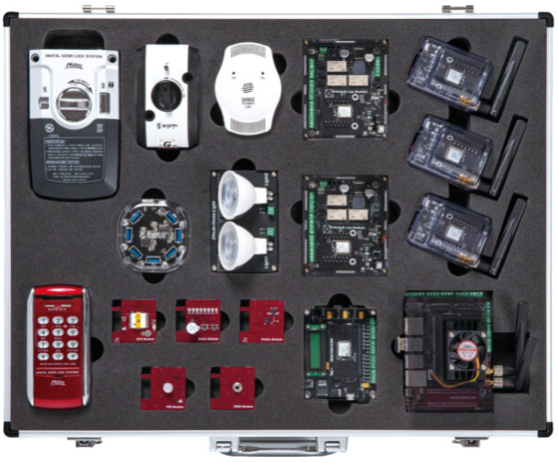

임베디드 플랫폼의 프로세서는 크게 두 가지로 나뉩니다. 하나는 스마트폰, 태블릿 등에 사용되는 애플리케이션 프로세서(AP)이고, 다른 하나는 고성능 센서, 산업용 제어기 등에 쓰이는 마이크로컨트롤러(MCU)입니다. XNode Home은 후자인 MCU를 사용하며, 저전력 무선 통신 기술인 지그비(Zigbee V3)를 탑재하고 있습니다.

### IoT 모트
IoT 모트는 먼지(mote)라는 단어에서 유래했으며, 작고 분산된 무선 센서 노드를 지칭하는 용어로 널리 사용됩니다. 따라서 무선 센서 네트워크(WSN) 또는 사물 인터넷(IoT) 환경에서 데이터를 수집하고 전송하는 데 사용되는 작은 장치라고 할 수 있습니다  
저전력 무선 통신 기술이 내장된 MCU와 배터리, 기본 센서, 확장 포트로 구성되며, 프로그래밍 언어는 파이썬의 하위 집합인 MicroPython을 사용합니다.

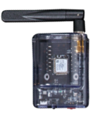

XNode Home은 3개의 IoT 모트를 제공하며, 각 IoT 모트는 다음과 같은 구성을 갖습니다.

- Zigbee와 BLE 무선 통신 기술이 내장된 Silicon Labs의 Cortex M4 MCU 사용
- XBee의 Zigbee V3 및 BLE 소프트웨어 스택 탑재
- LiPo 타입 3.7V 내장 배터리로 운영
- USB B 타입 포트를 통해 배터리를 충전하거나 PC와 시리얼 통신 수행
- 공급 전압 측정을 비롯해 조도, 온도, 기압, 습도, VOC(유기화합물) 측정 센서 내장
- 전원 켜짐과 배터리 충전 중을 표시하는 LED와 사용자 정의 LED 내장
- 전원 스위치 및 리셋 버튼 내장
- 26핀 확장 커넥터 내장

<details>
<summary><b>CPU, AP, MCU 비교</b></summary>
<div class="shadow-box">
CPU(Central Processing Unit), AP(Application Processor), 그리고 MCU(Microcontroller Unit)는 모두 데이터를 처리하는 전자 장치이지만, 설계 목적, 성능, 그리고 사용되는 환경에 따라 다음과 같은 뚜렷한 차이점을 가지고 있습니다.</p>

구분         | CPU                                                       |	AP 	                                                                        |MCU 
-------------|----------------------------------------------------------|-------------------------------------------------------------------------------|---------------------------------------------
주 용도       | 범용 컴퓨팅, 고성능 작업 (데스크탑, 노트북, 서버)	                  | 모바일 기기의 핵심 제어 (스마트폰, 태블릿)	                                             |특정 작업 제어, 임베디드 시스템 (가전제품, 산업 장비, IoT 기기)
핵심 역할     | 시스템의 주 연산 처리 장치, 운영체제 및 응용 프로그램 실행	           | CPU, GPU, 통신 모뎀, DSP, NPU 등을 통합한 SoC(System-on-Chip), 모바일 기기의 모든 기능 제어	| CPU, 메모리, I/O 인터페이스를 단일 칩에 통합, 특정 기능 수행 및 제어
성능         |	높음: 높은 클럭 속도, 다중 코어, 대용량 캐시 메모리                 | 균형 잡힘: CPU 성능은 PC 대비 낮으나, GPU, NPU 등 특화된 처리 장치 통합, 효율적인 전력 관리	     | 낮음: 낮은 클럭 속도, 단일 코어, 제한된 메모리, 실시간 처리에 중점
전력 소모      |	높음: 수십~수백 와트 (W)                                    |	낮음: 수 와트 (W) 이하, 배터리 수명 최적화                                             | 매우 낮음: 밀리와트(mW) ~ 마이크로와트(µW), 장시간 배터리 구동 또는 에너지 하베스팅에 적합
아키텍처      |	x86, ARM64                                              | 주로 ARM                                                                         |	ARM, PIC, AVR, 8051, RISC-V 등 다양
메모리        |	외부 RAM 및 저장 장치(HDD, SSD) 연결 필요	                   | 내장 RAM, 스토리지                                                                  | 소량의 내장 RAM 및 플래시 메모리
운영체제      | (OS)	Windows, macOS, Linux 등 범용 OS	                     | Android, iOS 등 모바일 OS                                                          | 경량 OS (RTOS) 또는 펌웨어
집적도        | 낮음: 주로 CPU 단일 칩으로 구성	                               | 매우 높음: CPU, GPU, 모뎀 등 다양한 기능이 하나의 칩에 집적된 SoC 형태                       | 높음: CPU, 메모리, I/O 인터페이스 등이 단일 칩에 통합
주변 장치 연결 | 메인보드를 통해 그래픽 카드, 저장장치, 네트워크 카드 등 다양한 장치와 연결 | 내장된 다양한 센서(카메라, GPS, 가속도 센서 등), 통신 모듈(Wi-Fi, Bluetooth, Cellular)과 연결 | ADC, DAC, UART, SPI, I2C, PWM 등 다양한 센서 및 액추에이터와 연결
냉각 시스템	   | 고성능으로 인한 발열 때문에 쿨러, 히트싱크 등 냉각 시스템 필수         |	저전력 설계로 발열이 적으나, 고사양 작업 시 방열판 등이 사용될 수 있음                           | 일반적으로 별도의 냉각 시스템 불필요
대표 제조사    | Intel, AMD                                               |	Qualcomm, Apple, Samsung, MediaTek, HiSilicon(Huawei)	                         | NXP, Microchip, STMicroelectronics, Renesas, Texas Instruments

</div>
</details></br>

#### IoT 모트 확장 커넥터
MCU의 GPIO, I2C, ADC 등이 확장 커넥터를 통해 노출되며, IoT 모트용 확장 모듈을 이곳에 연결해 사용합니다.

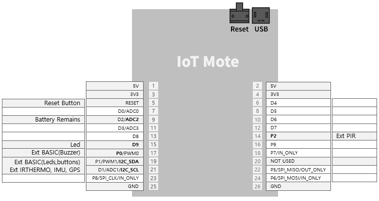

### IoT 모트용 확장 모듈
확장 모듈은 IoT 모트의 26핀 확장 커넥터를 통해 연결되어, 센서 연결, 통신 인터페이스 확장 등 IoT 모트의 기능을 확장하고, 특정 프로젝트에 필요한 맞춤형 기능을 제공합니다.

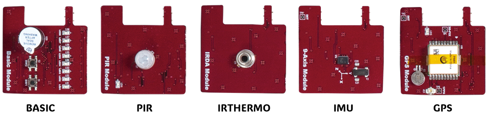

#### BASIC 모듈  
BASIC 모듈은 LED, 버튼, 부저와 같은 필수적인 입출력 요소를 통합하여, 사용자가 별도의 부품 없이도 간단한 인터페이스를 빠르게 구성할 수 있도록 설계되었습니다. 따라서, 간단한 기능 테스트를 위한 시제품 제작에 적합합니다.

#### PIR 모듈  
PIR 모듈에 내장된 PIR 센서(Passive Infrared Sensor)는 사람이나 동물의 움직임을 감지하는 데 사용되는 전자 센서입니다. 수동적이라는 이름에서 알 수 있듯이, 센서 자체가 적외선을 방출하는 것이 아니라 주변 환경에서 방출되는 적외선을 감지하여 작동합니다. 주로 보안 시스템, 자동 조명, 자동문 등 다양한 분야에서 활용됩니다.

#### IRTHERMO 모듈  
IRTHERMO 모듈에 내장된 적외선 온도 센서는 물체에서 방출되는 적외선 복사 에너지를 감지하여 온도를 측정하는 비접촉식 온도 센서입니다. 물체에 직접 접촉하지 않고 온도를 측정할 수 있기 때문에 다양한 산업 및 일상 생활에서 널리 사용됩니다.

#### IMU 모듈  
IMU 모듈에 내장된 관성 측정 장치(IMU: Inertial Measurement Unit)는 물체의 움직임과 방향을 측정하는 전자 장치입니다. 우리 주변의 스마트폰, 드론, 로봇, 자동차 내비게이션 시스템 등 다양한 곳에서 사용되고 있습니다. IMU 모듈은 가속도계, 자이로스코프, 지자기 센서(자력계)를 결합하여 3차원 공간에서의 움직임을 정밀하게 측정합니다.

#### GPS 모듈  
범지구 위치 결정 시스템(GPS: Global Positioning System)는 지구 궤도를 도는 여러 개의 위성을 이용하여 지구상의 위치를 정확하게 측정하는 위성 항법 시스템입니다. 미국 국방부에서 군사 목적으로 개발되었지만, 현재는 민간에서 내비게이션, 측량, 지도 제작, 시간 동기화 등 다양한 용도로 널리 사용되고 있습니다.  
GPS 모듈에 내장된 GPS 수신기는 최소 4개 이상의 GPS 위성으로부터 신호를 받아 자신의 위치를 계산합니다. 각 위성은 고유의 신호와 함께 신호를 보낸 시간 정보를 포함하여 전파를 송신합니다. 수신기는 각 위성에서 보낸 신호가 도달하는 시간 차이를 측정하여 각 위성과의 거리를 계산합니다.   
이때 삼변 측량(Trilateration)이라는 수학적 원리가 사용됩니다. 3개의 위성과의 거리를 알면 2차원 평면에서의 위치를 결정할 수 있고, 4개의 위성과의 거리를 알면 3차원 공간에서의 위치(위도, 경도, 고도)를 정확하게 결정할 수 있습니다.

### Auto 제어기
Auto 제어기는 릴레이, PWM 컨트롤러, IO 포트를 통해 산업 현장의 다양한 장치를 제어할 수 있습니다. 릴레이를 이용하여 12V 조명이나 환풍기를 켜고 끌 수 있으며, PWM 컨트롤러로는 12V 조명의 밝기나 DC 모터의 속도를 정밀하게 조절할 수 있습니다. 또한, IO 포트를 통해 3.3V 스위치, 가스 누설 감지 센서 등을 연결하여 다양한 상황을 감지하고 대응할 수 있습니다. 
Auto 제어기의 두뇌에 해당하는 IoT 모트는 배터리 대신 외부 전원을 사용하므로 전원 관리가 용이하며, 필요시 리셋 버튼을 통해 시스템을 재시작할 수 있습니다.

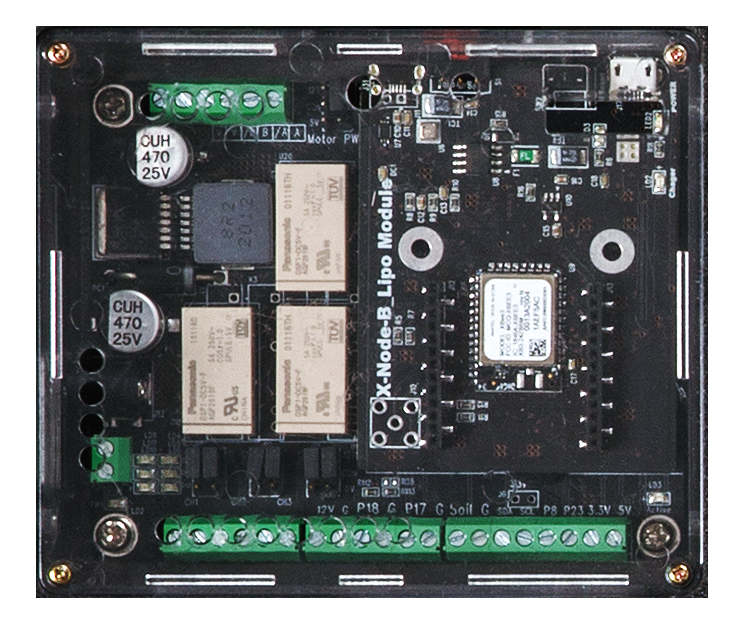

다음은 Auto 제어기에서 IoT 모트를 제외한 추가 구성입니다.

- IoT 모트의 IO 라인과 전원으로 구성된 디지털 IO 터미널 블록 제공
- 전원을 사용하는 ON-OFF 형태의 외부 장치(조명, 환기팬 등)를 연결할 수 있도록 공용 접점(Common)과 A접점(normmal open)으로 구성된 3개 채널 릴레이 터미널 블록 제공
- PWM 컨트롤러에 연결하여 최대 2kHz 주파수의 12V PWM 신호를 출력할 수 있는 4개 채널 PWM 터미널 블록 제공
- 12V DC 전원으로 운영

**터미널 블록**  
단자대 또는 단자판이라 불리는 터미널 블록은 전기 회로에서 전선들을 연결하기 위한 모듈식 연결 장치입니다. 간단히 말해, 여러 전선을 안전하고 깔끔하게 연결할 수 있도록 해주는 부품입니다. 특히 산업 현장이나 제어 패널 등에서 배선을 정리하고 유지 보수를 용이하게 하기 위해 널리 사용됩니다. 

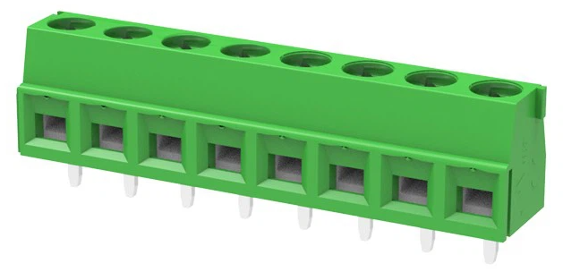

터미널 블록은 크게 다음과 같은 부분으로 구성됩니다.

- 절연체 (Insulating Body/Housing): 플라스틱(나일론, 폴리카보네이트 등) 또는 세라믹과 같은 절연 재료로 만들어진 몸체. 전기적 안전을 확보하고 단자들을 고정하는 역할
- 도체 (Conductor/Terminal): 금속(구리, 황동 등)으로 만들어진 부분으로, 전선과 연결되어 전류 전달
- 클램핑 부품 (Clamping Mechanism): 전선을 도체에 단단히 고정하는 부분. 나사, 스프링, 레버 등의 형태로 제공

#### Auto 제어기 터미널 블록  
Auto 제어기에는 PCB에 견고하게 고정된 나사식 터미널 블록이 장착되어 있습니다. 이 터미널 블록은 전선과 제어기 간의 안정적인 연결을 제공합니다. 전선을 연결할 때는 먼저 전선의 피복을 적절히 벗긴 후, 각 단자에 삽입합니다. 이후 일자 드라이버를 사용하여 단자의 나사를 시계 방향으로 돌려 조여 전선을 단단히 고정합니다.

Auto 제어기의 PWM 채널, 릴레이 채널, 그리고 사용자가 용도에 맞게 설정할 수 있는 디지털 IO 핀들이 터미널 블록을 통해 외부로 연결됩니다. 따라서 사용자는 터미널 블록의 각 단자에 필요한 전선을 연결함으로써 다양한 외부 장치와 편리하게 연결하고 제어할 수 있습니다.

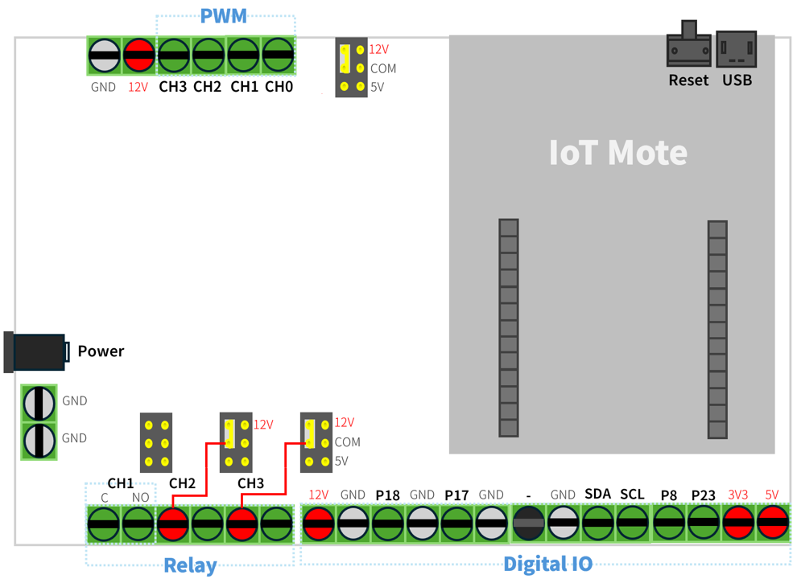  

디지털 IO 터미널 블록의 단자 구성은 다음과 같습니다.

- P18 단자: 내부에 전압 분배 저항이 연결되어 있어, 12V Active Hight 신호(입력이 없으면 LOW, 입력이 있으면 HIGH)를 출력하는 입력 장치 연결
- P18 단자: 내부에 풀업(Pull-Up) 저항이 연결되어 있어, Active Low 신호(입력이 없으면 HIGH, 입력이 있으면 LOW)를 출력하는 입력 장치 연결
- P8, P23 단자: 3V3에서 동작하는 입출력 장치 연결
  - 스위치의 2가닥 제어선 중 한쪽을 3V3 전원 단자에 연결하고, 다른 한쪽을 P8 또는 P23 단자에 연결하면 스위치를 누를 때마다 P8 또는 P23은 HIGH 레벨이 됨
- 3V3, 5V, 12V, GND으로 구성된 전원 단자도 함께 제공함
  - 전원선을 잘못 연결할 경우 **장비가 파손될 수 있으므로** 각별히 주의 

다음은 릴레이 터미널 블록 단자 구성입니다.

- 2.54mm 2핀 점퍼 쇼트 커넥터를 통해 해당 채널의 공용 접점 단자(이하 C 단자)에 내부 전원 연결 설정
  - 12V 또는 5V 전원을 공급하거나 공급하지 않음
- 제품 출고 시 1번 채널의 C 단자는 전원에 연결되어 있지 않지만, **2번과 3번 채널의 C 단자는 내부적으로 12V 전원이 연결되어 있음**

다음은 PWMM 터미널 블록의 단자 구성입니다.

- 2.54mm 2핀 점퍼 쇼트 커넥터를 통해 모든 PWM 채널의 최대 전압 선택
  - 12V 또는 5V 출력 전원 중 선택
- 제품 출고 시 최대 출력 전압은 12V
- 12V 전원 및 GND 단자도 함께 제공함


### Auto 제어기용 주변장치
XNode Home에는 가정이나 빌딩, 공장 자동화에 사용되는 환기팬이나 조명, 도어락, 가스 밸브 차단기, 가스 누설 감지기 등이 포함되어 있으며, 이들은 목적에 따라 Auto 제어기의 릴레이나 PWM 컨트롤러, IO 포트에 대응하는 터미널 단자에 연결해 사용합니다.

### 환기팬  
환기팬으은 단방향으로 회전하는 12V DC 모터가 내장되어 있으며, 검은색 선은 GND 단자, 빨간색 선은 릴레이 또는 PWM 채널 단자에 연결해 사용합니다. 이때 ON-OFF 제어가 필요하면 빨간색 선을 **릴레이 2번 또는 3번 채널 NO 단자**에 연결하고, 가변 속도 제어가 필요하면 PWM 채널 단자에 연결하면 됩니다.

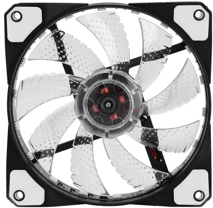

#### 조명  
고휘도 LED로 구성된 조명은 환기팬과 같이 검은색 선은 GND 단자, 빨간색 선은 릴레이 또는 PWM 채널 단자에 연결해 사용합니다. 빨간색 선은 ON-OFF 제어를 수행할 때는 **릴레이 2번 또는 3번 채널 NO 단자**에 연결하고, 가변 밝기 제어가 필요하면 PWM 채널 단자에 연결합니다.

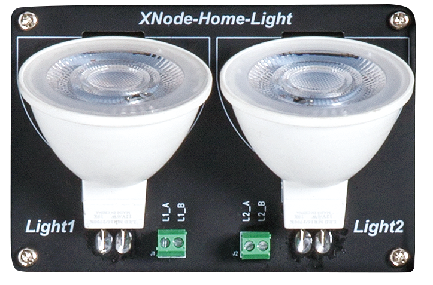

#### 도어락  
도어락은 기계식과 디지털식으로 나눠지는데, XNode Home에서 채택한 디지털 도어락은 외부 장치와 내부 장치로 구성됩니다. 외부 장치는 번호 입력부와 카드 인식부 등으로, 내부 장치는 모터, 구동부, 잠금쇠, 제어 회로, 수동 개폐 장치 등으로 구성됩니다.  
제어는 내장 장치에 건전지를 채워 넣고 2가닥의 신호선을 각각 릴레이 1번 채널 C와 NO 단자에 연결해 사용합니다.  

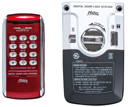

#### 가스 밸브 차단기  
가스 밸브 차단기(또는 가스 안전 차단기)는 가스 누출로 인한 화재나 폭발 사고를 예방하기 위해 가스 밸브를 자동으로 차단하는 장치입니다. 특히 가스레인지 사용 중 깜빡 잊고 밸브를 잠그지 않았을 경우 발생할 수 있는 사고를 막아주는 중요한 안전 장치입니다.  
양방향으로 회전하는 12V DC 모터가 토크가 높은 기어와 함께 장착되어 있으며, 검은색 선과 빨간색 선을 각각 PWM 채널 2개 단자에 연결해 사용합니다.

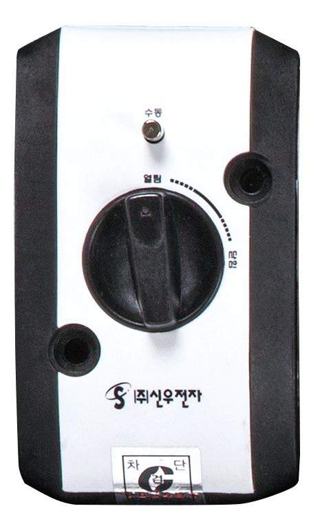

#### 가스 누설 감지기  
가스 누설 감지기는 공기 중의 가스 농도를 실시간으로 감지하여 누출 여부를 알려주는 장치입니다. 가스 누출은 화재, 폭발, 인체 질식 등 심각한 사고를 초래할 수 있으므로, 가정 및 산업 현장에서 필수적인 안전 장비로 자리 잡았습니다.  
감지기 내부에는 가스에 반응하는 센서가 내장되어 있으며, 이 센서는 특정 가스에 노출될 경우 전기 전도도나 저항 등의 전기적 특성이 변화하는 원리를 이용합니다. 이러한 변화를 감지 회로가 감지하여 경보를 발생시키거나 외부 제어 장치로 신호를 전송합니다.  
XNode Home에 포함된 감지기는 가스 누출이 감지되면, 연결된 신호선을 통해 12V DC High 신호를 출력(ActiveHigh)합니다. 이 신호는 IO 터미널의 P18과 같은 디지털 입력 단자에 연결해 사용합니다.


### 엣지 게이트웨이
엣지 게이트웨이는 Zigbee 기반의 IoT 기기(예: IoT 모트, Auto 제어기)와 인터넷 간의 통신을 중계하는 역할을 하는 소형 컴퓨터입니다. Wi-Fi 또는 이더넷 연결을 통해 인터넷에 접속하며, 여러 대의 IoT 기기를 동시에 관리할 수 있습니다.  
NVIDA의 Jetson nano 플랫폼에서 Ubuntu 리눅스로 운영되며, 오픈 MQTT(Message Queuing Telemetry Transport) 브로커인 모스키토(Mosquitto)가 내장되어 있습니다. 

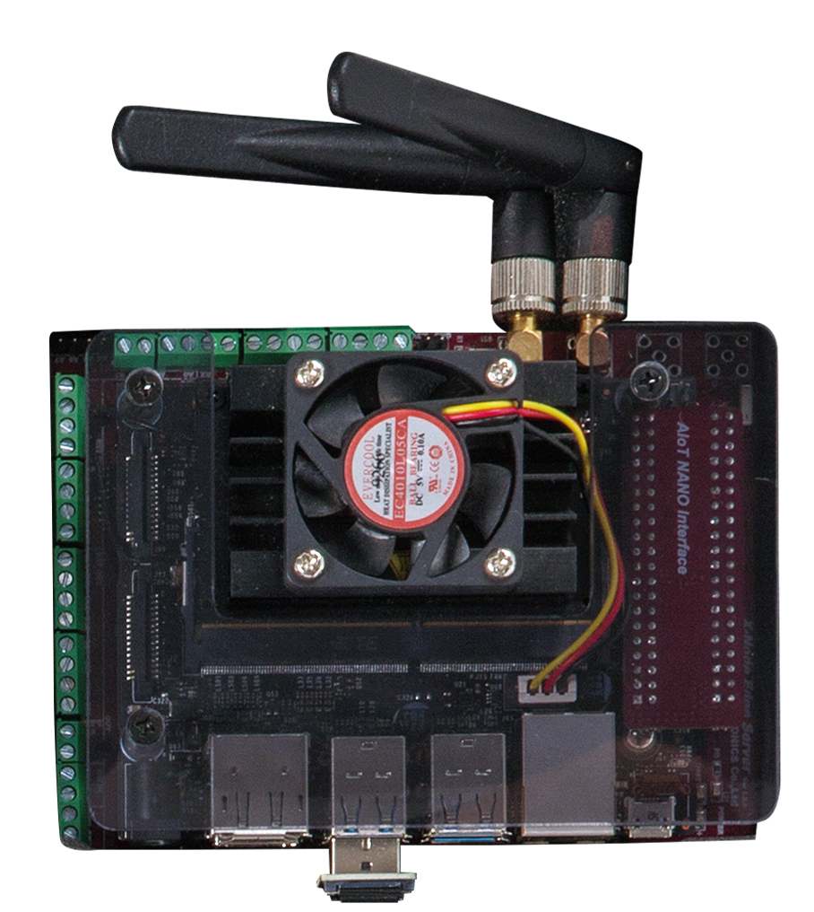

### 전원 공급기
전원 공급기는 12V DC 입력을 받아 최대 3개의 12V DC 출력으로 분배합니다. 이를 통해 여러 대의 Auto 제어기 및 엣지 게이트웨이에 안정적인 전원 공급이 가능합니다. 또한, Auto 제어기와 동일하게 IoT 모트와 터미널 IO 블록을 내장하고 있어 필요에 따라 주변 장치를 추가로 연결할 수 있습니다.  
전원 공급기에 포함된 2x16 텍스트 LCD에는 실시간으로 현재 전력 공급 상태를 표시합니다.

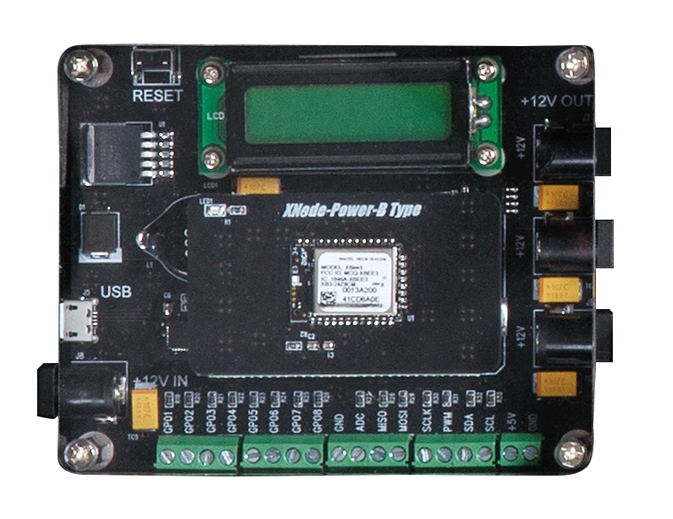

### USB 허브 
USB 허브는 여러 대의 IoT 모트와 Auto 제어기를 하나의 PC에 연결하여 다중 장치 통신 환경을 구축하는 데 사용됩니다. PC는 USB를 통해 연결된 IoT 모트를 가상 COM 포트(가상 시리얼 장치)로 인식하며, 각 COM 포트 번호를 통해 장치를 구분합니다.

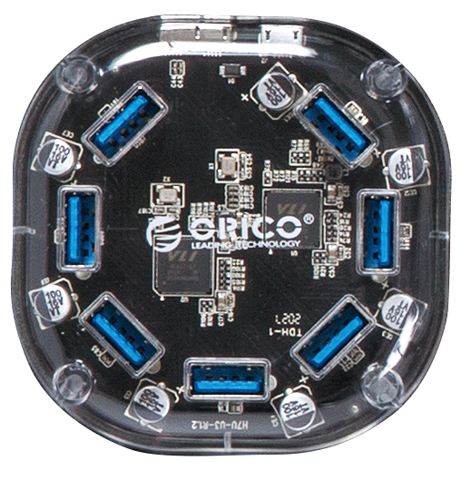

----------

## 실습 환경
본 문서에서 IoT 모트와 IoT 모트 내장형 Auto 제어기는 실습 장비로 통칭합니다. 실습을 시작하려면 먼저 실습 장비에 전원을 공급하고 PC와 USB 케이블로 연결합니다. 연결이 완료되면 PC는 실습 장비와의 통신을 위한 가상 시리얼 포트를 자동으로 생성합니다. 다음으로, 실습 장비에서 실행할 펌웨어는 MicroPython 라이브러리와 마이크로컨트롤러 환경에 맞춰 축소된 파이썬 문법을 사용해 작성합니다. 이후, 필요에 따라 paho-mqtt, pyside6 등의 라이브러리와 파이썬 문법을 활용하여 실습 장비와 PC 간 시리얼 통신을 위한 브릿지 또는 GUI 프로그램을 작성합니다. 이를 위해 [101 개발환경]에서 소개한 개발 환경 구성을 참고하시기 바랍니다. 마지막으로, 오픈 소스 도구인 upyboard을 사용하여 작성된 펌웨어를 실습 장비에 배포하고 실행합니다.

[101 개발환경]:https://github.com/PlanXStudio/meister/blob/main/common/101_개발환경.md

일반적으로 IoT 모트와 같은 MCU 기반 장비는 C 언어로 개발됩니다. 그러나 C 언어는 학습 곡선이 가파르고, 메모리 관리 등에 숙련된 개발 경험을 필요로 합니다. 반면 XNode Home은 최근 인공지능 개발에 널리 쓰이는 파이썬을 경량화한 MicroPython을 채택하여, C 언어보다 쉽고 빠르게 원하는 결과를 얻을 수 있다는 장점을 제공합니다.

<details>
<summary><b>파이썬과 MicroPython 비교</b></summary>
<div class="shadow-box">

파이썬(Python)과 MicroPython은 모두 인기 있는 프로그래밍 언어이지만, 사용 목적과 기능, 성능 면에서 뚜렷한 차이점이 있습니다.

1. 사용 목적
   - 파이썬: 범용 프로그래밍 언어로, 웹 개발, 데이터 과학, 인공 지능, 머신러닝, 데스크톱 애플리케이션, 시스템 스크립팅 등 다양한 분야서 사용
   - MicroPython: 임베디드 시스템, 마이크로컨트롤러, IoT 장치와 같이 리소스가 제한된 환경에서 사용하도록 설계된 파이썬의 경량화된 버전

2. 크기와 성능
   - 파이썬: 상대적으로 크고 무거운 언어. 인터프리터와 표준 라이브러리가 많은 메모리를 차지하며, 실행 속도도 MicroPython에 비해 느림
   - MicroPython: 매우 작고 효율적으로 설계됨. 인터프리터와 핵심 라이브러리가 수백 킬로바이트(KB)에 불과하며, RAM 사용량도 매우 적음. 실행 속도는 파이썬보다 빠르지만, 여전히 C/C++와 같은 컴파일 언어보다는 느림

3. 라이브러리 지원
   - 파이썬: 방대하고 풍부한 표준 라이브러리와 서드파티 라이브러리 제공. NumPy, Pandas, TensorFlow, Django 등 유명 라이브러리를 포함하여 거의 모든 분야에 필요한 라이브러리를 찾을 수 있음
   - MicroPython: 파이썬 표준 라이브러리의 일부만 지원하며, 서드파티 라이브러리 지원도 제한적. 주로 하드웨어 제어, 네트워킹, 센서 인터페이스 등 임베디드 시스템에 필요한 기능에 중점을 둔 라이브러리 제공

4. 문법 및 기능
   - 파이썬: 완전한 기능을 갖춘 언어로, 객체 지향 프로그래밍, 함수형 프로그래밍, 메타프로그래밍 등 다양한 프로그래밍 패러다임 지원
   - MicroPython: 파이썬 3 문법을 대부분 지원하지만, 일부 고급 기능이나 덜 사용되는 기능은 제외. 예를 들어, 일부 데코레이터, 메타클래스, 복잡한 제너레이터 표현식 등이 제한될 수 있음

5. 하드웨어 제어
   - 파이썬: 운영체제 추상화를 통해 하드웨어와 간접적으로 상호 작용. 직접적인 하드웨어 제어는 일반적으로 C/C++로 작성된 확장 모듈을 통해 이루어짐
   - MicroPython: 마이크로컨트롤러의 하드웨어에 직접 접근하고 제어할 수 있도록 설계됨. GPIO, UART, SPI, I2C, PWM, ADC 등 하드웨어 인터페이스를 직접 조작할 수 있는 API 제공

6. 개발 환경
   - 파이썬: Windows, macOS, Linux 등 다양한 운영체제에서 실행되며, PyCharm, VSCode, Jupyter Notebook 등 다양한 개발 도구 사용
   - MicroPython: 일반적으로 마이크로컨트롤러 보드에 직접 업로드되어 실행됨. 개발을 위해서는 보드와 연결할 수 있는 시리얼 콘솔과 코드 편집기 필요. Thonny, uPyCraft, Mu 등 MicroPython 개발에 특화된 IDE도 있음.

7. REPL (Read-Eval-Print Loop)
   - 파이썬: 대화형 인터프리터를 제공하여 코드를 한 줄씩 실행하고 결과를 즉시 확인할 수 있음
   - MicroPython: 마찬가지로 REPL을 지원하며, 이를 통해 마이크로컨트롤러와 실시간으로 상호 작용하며 코드를 테스트하고 디버깅할 수 있음. (하드웨어 제어에 매우 유용)

</div>
</details></br>

다음은 전체 실습 환경 구성입니다.  

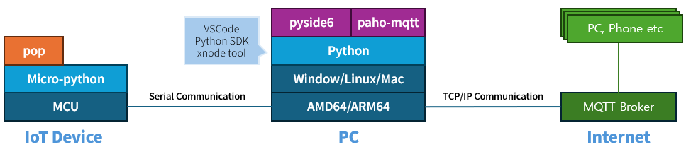  

### PC에 실습 장비 연결
IoT 모트는 내장 배터리를 통해 전원 스위치를 켜는 즉시 사용할 수 있으며, PC와 USB 케이블로 연결하면 자동으로 충전됩니다. 반면 Auto 제어기에 포함된 IoT 모트는 배터리 없이 외부 전원을 연결하여 작동하며, 따라서 전원 스위치가 없습니다.  
실습 장비와 PC를 연결하기 위해 제공되는 USB 케이블의 PC 연결 부분은 USB Type A 커넥터 형태입니다. 만약 사용자의 PC에 USB Type A 포트가 없고 Type C 포트만 있다면, 별도로 **Type C to A 변환 젠더**를 준비하여 연결해야 합니다.

#### IoT 모트  

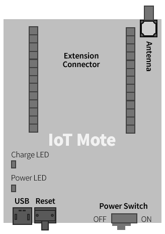  

1. USB Type-A to Micro USB Type-B 케이블을 준비합니다. 이 케이블은 PC의 USB Type-A 커넥터에 연결하는 한쪽 끝과 실습 장비의 Micro USB Type-B 커넥터를 연결하는 다른 한쪽 끝으로 구성되어 있습니다. 

   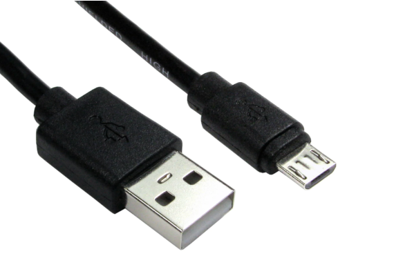  

2. 전원 스위치를 켜짐(ON) 쪽으로 옮기면, 전원 LED가 켜집니다.

3. 준비한 케이블로 PC와 실습 장비를 연결합니다. 배터리 잔량이 부족할 경우 충전 LED가 점등되면서 충전이 시작됩니다.

4. PC에서 가상 시리얼 포트가 생성되었는지 확인합니다.
   1. 윈도우: '장치 관리자 > 포트(COM & LPT) > USB Serial Port(COMx)'
   2. 리눅스/맥: '터미널 > ls /dev/tty*'

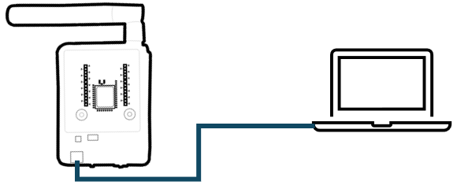  

</p> 

<details open>
<summary><b>USB 케이블 연결과 전원 켜기</b></summary>
<div class="shadow-box">

실습 장비의 전원 스위치가 꺼진(OFF) 상태에서 USB 케이블을 먼저 연결하면, PC 전원이 실습 장비에 공급되어 실습 장비의 USB to Serial 칩이 활성화됩니다.  
하지만 마이크로컨트롤러는 꺼진 상태이므로 프로그래밍은 불가능 합니다. 이때는 전원 스위치를 켜면(ON) 프로그래밍 할 수 있습니다.

</div>
</details></br>

#### Auto 제어기  
1. USB Type-A to Micro USB Type-B 케이블을 준비합니다. 

2. 12V DC 전원 어댑터를 실습 장비의 전원 포트에 연결합니다. 

3. 준비한 케이블로 PC와 실습 장비를 연결합니다.

4. PC에서 가상 시리얼 포트가 생성되었는지 확인합니다.


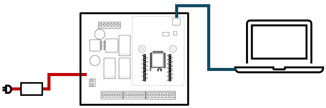  


#### USB 허브   
여러 대의 실습 장비를 PC의 USB 포트에 직접 연결하는 대신, 제공된 USB 허브를 이용하여 한 번에 연결할 수 있습니다.

1. USB Type-A to Micro USB Type-B 케이블과 추가로 PC와 허브를 연결할 Micro USB 3.0 Type B to USB 3.0 Type A 케이블을 준비합니다. 
   
   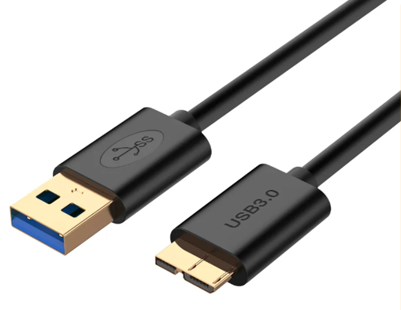  

2. 5V USB 허브용 전원 어댑터를 USB 허브에 연결합니다.

3. 준비한 두 번째 USB 케이블로 PC와 허브를 연결합니다.

4. 준비한 첫 번째 USB 케이블로 실습 장비와 USB 허브를 연결합니다.

5. PC에서 가상 시리얼 포트가 생성되었는지 확인하는데, 한 번에 하나씩 확인하면서 연결합니다.

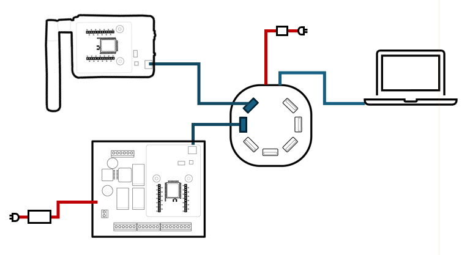  

#### 전원 공급기    
여러 대의 Auto 제어기를 USB 허브를 이용하여 연결할 때 하나의 전원 어댑터로 통합하여 전원을 공급하면 더욱 편리하게 시스템을 운영할 수 있습니다. 이는 복수의 전원 어댑터를 사용해야 하는 번거로움을 줄여줍니다.

1. 제공되는 12V DC 전원 어댑터를 전원 공급기의 입력 포트에 연결합니다.

2. 별도 전원 케이블을 이용해 전원 공급기의 출력과 실습 장비의 전원 포트를 연결합니다.

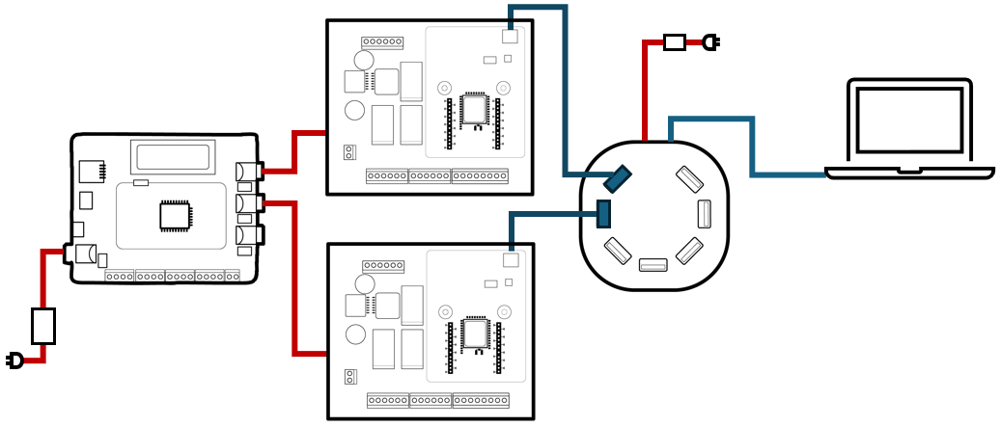  

### MicroPython 개발 툴 설치
[101 개발환경]에서 소개한 VSCode 기반 파이썬 개발 환경 구축을 완료했다면, MicroPython이 탑재된 실습 장비를 지원하기 위해 upyboard를를 추가로 설치합니다.

upyboard는 명령행 도구로 파이썬 개발 환경을 확장하여 PC와 실습 장비 간의 원활한 통신 및 MicroPython 코드 실행을 지원하는 툴입니다. 실습 장비 탐색 및 초기화, 펌웨어 배포 및 실행, 실행 중인 펌웨어와 데이터 교환, 파일 시스템 관리 같은 기능을 제공하여 효율적인 펌웨어 개발을 가능하게 합니다.

```sh
pip install -U upyboard
```

PC에 upyboard가 설치되면 upy 프로그램을 사용할 수 잇는데, 일반적인 사용법은 다음과 같습니다.
```sh
upy [OPTIONS] COMMAND [ARGS]...
```

-s(또는 --sport) OPTIONS은 COMMAND 중 scan과 env를 제외하고는 필수이며, 현재 연결된 실습 장비의 시리얼 포트 이름을 지정합니다. -t(또는 --type)은 장치 유형을 지정하는데, 실습 장비에서는 생략합니다.
동작을 지정하는 COMMAND는 다음과 같이 scan, env을 비롯해 init, run, ls, get, put, rm 등이 있습니다.
- scan: 시리얼 포트에 연결된 실습 장비 탐색
- env: VSCode 작업 공간을 MicroPython 지원하도록 초기화
- init: 실습 장비 초기화(포맷 및 xnode 라이브러리 설치)
- run: PC에서 작성한 .py(MicroPython 스크립트)를 실습 장비로 전송한 후 실행
  - 추가 옵션으로 -i(또는 --input-echo-on) 또는 -n(또는 --no-stream) 지원
    - -i(또는 --input-echo-on): 대화형 실행(기본값) 중 PC에서 실습 장비로 전송한 문자를 화면에 출력 (input()을 사용할 때는 필요 없음)
    - -n(또는 --no-stream): 대화형 실행 안함. 실습 장비에서 .py가 실행되면 시리얼얼 연결을 끊음
- ls: 실습 장비의 파일 시스템 탐색 (디렉터리는 흰색, 파일은 밝은 파란색으로 표시)
- get: 실습 장비의 파일 시스템에 위치한 .py 파일을 PC로 복사
- put: PC의 .py 파일을 실습 장비의 파일 시스템으로 복사
- rm: 실습 장비의 파일 시스템에 위치한 파일 또는 디렉터리 삭제
- repl: MicroPython 인터프리터의 REPL에 연결
- mkdir: 실습 장비의 파일 시스템에 디렉터리 생성

<details>
<summary><b>MicroPython 파일 시스템 구조</b></summary>
<div class="shadow-box">

MicroPython 파일 시스템은 일반적으로 임베디드 장치의 제한된 리소스(저장 공간, 메모리)에 맞게 설계된 경량 파일 시스템입니다. PC의 파일 시스템과 유사한 계층적 구조를 가지지만, 몇 가지 중요한 차이점이 있습니다.

1. 루트 디렉토리 (/)
   - 파일 시스템의 최상위 디렉토리
   - 모든 파일과 디렉토리는 루트 디렉토리 아래에 위치

2. 파일 및 디렉토리
   - MicroPython은 일반적인 파일 시스템과 마찬가지로 파일과 디렉토리를 사용하여 데이터 구성
   - 파일 이름과 디렉토리 이름은 /로 구분 (예: /lib/mote.py, /data/config.txt)

3. 저장 장치
   - MicroPython이 실행되는 장치는 일반적으로 내장 플래시 메모리 또는 SD 카드와 같은 저장 장치 사용
   - 내장 플래시 메모리
     - 대부분의 MicroPython 보드에 내장된 저장소
     - 용량이 제한적 (보드에 따라 수백 KB에서 수 MB 정도)
     - 일반적으로 / (루트 디렉토리) 또는 /flash로 마운트
   - SD 카드
     - 별도의 SD 카드를 장착하여 저장 공간 확장
     - SD 카드는 일반적으로 /sd 또는 /sdcard와 같은 경로로 마운트

</div>
</details>

----------

## 시작하기
실습 장비를 PC에 연결하고 개발 툴 설치가 끝났다면 VSCode에서 MicroPython을 위한 작업 공간(Workspace)을 만든 후 파이썬 구문으로 간단한 코드를 작성하고 테스트해 봅니다. 

### 부팅 절차
실습 장비에 전원을 공급하거나(Auto 제어기) 추가로 전원 스위치를 켜면(IoT 모트) 다음과 같은 절차로 부팅 작업이 진행되는데, 실습 장비에는 boot.py와 main.py가 존재하지 않으므로 MicroPython 인터프리터는 이들의 실행을 생략하고 대신 REPL(읽기-평가-인쇄 루프) 프롬프트를 시작합니다.

1. 전원 인가 및 초기화
   - 마이크로컨트롤러에 전원이 공급되면, 하드웨어 초기화
   - CPU, 메모리, 주변 장치들이 활성화되고 초기 상태로 설정됨
2. 부트로더(bootloader) 실행
   - ROM에 저장된 부트로더가 실행되어 기본적인 하드웨어 초기화 수행
   - MicroPython 펌웨어를 플래시 메모리에서 읽어 RAM에 로드
3. MicroPython 펌웨어 실행
   - RAM에 로드된 MicroPython 펌웨어 실행
   - 펌웨어는 MicroPython 인터프리터, 라이브러리, 런타임 환경으로 구성
4. boot.py 실행
   - MicroPython은 부팅 시 먼저 boot.py 파일을 찾고, 존재하면 실행
   - 사용자 설정, 파일 시스템 마운트, 네트워크 설정 등을 수행
   - boot.py 내부 오류는 부팅을 방해할 수 있으므로 코드를 최소화하고 철저히 테스트해야 함.
5. main.py 실행
   - boot.py 실행이 완료되면, MicroPython은 main.py 파일을 찾고, 존재하면 실행
   - 사용자가 작성한 메인 프로그램 코드를 포함하며, 실제 애플리케이션 로직이 구현됨

### VSCode 작업 공간 초기화
VSCode에서 작업 공간은 특정 프로젝트 또는 작업과 관련된 파일, 폴더 및 설정 등을 묶어 놓은 하나의 단위입니다. 쉽게 말해, 특정 프로젝트를 위한 독립된 가상의 개발 환경이라고 할 수 있습니다. 작업 공간을 사용하면 여러 프로젝트를 효율적으로 관리하고, 프로젝트별로 서로 다른 설정을 적용할 수 있습니다.

VSCode에서 새 작업 공간을 생성할 때 MicroPython과 관련된 초기화 작업도 함께 수행해야 합니다. 이 과정에서 .vscode 폴더가 생성되고 그 안에는 VSCode가 MicroPython 코드에 대한 자동 완성, 오류 검사, 정의 이동과 같은 기능을 제공할 때 필요한 스텁 파일(.pyi)과 설정 파일 등이 추가됩니다.

1. VSCode에서 'File > Open Folder... (macOS: File > Open...)'를 선택합니다. 

2. 작업 공간으로 사용할 폴더를 선택하고 Open을 클릭합니다. 문서 폴더 아래 IoT 폴더를 만든 후 이곳을 선택하세요.

3. 이제 해당 폴더가 VSCode의 작업 공간으로 열립니다.

4. 작업 공간에서 신뢰할 수 없는 코드가 자동으로 실행되는 것을 방지하기 위해 "Do you trust the authors of the files in this folder?" 창이 표시되면 "Yes, I trust the authors"를 선택합니다. 

5. 'Terminal > New Terminal'을 선택해 터미널 창을 실행합니다. 

6. 다음 명령으로 작업 공간을 초기화합니다. 초기화가 끝나면 작업 공간 안에 .vscode 폴더가 만들어집니다.

```sh
upy env
```
> Please open the .upyboard file within the .vscode folder and configure the SERIAL_PORT setting.

<details open>
<summary><b>주의</b></summary>
<div class="shadow-box">

초기화된 작업 공간에서 upy env 명령을 다시 실행하면, 기존 .vscode 폴더를 삭제한 후 작업을 진행할 것임을 알리는 메시지가 출력됩니다. 이때 n와 \<ENTER>를 누르면 작업을 취소합니다.

```sh
The .vscode folder already exists. This folder will be deleted to proceed. Do you wish to continue? (y or n): 
```

또한 우리는 앞으로 브릿지, GUI 등 PC용 프로그램 작성을 위해 파이썬용 작업 공간도 함께 사용할 예정인데, 이곳에서는 <u>**upy env 명령을 실행하면 안 됩니다.**</u>

</div>
</details></br>

### 실습 장비 초기화
실습 장비는 MicroPython 표준 라이브러리와 한백전자에서 제공하는 xnode 라이브러리를 사용하여 프로그래밍할 수 있습니다. MicroPython 표준 라이브러리는 MicroPython 인터프리터와 함께 기본적으로 설치되어 있지만, xnode와 같은 외부 라이브러리는 사용자가 직접 설치해야 합니다. xnode는 실습 장비를 제어하는데 필요한 MicroPython 라이브러리의 일종으로 util, mote, ext, autoctl 모듈로 구성되어 있습니다.

1. upy scan 명령으로 실습 장비에 할당된 시리얼 포트 이름을 확인합니다. scan 옵션은 MicroPython 환경이 구축된 장치를 찾아 시리얼 포트 이름과 MicroPython 버전, 하드웨어 정보 등을 출력합니다.
```sh
upy scan
```
> COM3 (v1.20.0-1844-g0266434 on 2023-11-29; XBee3 Zigbee with EFR32MG)

2. 찾은 시리얼 포트 번호를 이용하여 실습 장비를 초기화합니다. 
```sh
upy --sport com3 init
```
> 실습 장비를 포맷하고 xnode 라이브러리 설치
```out
Formatting...
Formatting is complete!
Installing the library on the board.
lib/xnode/autoctrl.mpy
[########################################] 100%
lib/xnode/ext.mpy
[########################################] 100%
lib/xnode/mote.mpy
[########################################] 100%
lib/xnode/util.mpy
[########################################] 100%
The job is done!
```

3. xnode 라이브러리가 실습 장비에 설치되었는지 확인합니다. xnode처럼 제3자가 제공하는 MicroPython 라이브러리는 일반적으로 실습 장비의 lib 폴더 아래 위치해야 합니다.
```sh
upy --sport com3 ls lib/xnode
``` 
> IoT 모트(mote.mpy)와 IoT 모트용 확장 모듈(ext.mpy), Auto 제어기(autoctrl.mpy), 유틸리티(util.mpy)로 구성
```out
autoctrl.mpy
ext.mpy
mote.mpy
util.mpy
```

### 시리얼 포트 이름을 기본값으로 지정

.vscode 폴더의 .upyboard 파일은 upyboard 툴의 옵션을 관리하는데, SERIAL_PORT 항목에 현재 연결된 실습 장비의 시리얼 포트 이름을 지정해 두면, upyboard 툴을 사용할 때 -s (또는 --sport) 옵션을 생략할 수 있어 편리합니다

1. xnode scan 명령으로 현재 연결된 실습 장비의 시리얼 포트 이름을 확인합니다.
```sh
upy scan
```

2. VSCode 탐색기에서 .vscode/.upyboard 파일을 클릭합니다.

3. 편집 영역에 .upyboard 파일이 열리면, 앞서 확인한 시리얼 포트 이름을 SERIAL_PORT 항목에 설정합니다.
```sh
SERIAL_PORT=com3
```

4. 수정이 끝나면 파일을 저장한 후 닫습니다.

5. 이제 다음과 같이 -s(또는 --sport) 옵션을 생략할 수 있습니다.
```sh
upy ls lib/xnode
```

<details open>
<summary><b>주의</b></summary>
<div class="shadow-box">

실습 장비가 바뀌면 PC 할당된 시리얼 포트 이름도 바뀔 수 있습니다. 따라서
실습 장비를 PC에 연결할 때마다 upy scan 명령으로 시리얼 포트 이름을 확인한 후 바뀌었으면 .vscode/.upyboard의 SERIAL_PORT 항목을 변경합니다.  
또한 실습 장비를 여러 개 연결했다면, 각각을 구분하기 위해 -s(또는 --sport) 옵션을 사용하는 것이 편리합니다.
</div>
</details></br>


### 첫 번째 MicroPython 프로그램
PC에서 작성한 파이썬 스크립트를 실습 장비에서 대화형으로 실행하는 방법을 알아보기 위해 문자열로 표현된 파이썬 표현식을 실습 장비로 전송하면, 실습 장비에서 이를 실행하고 그 결과를 PC로 반환하는 간단한 프로그램을 작성해 봅니다.  

upy run 명령은 PC의 MicroPython 코드를 실습 장비의 RAM으로 복사한 후 실행합니다. 따라서 리셋 버튼을 누르거나 전원을 끄면 RAM의 내용을 사라집니다.

1. VSCode 탐색기에서 '마우스 우클릭 > 새 파일..."을 선택한 후 파일 이름을 simple_express.py로 설정합니다.

2. 편집 영역에 simple_express.py가 열리면 다음 내용을 입력합니다.

```python
def setup():
    print("Start...")

def loop():
    exp = input("> ")
    try:
        ret = eval(exp)
        print(ret)
    except:
        print("Syntax Error")

if __name__ == "__main__":
    setup()
    while True:
        loop()
```

3. 완성한 simple_express.py 파일은 터미널 창에서 upyboard 툴로 실행하는데, 다음 4가지 방법 중 하나를 사용합니다.

   - 방법1: 시리얼 포트 이름과 함께 run 명령으로 실행

   ```sh
   upy --sport com3 run simple_express.py
   ```

   - 방법2: .vscode/.upyboard의 SERIAL_PORT 항목에 시리얼 포트 이름이 설정되어 있다면, run 명령만으로 실행

   ```sh
   upy run simple_express.py
   ```

   - 방법3: 방법2가 유효하다면, run 명령까지 생략하고 실행 (가장 간단함)

   ```sh
   upy simple_express.py
   ```

   - 방법4: 방법2가 유효하다면, 편집창에 simple_express.py이 활성화된 상태에서, 실행 단축키인 \<Ctrl>+\<SHIFT>+\<B>를 눌러 실행

> run은 PC에 있는 MicroPython 파일을 실습 장비로 전송하고 실행합니다. 추가 옵션으로 -n을 사용하지 않는 한 대화형 실행을 위해 PC의 표준 입출력과 실습 장비의 표준 입출력을 시리얼 통신으로 상호 연결하므로, PC의 키 입력은 실습 장비의 input()으로 전달되고, 실습 장비의 print() 출력은 PC로 전달됩니다.
```out
Start...
> 10**2
100
> 3+4*5
23
> type(30)
<class 'int'>
> 
```

4. \<Ctrl>+C 키 조합을 입력하면 PC와 실습 장비 간의 연결이 끊어집니다.

5. 대화형으로 프로그램을 실행하다가 연결을 종료해도 실습 장비에는 프로그램이 여전히 실행 중입니다.  

6. 다시 upy run 명령으로 프로그램을 실행하면, 기존 프로그램은 종료하고 새로운 프로그램이 실행됩니다. 

### 두 번째 MicroPython 프로그램
이 번에는 비 대화형으로 실행하는 방법을 알아보기 위해 실습 장비의 사용자 LED를 지속적으로 깜빡이는 프로그램을 작성해 봅니다.

1. VSCode에서 blink_led.py란 이름으로 새 파일을 만든 후 다음과 같이 코드를 작성합니다. 이때 loop() 함수 안에 input() 호출이 없으므로 PC에서 키를 입력하는 것은 의미가 없습니다.

```python
import machine 
import time

led = machine.Pin('D9', machine.Pin.OUT, value=1)

def setup():
    print("Start...")
      
def loop():
    led.value(0)
    time.sleep(0.1)
    led.value(1)
    time.sleep(0.1)
    
if __name__ == "__main__":
    setup()
    while True:
        loop()
```


2. run -n 명령으로 완성한 blink_led.py를 실습 장비에서 실행합니다.

```sh
upy --sport com3 run -n blink_led.py
```

또는 

```sh
upy run -n blink_led.py
```

또는

```sh
upy -n blink_led.py
```

> -n 옵션 때문에 실습 장비에서 프로그램이 실행되면, upyboard와 실습 장비의 시리얼 연결은 끊어집니다.

3. LED가 깜빡이는 것을 멈추려면 실습 장비의 리셋 버튼을 눌러 프로그램을 강제 종료합니다.

### 실습 장비 파일 관리
앞서 작성한 blink_led.py를 실습 장비의 루트(/) 경로에 넣은 후, 결과를 확인하는 과정을 통해 실습 장비에서 파일을 관리하는 방법을 알아봅니다.
해당 파일을 main.py란 이름으로 바꿔 실습 장비의 루트에 저장하면 리셋 또는 다시 시작할 때 자동으로 main.py가 실행됩니다. 만약 main.py의 실행을 중단하려면 main.py를 삭제하거나 이름을 바꿔야 합니다.

1. put 명령으로 앞서 작성한 blink_led.py를 main.py란 이름으로 실습 장비의 루트 경로에 넣습니다. 이때, 루트 심볼(/)은 생략할 수 있습니다.

```sh
upy put blink_led.py main.py
```  

2. ls 명령으로 결과를 확인합니다. 
```sh
upy ls 
```
```out
lib
main.py
```

3. 실습 장비의 리셋 버튼을 누르거나 전원을 컸다켜면 자동으로 main.py가 실행되므로 LED가 깜빡입니다.

4. get 명령으로 실습 장비에 위치한 파일을 PC로 가져옵니다. 이때, PC에 저장할 파일 이름을 생략하면 내용만 보여 줍니다.
```sh
upy get /main.py
```
> 내용은 blink_led.py와 같습니다.
```out
import machine 
import time

led = machine.Pin('D9', machine.Pin.OUT, value=1)

def setup():
    print("Start...")

def loop():
    led.value(0)
    time.sleep(0.1)
    led.value(1)
    time.sleep(0.1)

if __name__ == "__main__":
    setup()
    while True:
        loop()
```

5. rm 명령으로 실습 장비에 저장된 파일을 삭제합니다.
```sh
upy rm main.py
```

6. ls 명령으로 결과를 확인합니다. 
```sh
upy ls 
```
```out
lib
```

<details open>
<summary><b>주의</b></summary>
<div class="shadow-box">

실습할 때 upy 다음에 -s(또는 --sport) 옵션을 생략한 것은 현재 PC에 연결된 실습 장비의 시리얼 포트 이름이 .vscode/.upyboard 파일의 SERIAL_PORT 항목에 설정되어 있기 때문입니다.
만약 시리얼 포트 이름이 다르면 SERIAL_PORT 항목을 수정하거나 upy 뒤에 -s(또는 --sport) 옵션을 붙여야 합니다.

</div>
</details>

### MicroPython 내장 모듈
실습 장비에는 Micropython 인터프리터와 더불어 array, io, json, os, struct, sys, time 등 자주 사용되는 Python 표준 라이브러리들이 내장 모듈로 이미 설치되어 있어 편리하게 사용할 수 있습니다. 다만, Micropython은 경량화를 위해 일부 기능이 축소되거나 생략되었을 수 있습니다. 따라서 표준 Python 모듈과의 구분을 위해 uio, usys, utime처럼 모듈 이름 앞에 'u' 접두사를 사용하며, 접두사가 없는 별칭(alias)도 함께 제공합니다. 예를 들어, time은 utime의 별칭입니다. 이는 표준 라이브러리와의 혼동을 피하고 Micropython에 최적화된 기능을 사용하기 위함이므로, 가급적 time 대신 utime과 같이 'u' 접두사가 붙은 모듈 이름을 사용하는 것을 권장합니다. 


파이썬       | MicroPython  | 파이썬     | MicroPython
-----------|-------------|-----------|------------
array      | uarray      |json       | ujson
binascii   | ubinascii   |os         | uos
cryptolib  | ucryptolib  |struct     | ustruct 
errno      | uerrno      |sys        | usys
hashlib    | uhashlib    |time       | utime 
io         | uio

그 밖에 machine 등은 파이썬 표준에는 제공하지 않는 모듈이므로 umachine 보다는 별칭인 machine을 권장합니다.

REPL(Read-Eval-Print Loop)은 MicroPython 코드를 대화형으로 작성하고 실행할 수 있는 환경입니다. 쉽게 말해, MicroPython 인터프리터와 실시간으로 소통할 수 있는 명령어 인터페이스라고 생각하시면 됩니다.  
PC에서 실습 장비의 REPL에 연결한 후 help() 함수로 실습 장비에서 제공하는 내장 모듈 이름들을 확인해 봅니다. 

1. repl 명령으로 실습 장비의 REPL에 연결합니다.
```sh
upy --sport com3 repl
```
또는
```sh
upy repl
```

2. 연결에 성공하면 프롬프트가 표시됩니다.
```
Entering REPL mode. Press Ctrl + X to exit.
 
>>>
```

3. help() 함수로 내장 모듈 이름을 확인합니다.
```sh
>>> help('modules')
```
> 결과는 다음과 같습니다.
```out
__main__          micropython       uhashlib          ustruct
ble               uarray            uio               usys
builtins          ubinascii         ujson             utime
digi              ucryptolib        umachine          xbee
gc                uerrno            uos
Plus any modules on the filesystem
```

4. utime(또는 time) 모듈을 로드합니다.
```sh
>>> import utime
```

5. utime 모듈에 포함된 함수 이름을 확인합니다.
```sh
>>> help(utime)
```
> sleep()을 제외한 나머지 함수는 MicroPython에서만 사용합니다.
```out
object <module 'utime'> is of type module
  __name__ -- utime
  sleep -- <function>
  sleep_ms -- <function>
  sleep_us -- <function>
  ticks_ms -- <function>
  ticks_us -- <function>
  ticks_cpu -- <function>
  ticks_add -- <function>
  ticks_diff -- <function>
```

6. \<Ctrl>X를 눌러 REPL과의 연결을 끊습니다.