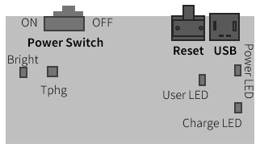
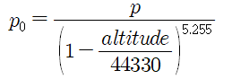
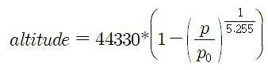

<style type='text/css'>
  [class*="shadow-box"] {
    border-radius: 10px;
    padding: 1.0em;
    box-shadow: 0 20px 50px -25px rgba(0, 0, 0, 0.7);
    display: flex;
    flex-direction: column;
    background-color: rgba(220, 220, 220, 0.01);
}
</style>


# IoT 모트 기본 제어
실습 장비는 사용자 인터페이스를 위한 사용자 LED와 주변 환경을 감지하는 다양한 센서(조도, 온도, 습도, 기압, 가스)를 내장하고 있습니다. 또한, 실습 장비의 동작에 필요한 공급 전원 전압을 실시간으로 모니터링할 수 있는 기능을 제공합니다.  

  


## 코드 기본 구조
프로세싱은 이미지, 애니메이션, 인터랙티브 그래픽 등을 쉽게 제작할 수 있도록 설계된 오픈 소스 프로그래밍 언어 및 개발 환경입니다. 자바 기반으로 만들어졌으며, 시리얼 통신을 통해 외부 장치와 데이터를 주고받으며 시각 예술, 디자인, 교육 분야에서 널리 활용됩니다.  
프로세싱 프로그램은 `setup()` 함수와 draw() 함수로 구성됩니다. `setup()` 함수는 프로그램 시작 시 단 한 번 실행되어 초기 설정을 담당하고, draw() 함수는 화면을 그리는 작업을 반복적으로 수행합니다.

다음은 프로세싱에서 시리얼 통신을 사용하여 데이터를 읽어오는 간단한 예시입니다.


```java
import processing.serial.*;

Serial myPort; // 시리얼 포트 객체

void setup() {
  size(200, 200);
  String portName = Serial.list()[0]; // 첫 번째 시리얼 포트 선택 (실제 포트 번호 확인 필요)
  myPort = new Serial(this, portName, 9600); // 시리얼 포트 연결
}

void draw() {
  if (myPort.available() > 0) { // 시리얼 포트에 데이터가 있는지 확인
    int sensorValue = myPort.read(); // 데이터 읽기
    background(sensorValue); // 읽어온 값으로 배경색 설정
  }
}
```

센서 제어와 같은 피지컬 컴퓨팅 분야에서 널리 사용되는 아두이노는 C/C++ 기반으로 프로그래밍됩니다. 프로세싱과 유사하게 `setup()` 함수와 반복 실행되는 `loop()` 함수를 사용합니다. `setup()` 함수는 초기 설정을, `loop()` 함수는 메인 로직을 반복적으로 실행합니다. 즉, 프로세싱의 draw() 함수와 같은 역할을 하는 것이 아두이노의 `loop()` 함수입니다.  

다음은 아두이노에서 아날로그 0번 핀의 센서 값을 읽어 시리얼 포트로 전송하는 예시입니다.

```cpp
void setup() {
  Serial.begin(9600); // 시리얼 통신 초기화 (통신 속도 9600 bps)
}

void loop() {
  int sensorValue = analogRead(A0); // 아날로그 0번 핀에서 센서값 읽기
  Serial.println(sensorValue); // 센서값을 시리얼 포트로 전송
  delay(100); // 0.1초 대기
}
```

우리도 아두이노와 같은 MCU 환경에서 MicroPython을 사용하기 때문에, 아두이노의 코드 구조를 차용하여 `setup()` 함수와 `loop()` 함수로 기본 골격을 구성합니다. 아두이노에서는 setup()과 `loop()` 함수가 내부적으로 호출되지만, MicroPython에서는 프로그램이 시작되면 `setup()`을 직접 호출하고, while 루프 안에서 메인 루프인 `loop()`를 반복 호출하는 방식을 사용합니다.

```python
def setup():
    # 초기화 코드를 여기에 작성합니다.
    pass

def loop():
    # 반복 실행할 코드를 여기에 작성합니다.
    pass

if __name__ == "__main__":
    setup()
    while True:
        loop()
```

<details>
<summary><b>__name__ 변수</b></summary>
<div class="shadow-box">

\_\_name__ 변수는 모듈의 이름을 담고 있는 내장 전역 변수입니다. 하지만, 이 변수의 값은 해당 코드가 어떻게 실행되느냐에 따라 달라지기 때문에 중요합니다.

\_\_name__ 변수의 값은 다음 두 가지 경우 중 하나입니다.

1. \_\_name__ == "\_\_main__":
   - 파이썬 스크립트 파일이 직접 실행될 때, __name__ 변수에는 "__main__" 이라는 문자열 할당됨
   - python my_script.py(실습 장비에서는 upy my_script.py)와 같이 파이썬 인터프리터가 해당 파일을 직접 실행하는 경우에 해당
   - 해당 파일은 프로그램의 주 진입점(entry point)

2. \_\_name__ == "<모듈_이름>":
   - 파이썬 스크립트 파일이 다른 파일에 의해 모듈로서 import 될 때, __name__ 변수에는 해당 파일의 이름(모듈 이름) 이 문자열로 할당됨
   - my_module.py 파일이 다른 파일에서 import my_module 과 같이 import 되면, my_module.py 파일 내의 __name__ 변수 값은 "my_module"

이러한 __name__ 변수의 특성을 활용하여, 파이썬에서는 if __name__ == "__main__": 이라는 관용적인 코드를 사용합니다. 이 코드는 해당 파일이 직접 실행될 때만 특정 코드 블록을 실행하고, 모듈로 import 될 때는 실행하지 않습니다.

</div>
</details>

--- 

## LED 제어
LED는 단순한 빛을 내는 소자를 넘어, 다양한 제어 시스템에서 중요한 역할을 수행합니다. 특히, 시각적인 신호를 전달하고 상태를 표시하는 데 있어서 LED는 그 효용성이 매우 큽니다.  

실습 장비에 내장된 사용자 LED는 켜졌을 때 녹색광을 띠며, `xnode.mote` 모듈의 `Led` 클래스에서 제공하는 다음과 같은 메서드(method)로 제어합니다.  

```doc
- Led(): Led 객체 생성
- on(): 켜기
- off(): 끄기
- toggle(): 현재 상태 반전 (켜져 있으면 끄고, 꺼져 있으면 켜기)
- state(): 현재 상태 반환. 
  - True이면 켜짐, 아니면 꺼짐
```

### LED 깜빡이기
시간 단위는 크기가 매우 작은 단위부터 큰 단위까지 다양합니다. 1 밀리초(ms)는 1초의 1/1000, 1 마이크로(µs)초는 1초의 1/100만, 1 나노초(ns)는 1/10억에 해당하는 아주 작은 시간 단위입니다.  

MCU에서는 초 단위보다는 더 작은 밀리초 단위를 사용하는 경우가 많은데, 모터 제어, 센서 데이터 처리, 통신 프로토콜 처리 등 많은 제어 시스템은 주기적인 동작을 필요로 합니다. 이 주기는 종종 밀리초 단위로 설정됩니다. 예를 들어, 모터의 속도나 위치를 제어하기 위해 10ms마다 센서 값을 읽고 제어 신호를 출력하는 경우가 많습니다. 또한 인간은 대략 100ms ~ 200ms 정도의 반응 속도를 가집니다. 버튼 입력, LED 깜빡임, 디스플레이 업데이트 등 사용자 인터페이스(UI) 요소는 밀리초 단위로 제어되어야 사용자가 즉각적인 반응을 인지하고 자연스럽게 느낄 수 있습니다. 더 느린 속도(초 단위)는 답답하게 느껴질 수 있고, 더 빠른 속도(마이크로초, 나노초)는 인간이 인지하기 어렵고 불필요한 연산 부하를 초래할 수 있습니다

`Led` 클래스를 이용해 500ms(0.5 초) 간격으로 사용자 LED를 켜고 끄는 것을 반복하는 코드를 작성해 봅니다.  

**led.py**
```python
import utime
import xnode.mote

led = xnode.mote.Led()

def setup():    
    print("Start...")

def loop():
    led.on()
    utime.sleep(0.5)
    led.off() 
    utime.sleep(0.5)
         
if __name__ == "__main__":
    setup()
    while True:
        loop()
```

#### import와 from    
파이썬에서 다른 모듈이나 패키지의 기능을 사용하기 위해 `import`와 `from` 문을 사용합니다. 두 가지 모두 다른 파일에서 정의된 함수, 클래스, 변수 등을 가져와 현재 파일에서 사용할 수 있도록 해줍니다. 하지만 각각의 용법과 의미가 다르므로, 어떤 경우에 어떤 문장을 사용해야 하는지 알아두는 것이 중요한데, `import`는 모듈 전체를 가져오고, `from`은 모듈의 특정 객체만 가져옮니다.  

`import`는 모듈의 모든 기능을 사용해야 하거나, 여러 모듈에서 동일한 이름의 함수 또는 변수 사용으로 인한 충돌을 피하고 싶을 때, 또는 코드 가독성을 위해 모듈 이름을 명시적으로 사용하고자 할 때 유용합니다.
모듈 이름이 너무 길거나 이름 충돌이 우려되는 경우 `as` 키워드로 별칭을 지정하여 코드를 간결하게 유지하고 가독성을 높입니다.

```python
import xnode.mote as mote

led = mote.Led()
```

반면 모듈 내에서 필요한 부분만 가져오고 싶을 때나 자주 사용하는 함수나 변수를 매번 모듈 이름(별칭 포함)과 함께 사용하는 것이 번거로울 때는 `from`을 사용합니다.  

```python
from xnode.mote import Led

led = Led()
```

<details>
<summary><b>led2.py</b></summary>
<div class="shadow-box">

아래 코드는 led.py에서 `import` 방식을 `from ... import ...` 방식으로 변경한 것으로 두 파일을 비교해 보면 그 차이점을 쉽게 파악하실 수 있습니다.

```python
from utime import sleep
from xnode.mote import Led

led = Led()

def setup():
    print("Start...")
    
def loop():
    led.on()
    sleep(0.5)
    led.off()
    sleep(0.5)
    
if __name__ == "__main__":
    setup()
    while True:
        loop()
```

</div>
</details></br>

#### 시간 지연 함수   
센서 제어에서 시간 지연 함수는 센서의 안정화 시간, 데이터 갱신 주기, 통신 프로토콜, 그리고 소프트웨어 처리 시간 등을 고려하여 정확하고 안정적인 데이터 획득을 위해 필수적입니다. LED 제어에서도 마찬가지로, 시간 지연 함수를 통해 특정 시간 동안 신호를 표시하거나 알림을 주는 등 정밀한 타이밍 제어가 가능합니다.

파이썬의 `time` 모듈은 `sleep()` 함수를 통해 초 단위 지연을 제공하는 반면, MicroPython의 `utime` 모듈은 임베디드 시스템의 세밀한 제어 요구에 맞춰 `sleep_ms()` (밀리초) 및 `sleep_us()` (마이크로초) 함수를 추가로 제공합니다. `sleep_us()` 함수는 1ms 미만의 시간을 정수로 표현하여 더 정밀한 지연을 구현합니다.
 
```python
import utime

def loop():
    led.on()
    utime.sleep_ms(500)
    led.off()
    utime.sleep_ms(500)
```

<details>
<summary><b>led3.py</b></summary>
<div class="shadow-box">

다음은 led2.py에서 `utime.sleep()`을 `utime.sleep_ms()`로 변경하고, `Led` 객체의 `on()`, `off()` 메서드 호출 대신 `toggle()` 메서드를 사용하도록 수정한 코드입니다. 이 코드는 이전 코드와 동일하게 LED를 500ms 간격으로 깜빡입니다.

```python
import utime
from xnode.mote import Led

led = Led()

def setup():
    print("Start...")
    
def loop():
    led.toggle()
    utime.sleep_ms(500)
    
if __name__ == "__main__":
    setup()
    while True:
        loop()
```

</div>
</details></br>

### 소프트웨어 PWM을 이용한 LED 밝기 조절
LED를 매우 빠른 속도로 켜고 끄는 동작을 반복하면 마치 항상 켜져 있는 것처럼 보이는 효과를 얻을 수 있습니다. 이때, 주기적인 시간 간격(주파수) 동안 LED가 켜져 있는 시간과 꺼져 있는 시간의 비율을 조절하여 밝기를 조절하는 방식을 펄스폭 변조([PWM](https://namu.wiki/w/PWM))라고 합니다. 즉, PWM은 LED의 ON/OFF 시간 비율(%), 즉 듀티 사이클을 조절하여 밝기를 연속적으로 조절하는 기술입니다.

이 번에는 전용 하드웨어 없이 소프트웨어만으로 LED 밝기를 조절하는 소프트웨어 PWM 기능을 구현해 봅니다.

#### 주파수 상수 정의  
먼저 LED 밝기 조절을 위한 PWM 주파수를 100 헤르츠(Hertz, 기호: Hz)로 설정합니다. 헤르츠는 주파수의 단위로 어떤 현상이 1초에 몇 번 반복되는지 를 나타내는 단위입니다. 진동수, 주파수, 또는 빈도수라고도 합니다.  
주파수는 시간(초)의 역수이므로, 100 헤르츠는 1/100 = 0.01 초, 즉 10ms(10,000us)의 주기를 갖습니다.

```python
FREQ = 100
```

#### ON, OFF 시간 변수 정의
LED의 ON, OFF 시간을 저장할 변수를 정의합니다.

```python
on_time = 0
off_time = 0
```

#### 듀티 사이클을 시간으로 변환하는 함수 정의 
듀티 사이클(value, 백분율)을 인자로 받아, 앞서 정의한 주파수 상수 FREQ를 기반으로 ON 시간과 OFF 시간을 밀리초 단위로 계산하는 `duty2time()` 함수를 정의합니다. FREQ를 이용해 한 주기(cycle)의 시간(마이크로초)을 구한 후 cycle에 듀티 사이클(value)을 백분율로 환산하여 곱하면 ON 시간을 얻을 수 있고, cycle에서 ON 시간을 빼면 OFF 시간을 계산할 수 있습니다.   

```python
def duty2time(value):
    cycle = 1/FREQ * 1000 * 1000 # 주파수를 마이크로초로 변환
    on = cycle * value / 100
    off = cycle - on
    return on, off
```

#### ON, OFF 시간 설정  
프로그램이 시작되면 `dut2time()` 함수로 1% 튜티 사이클일 때 ON, OFF 시간을 전역 변수 `on_time`과 `off_time`에 대입한 후 LED를 최대 밝기로 3초간 켜둡니다.

100Hz 주파수, 1% 듀티 사이클에서 `on_time`은 0.1ms, `off_time`은 9.9ms입니다. 밀리초 단위에서는 소수점으로 표현되지만, 마이크로초 단위로는 각각 100us와 9900µs로 나타내어 정수로 정확하게 표현할 수 있습니다.

```python
from xnode.mote import Led

led = Led()

def setup():
    global on_time, off_time
    
    on_time, off_time = duty2time(1) # 듀티 사이클 1%
    led.on()
    time.sleep(3)
```

#### 소프트웨어 PWM 구현  
앞서 계산된 ON/OFF 시간에 따라 메인 루프 내에서 LED가 주기적으로 켜지고 꺼집니다. 이때 OFF 시간이 ON 시간보다 길어지면, LED가 켜져 있는 시간보다 꺼져 있는 시간이 더 길어지므로, 결과적으로 우리 눈에는 LED가 더 어둡게 인식됩니다.

```python
import utime

def loop():
    led.on()
    utime.sleep_us(on_time)
    led.off()
    utime.sleep_us(off_time)
```

#### 전체 코드 (led_sw_pwm.py) 
위의 코드 조각들을 결합한 전체 코드는 다음과 같습니다.

```python
import utime
from xnode.mote import Led

FREQ = 100

on_time = 0
off_time = 0

led = Led()

def duty2time(value):
    cycle = int(1/FREQ * 1000 * 1000)  # in µs 
    on = int(cycle * value / 100)
    off = cycle - on
    return on, off
    
def setup():
    global on_time, off_time
    
    on_time, off_time = duty2time(1) # 1% duty cycle

    print("Maximum Brightness")        
    led.on()
    
    utime.sleep(3)
    print("Significant Dimming")        
            
def loop():
    led.on()
    utime.sleep_us(on_time)
    led.off()
    utime.sleep_us(off_time)
    
if __name__ == "__main__":
    setup()
    while True:
        loop()
```

PWM 제어에서 가장 중요한 점은 ON/OFF 상태의 지속 시간을 정확하게 조절하는 것입니다. 전용 하드웨어를 사용하는 하드웨어 PWM 방식과 달리, 소프트웨어 PWM 방식은 코드를 실행하는 과정에서 발생하는 지연(오차)으로 인해 ON/OFF 시간 제어의 정밀도가 낮아질 수 있습니다. 이로 인해 미세한 LED 깜빡임 현상이 나타날 수 있습니다.

### LED를 이용한 모스 부호 출력
[모스 부호](https://namu.wiki/w/%EB%AA%A8%EC%8A%A4%20%EB%B6%80%ED%98%B8)는 짧은 신호(·, 점 또는 단점)와 긴 신호(-, 선 또는 장점)의 조합으로 문자, 숫자, 구두점 등을 나타내는 통신 방식입니다. 19세기 중반, 새뮤얼 모스가 발명했으며, 전신 시대에 널리 사용되었습니다.  

이 번에는 LED로 모스 부호 "sos"를 출력하는 코드를 작성해 봅니다.

#### 모스 부호 정의
먼저, 딕셔너리를 사용하여 문자 'o'와 's'에 대응하는 모스 부호를 정의합니다.

```python
MORSE = {
    'o':'---', 's':'...'
}
```

#### 신호 길이와 출력한 문자열 정의  
모스 부호에는 단점(dit), 장점(dah), 그리고 각 신호(점과 선), 문자, 단어 사이의 간격을 나타내는 무음 시간이 필요합니다. 단점의 길이를 기본 단위(`DIT_PT`)로 설정하고, 장점은 단점의 3배, 신호 간 간격은 단점과 동일, 문자 간 간격은 단점의 3배, 단어 간 간격은 단점의 7배로 정의합니다.

```python
DIT_PT = 100
DAH_PT = DIT_PT * 3
NUL_LT = DIT_PT
CHR_LT = DIT_PT * 3
STR_LT = DIT_PT * 7

WORD = "sos"
```

#### 신호 출력 함수 정의  
앞서 정의한 단점과 장점 상수를 이용해 신호를 LED로 출력하는 `dit_led()` 함수와 `dah_led()` 함수를 정의합니다. 이렇게 작은 단위의 함수로 분리하면 코드의 가독성이 향상되어 코드를 수정하거나 기능을 변경할 때 도움이 됩니다.

```python
import utime
from xnode.mote import Led


led = Led()

def dit_led():
    led.on()
    utime.sleep_ms(DIT_PT)
    led.off()

def dah_led():
    led.on()
    utime.sleep_ms(DAH_PT)
    led.off()
```

#### 모스 부호 출력  
`loop()` 함수에서는 WORD 상수에 저장된 문자열을 순회하며 각 문자에 해당하는 모스 부호 코드를 MORSE 딕셔너리에서 조회합니다. 조회된 각 모스 부호는 `. (dit)` 또는 `- (dah)`로 구성되는데, `.`일 경우 `dit_led()` 함수를, `-`일 경우 `dah_led()` 함수를 호출하여 LED를 깜빡입니다. 각 신호(`.` 또는 `-`) 출력 후에는 `NUL_LT`만큼, 문자 사이에는 `CHR_LT`만큼, 그리고 단어 사이에는 `STR_LT`만큼 지연 시간을 갖습니다.

```python
def loop():
    for c in WORD:  # 단어의 각 문자에 대해 반복
        code = MORSE[c]  # 해당 문자의 모스 부호 가져오기
        for pulse in code:  # 모스 부호의 각 신호(., -)에 대해 반복
            if pulse == '.':
                dit_led()
            else:
                dah_led()
            utime.sleep_ms(NUL_LT)  # 신호 간 간격
        utime.sleep_ms(CHR_LT)      # 문자 간 간격
    utime.sleep_ms(STR_LT)          # 단어 간 간격
```

#### 전체 코드 (led_morse.py)  
위의 코드 조각들을 결합한 전체 코드는 다음과 같습니다.

```python
import utime
from xnode.mote import Led

MORSE = {
    'o':'---', 's':'...'
}

DIT_PT = 100
DAH_PT = DIT_PT * 3
NUL_LT = DIT_PT
CHR_LT = DIT_PT * 3
STR_LT = DIT_PT * 7

WORD = 'sos'

led = Led()

def dit_led():
    led.on()
    utime.sleep_ms(DIT_PT)
    led.off()

def dah_led():
    led.on()
    utime.sleep_ms(DAH_PT)
    led.off()

def setup():
    print("Start...")
      
def loop():
    for c in WORD:
        code = MORSE[c]
        for pulse in code:
            if pulse == '.':
                dit_led()
            else:
                dah_led()
            utime.sleep_ms(NUL_LT)
        utime.sleep_ms(CHR_LT)
    utime.sleep_ms(STR_LT)
    
if __name__ == "__main__":
    setup()
    while True:
        loop()
```

#### 디버깅: print() 함수 활용  
디버깅은 프로그램의 오류를 찾아 수정하는 과정입니다. 특히 `print()` 함수는 프로그램 실행 과정을 추적하고 변수 값을 확인하는 데 유용한 도구입니다. 앞서 구현한 모스 부호 출력 코드의 메인 루프에 아래와 같이 현재 처리 중인 문자, 모스 부호, 각 신호를 추가한 `print()` 함수로 출력하면, 코드의 흐름과 내부 상태를 더 명확하게 파악할 수 있습니다.

```python
    for c in WORD:
        print(f"Character: {c}") # 현재 문자 출력
        code = MORSE[c]
        print(f"Morse Code: {code}") # 해당 문자의 모스 부호 출력
        for i in code:
            print(f"Signal: {i}") # 현재 신호(., -) 출력
            if i == '.':
                dit_led()
            else:
                dah_led()
            utime.sleep_ms(NUL_LT)
        utime.sleep_ms(CHR_LT)
    utime.sleep_ms(STR_LT)
```

<details>
<summary>led_morse_debug.py</summary>

```python
import utime
from xnode.mote import Led

MORSE = {
    'o':'---', 's':'...'
}

DIT_PT = 100
DAH_PT = DIT_PT * 3
NUL_LT = DIT_PT
CHR_LT = DIT_PT * 3
STR_LT = DIT_PT * 7

WORD = 'sos'

led = Led()

def dit_led():
    led.on()
    utime.sleep_ms(DIT_PT)
    led.off()

def dah_led():
    led.on()
    utime.sleep_ms(DAH_PT)
    led.off()

def setup():
    print("Start...")
      
def loop():
    for c in WORD:
        print(c)
        code = MORSE[c]
        print(code)
        for pulse in code:
            print(pulse)
            if pulse == '.':
                dit_led()
            else:
                dah_led()
            utime.sleep_ms(NUL_LT)
        utime.sleep_ms(CHR_LT)
    utime.sleep_ms(STR_LT)
    
if __name__ == "__main__":
    setup()
    while True:
        loop()
```

</details>


----

## 조도 센서
조도 센서는 주변 환경의 밝기를 측정하는 센서입니다. 어떤 면에 비춰지는 빛의 양을 감지하여 전기 신호로 변환하고, 이를 바탕으로 자동화된 시스템을 작동시키는 데 중요한 역할을 합니다. 마치 사람의 눈처럼 주변 환경의 밝기를 인식하고, 이에 맞춰 다양한 기능을 수행합니다. 단위는 럭스(lux)를 사용합니다.

실습 장비에 내장된 조도 센서는 스마트폰에 내장된 것과 유사한 부품으로 `xnode.mote` 모듈의 `Illuminance` 클래스에서 제공하는 다음과 같은 메서드로 값을 읽습니다.

```doc
- Illuminance(scale_factor=2.8): Illuminance 객체 생성
  - scale_factor: 실수 타입으로 조도 계산용 스케일로 기본값은 2.8.
    - 신뢰할 수 있는 조도계 보다 센서 값이 높게 측정되면 이 값을 증가시키고 낮으면 감소
- read(): 조도 값 읽기
  - 반환값: 정수 타입으로 단위는 럭스
```

### 조도 읽기
`Illuminance` 클래스를 이용해 20ms 간격으로 조도 센서 값을 읽어 PC로 전송하는 코드를 작성해 봅니다.

**illuminance.py**
```python
import utime
from xnode.mote import Illuminance

ill = Illuminance()

def setup():
    print("Start...")

def loop():    
    value = ill.read()
    print(value)
    utime.sleep_ms(20)

if __name__ == "__main__":
    setup()
    while True:
        loop()
```

#### 문자열 포매팅  
MicroPython의 `print()` 함수는 주로 시리얼 통신을 통해 데이터를 외부 장치로 출력합니다. 출력되는 데이터 형식을 유연하게 조정하려면 [문자열 포매팅](https://docs.python.org/3/library/string.html#formatstrings)을 사용하는 것이 효과적입니다. 문자열 포매팅은 `format()` 메서드 또는 `f-문자열`을 이용하여 변수나 값을 문자열 내에 동적으로 삽입하는 방식을 말합니다. (주의: 현재 실습 장비에서는 `f-문자열`을 지원하지 않습니다.)

다음은 변수나 값을 문자열 안에 동적으로 삽입하기 위해 `format()` 메서드로 문자열 포매팅을 적용한 사례입니다.

```python    
    out = "Illuminance[{:>3}]: {:.1f} lux".format(cnt, ill.read())
    print(out)
```

문자열 포매팅에서 중괄호 {}는 값을 삽입할 자리를 나타내는 플레이스홀더 역할을 합니다. 중괄호 안에 콜론 :을 사용하여 값의 정렬 방식, 자릿수, 소수점 자리 등을 지정하는 형식 지정자를 추가할 수 있습니다. >는 오른쪽 정렬, <는 왼쪽 정렬을 의미하며, 숫자는 최소 자릿수를 나타냅니다. 소수점 자리를 지정하려면 .과 함께 f 문자를 사용합니다. 예를 들어, {:.2f}는 소수점 아래 둘째 자리까지 표현합니다.  

<details open>
<summary><b>illuminance_formatting.py</b></summary>
<div class="shadow-box">

조도 값을 읽은 횟수를 나타내는 전역 변수 `cnt`를 추가한 후 횟수와 조도 값을 문자열 포매팅으로 출력해 봅니다. 이때, 횟수는 3자리 폭만큼 오른쪽 정렬합니다.

```python
import utime
from xnode.mote import Illuminance

ill = Illuminance()
cnt = 1

def setup():
    print("Start...")

def loop():
    global cnt

    out = "Illuminance[{:>3}]: {} lux".format(cnt, ill.read())
    print(out)
    cnt += 1
    
    utime.sleep_ms(20)

if __name__ == "__main__":
    setup()
    while True:
        loop()
```

</div>
</details></br>

### 조도별 작업 환경 분류
일반적인 실내조명은 500 ~ 700 럭스(lux) 수준이며, 정밀한 작업을 수행하는 환경일수록 더 높은 조도가 필요합니다. 대한민국 산업안전보건법에서는 작업 종류에 따른 권장 조도 기준을 다음과 같이 규정하고 있습니다.

초정밀 작업 | 정밀 작업 | 보통 작업 | 기타 작업
---------|---------|---------|---------
 750 lux | 300 lux | 150 lux |  75 lux

이러한 기준 조도를 상수로 정의하면 다음과 같습니다.

```python
NORMAL_LUX = 150
PRECISION_LUX = 300
ULTRA_PRECISION_LUX = 750
```

#### 조도 값에 따른 작업 환경 분류 함수 
측정된 조도 값을 입력받아 위에서 정의한 기준 조도와 비교하여 해당 조도에 적합한 작업 환경을 문자열로 반환하는 `check_illuminance()` 함수를 정의합니다.

```python
def check_illuminance(value):
    if value < NORMAL_LUX:
        ret = "etc"
    elif value < PRECISION_LUX:
        ret = "normal"
    elif value < ULTRA_PRECISION_LUX:
        ret = "precision"
    else:
        ret = "ultra-precision"
    
    return ret
```

#### 조도 값 활용
조도 센서로부터 측정된 값을 `check_illuminance()` 함수에 입력하면, 해당 조도 값에 적합한 작업 환경이 소문자 문자열 형태로 반환됩니다. 반환된 문자열을 대문자로 변환하려면 문자열의 `upper()` 메서드를 사용하면 됩니다.

```python
    value = ill.read()
    ret = check_illuminance(value).upper()
    print("The current illuminance is {:d} lux, which is sufficient for {} work.".format(value, ret))
```

#### 전체 코드 (illuminance_classification.py) 
위의 코드 조각들을 결합한 전체 코드는 다음과 같습니다.

```python
import utime
from xnode.mote import Illuminance

NORMAL_LUX = 150
PRECISION_LUX = 300
ULTRA_PRECISION_LUX = 750

ill = Illuminance()

def check_illuminance(value):
    if value < NORMAL_LUX:
        ret = "etc"
    elif value < PRECISION_LUX:
        ret = "normal"
    elif value < ULTRA_PRECISION_LUX:
        ret = "precision"
    else:
        ret = "ultra-precision"
    
    return ret

def setup():
    print("Start...")

def loop():
    global cnt
    
    value = ill.read()
    ret = check_illuminance(value).upper()
    print("The current illuminance is {:d} lux, which is sufficient for {} work.".format(value, ret))
    utime.sleep_ms(20)

if __name__ == "__main__":
    setup()
    while True:
        loop()
```

### 조도 센서를 이용한 스마트 가로등 구현
기존의 가로등은 정해진 시간에 따라 점등 및 소등되는 반면, 조도 센서를 활용한 스마트 가로등은 주변 밝기를 스스로 감지하여 작동하기 때문에 에너지 효율성을 높이고 사용자 편의성을 향상 시킵니다.
이 번에는 조도 센서로부터 측정된 값을 임계 값과 비교하여 LED 가로등의 점등/소등 여부를 결정하는 알고리즘을 구현합니다.

#### 임계값 정의  
조도 임계 값을 정의합니다. 이 예제에서는 실내 환경 테스트를 가정하여 임계 값을 90 럭스로 설정했지만, 실제 외부 햇빛의 밝기를 고려할 경우 더 높은 값으로 조정해야 할 수 있습니다.

```python
THRESHOLD = 90
```

**조도 값 판별 함수 정의**  
측정된 조도(value)를 임계 값과 비교하여 밝기 상태를 판별하는 `check_darkness()` 함수를 정의합니다. 함수 호출 시 조도 값을 인자로 전달하고, 반환 값이 True이면 어두운 상태, False이면 밝은 상태를 의미합니다.

```python
def check_darkness(value):
    if value < THRESHOLD:
        return True
    else:
        return False
```

#### LED 제어 로직  
`loop()` 함수에서는 `read()` 메서드를 호출해 먼저 조도 센서로부터 현재 조도 값을 읽어옵니다. 측정된 조도 값은 `check_darkness()` 함수에 인자로 전달되고, 어두움 여부에 따라 LED를 켜거나 끕니다.

```python
import xnode.mote as mote

led = mote.Led()
ill = mote.Illuminance()

def loop()
    value = ill.read()
    ret = check_darkness(value)
    if ret:
        led.on()
    else:
        led.off()
```

#### 전체 코드 (illuminance_smart_streetlight.py)  
위의 코드 조각들을 합쳐서 완전한 코드를 구성하면 다음과 같습니다.

```python
import utime
import xnode.mote as mote

THRESHOLD = 90

led = mote.Led()
ill = mote.Illuminance()

def check_darkness(value):
    if value < THRESHOLD:
        return True
    else:
        return False

def setup():
    print("Start...")

def loop():   
    value = ill.read()
    print("Current illuminace is {:d} lux".format(value))
    
    ret = check_darkness(value)
    if ret:
        led.on()
    else:
        led.off()
    
    utime.sleep_ms(20)
    
if __name__ == "__main__":
    setup()
    while True:
        loop()
```

### 코드 최적화
코드 최적화는 소프트웨어 개발에서 매우 중요한 과정으로 최적화된 코드는 동일한 작업을 더 적은 시간 안에 완료할 수 있습니다. 이는 사용자에게 더 빠르고 반응성이 뛰어난 애플리케이션 경험을 제공합니다. 특히, 많은 데이터를 처리하거나 복잡한 계산을 수행하는 애플리케이션에서 성능 향상은 매우 중요합니다. 또한 최적화 과정에서 코드를 정리하고 불필요한 부분을 제거하면 코드의 가독성이 향상됩니다. 이는 다른 개발자가 코드를 이해하고 수정하기 쉽게 만들어 유지 보수성을 높입니다.

#### 독스트링  
톡스트링(docstring)은 단순한 문자열이지만 함수나 메서드의 기능과 매개변수, 반환 값에 대한 정보를 제공하여 코드의 가독성을 높이는 데 중요한 역할을 합니다. 이렇게 정의된 문자열은 함수의 `__doc__` 속성에 저장되어, `help()` 함수를 호출하거나 `__doc__` 속성을 직접 참조하여 해당 함수의 도움말을 외부에서 확인할 수 있습니다.


```python
def check_darkness(illuminance_lux):
    """
    Compares an illuminance value (in lux) against a set of thresholds to determine the brightness level.

    Args:
        illuminance_lux: The illuminance value in lux.

    Returns:
        bool: True means dark, and False means bright.
    """
```

```python
help(check_darkness)
```

<details open>
<summary><b>주의</b></summary>
<div class="shadow-box">

독스트링은 문자열 형태로 메모리에 저장되므로, 큰 독스트링은 메모리 사용량을 증가시킬 수 있습니다. MicroPython은 메모리가 제한된 환경에서 실행되도록 설계되었으므로, 실습 장비처럼 제품에 따라 메모리를 절약하기 위해 `help()`와 `__doc__` 속성을 지원하지 않을 수 있습니다. 

</div>
</details>

#### 함수의 반환 값과 지역 변수  
함수의 반환 값을 저장하기 위해 지역 변수를 사용하는 것은 일반적인 방법이지만, 반환 값을 한 번만 사용하는 경우에는 불필요한 메모리 공간을 할당하는 결과를 초래할 수 있습니다. 따라서 반환 값을 바로 사용하여 코드를 간결하게 만들고, 메모리 사용량을 줄이는 것이 좋습니다.

```python
    ret = check_darkness(value)
    if ret:
        led.on()
    else:
        led.off()
```

따라서 위 구문은 다음과 같이 개선할 수 있습니다.
```python
    if check_darkness(value):
        led.on()
    else:
        led.off()
```

#### 삼항 연산자  
파이썬에서 `x if condition else y` 와 같은 형태의 표현식을 삼항 연산자라고 합니다. 이는 조건에 따라 값을 선택하는 간결한 방법을 제공합니다.

아래 구문을, 

```python
    if check_darkness(value):
        led.on()
    else:
        led.off()
```

삼항 연산자로 구문을 바꾸면 다음과 같습니다.

```python
    led.on() if check_darkness(value) else led.off()
```

#### 조건에 따른 return 구문  
`return` 문은 함수의 실행을 즉시 종료하기 때문에, `check_darkness()` 함수 내 if 블록에서 return True가 실행되면 그 이후 코드는 실행되지 않습니다. 따라서 else 문을 사용하지 않고도 if 조건이 거짓일 경우 return False를 실행하도록 간결하게 표현할 수 있습니다.

```python
    if value < THRESHOLD:
        return True
    return False
```

이 코드는 조건식 `value < THRESHOLD`의 결과를 직접 반환하는 방식으로 더욱 간결하게 표현할 수 있습니다.

```python
    return value < THRESHOLD
```

#### 하나의 임계값 문제  
실제 환경에서는 조도가 일정하게 유지되더라도, 외부 요인이나 센서 자체 특성으로 인해 측정값에 약간의 오차가 발생할 수 있습니다. 예를 들어, 실제 조도가 90lux 로 일정하더라도 센서 측정값은 88~91lux 사이를 오르내릴 수 있습니다. 이러한 환경에서 단일 임계 값을 사용할 경우, 측정값이 임계 값 근처에서 미세하게 변동할 때마다 LED가 불필요하게 켜졌다 꺼지는 깜빡임 현상이 발생하여 시스템 안정성을 저해할 수 있습니다.

```sh
Current illuminace is 90 lux
Current illuminace is 89 lux
Current illuminace is 88 lux
Current illuminace is 91 lux
Current illuminace is 90 lux
Current illuminace is 91 lux
```

이러한 문제를 해결하기 위해 히스테리시스(Hysteresis) 기법을 적용할 수 있습니다. 즉, 두 개의 임계 값(상위 임계 값과 하위 임계 값)을 설정하여 LED의 ON/OFF 상태 변화에 여유 범위(deadband)를 두는 것입니다. 측정값이 상위 임계 값(`THRESHOLD_UPPER`) 이상으로 올라가면 LED를 끄고, 하위 임계 값(`THRESHOLD_LOWER`) 이하로 내려갈 때 LED를 켜도록 프로그램을 개선할 수 있습니다.

```python
THRESHOLD_UPPER = 92
THRESHOLD_LOWER = 89
```

두 개의 임계 값을 사용하여 밝기 상태를 판별하도록 `check_darkness()` 함수를 수정합니다.

```python
def check_darkness(value):
    if value <= THRESHOLD_LOWER:
        return True
    
    if value >= THRESHOLD_UPPER:
        return False
```

이제 `check_darkness()` 함수는 조도 값이 `THRESHOLD_LOWER` 이하일 때만 True(어두움)를 반환하고, `THRESHOLD_UPPER` 이상일 때만 False(밝음)를 반환합니다. 즉, 조도 값이 `THRESHOLD_LOWER`와 `THRESHOLD_UPPER` 사이 구간에서는 이전 상태를 유지합니다. 결과적으로 조도 측정값의 미세한 변동에도 LED가 불필요하게 깜빡이는 현상을 방지할 수 있습니다. 예를 들어, 조도가 88럭스 이하이면 LED가 켜지지만, 한번 켜진 후에는 조도가 89~91럭스 사이로 올라가더라도 LED는 계속 켜진 상태를 유지합니다. LED를 끄려면 조도가 92lux 이상으로 올라가야 합니다.

#### 전체 코드 (illuminance_smart_streetlight_optimization.py)  
위의 코드 조각들을 결합한 전체 코드는 다음과 같습니다.

```python
import utime
import xnode.mote as mote

THRESHOLD_UPPER = 92
THRESHOLD_LOWER = 89

led = mote.Led()
ill = mote.Illuminance()

def check_darkness(value):
    """
    Compares an illuminance value (in lux) against a set of thresholds to determine the brightness level.

    Args:
        value: The illuminance value in lux.

    Returns:
        bool: True means dark, and False means bright.
    """

    if value <= THRESHOLD_LOWER:
        return True
    
    if value >= THRESHOLD_UPPER:
        return False

def setup():
    #print(check_darkness.__doc__) # Function docstrings are not supported.
    print("Start...")

def loop():  
    value = ill.read()
    print("Current illuminace is {:d} lux".format(value))
    
    led.on() if check_darkness(value) else led.off()
    utime.sleep_ms(20)

if __name__ == "__main__":
    setup()
    while True:
        loop()
```

----

## 전원 전압 감지
IoT 장비에서 전원 전압을 정확하게 확인하고 관리하는 것은 IoT 장비의 안정적인 작동과 수명에 직접적인 영향을 미치기 때문에 매우 중요합니다. 특히 배터리로 작동하는 IoT 장비의 경우, 배터리 수명을 연장하기 위해 적절한 전압 관리는 필수입니다.

배터리는 공칭 전압(Nominal Voltage)과 방전 종지 전압(Cut-off Voltage)이란 개념이 있는데, 공칭 전압은 제조사가 배터리 종류별로 정한 대표 전압 값입니다. 마치 배터리의 이름과 같은 기준 전압으로, 실제 전압은 충전 상태, 온도, 부하 등에 따라 달라지지만 공칭 전압은 이러한 변수를 고려하지 않은 이상적인 값입니다. IoT 모트의 경우, 배터리 외부에 3.7volt 로 표기된 공칭 전압의 배터리를 사용합니다.

방전 종지 전압은 배터리 방전을 중단해야 하는 최저 전압입니다. 이 전압 이하로 방전시키면 배터리 성능 저하 및 수명 단축을 초래할 수 있습니다. IoT 모트 배터리의 방전 종지 전압은 3.2volt 이므로, 이 값 아래로 전압이 떨어지면 USB 케이블을 연결하여 배터리를 충전해야 합니다.

스마트폰이나 전기 자동차 등에는 배터리 관리 시스템(BMS)이 탑재되어 배터리 전압을 실시간으로 모니터링하고, 종지 전압에 도달하면 자동으로 방전을 차단하여 배터리를 보호합니다. 하지만 대부분의 MCU 기반 IoT 장비(IoT 모트 포함)에는 BMS가 없기 때문에 소프트웨어적으로 전압을 모니터링하며 관리해야 합니다.

실습 장비는 아날로그-디지털 변환기([ADC](https://namu.wiki/w/%EC%95%84%EB%82%A0%EB%A1%9C%EA%B7%B8%20%EB%94%94%EC%A7%80%ED%84%B8%20%EB%B3%80%ED%99%98%20%ED%9A%8C%EB%A1%9C))를 이용해 공급 전원에 대한 전압을 감지하며, `xnode.mote` 모듈의 `SupplyVoltage` 클래스에서 제공하는 다음과 같은 메서드로 전압 값을 읽습니다.

```doc
- SupplyVoltage(): SupplyVoltage 객체 생성
- read(): 현재 공급 전원 전압값 읽기
  - 반환값: 실수 값으로 USB 케이블을 연결한 상태에서는 4.1, 연결 안한 상태에서는 배터리 잔량에 따라 최대 3.7 
    - 단위는 볼트(volt)
```

<details open>
<summary><b>주의</b></summary>
<div class="shadow-box">

Auto 제어기에 내장된 IoT 모트는 상시 전원을 사용하기 때문에 전원 전압이 5volt 로 고정되지만, 전압 강하로 인해 실제로 측정되는 값은 4.9volt 입니다. 배터리로 동작하는 IoT 모트는 전원이 연결되어 있으면 측정되는 값은 4.1~4.2volt 입니다. 하지만 전원이 연결되어 있지 않으면 최대 3.7volt 부터 3.1volt 까지 배터리 잔량에 따라 변합니다. 

</div>
</details></br>

### 전원 전압 읽기
`SupplyVoltage` 클래스를 이용해 1000ms 마다 현재 실습 장비의 공급 전원 전압을 읽어 PC로 전송하는 코드를 작성해 봅니다.

**supply_voltage.py**  
```python
import utime
from xnode.mote import SupplyVoltage

supply = SupplyVoltage()

def setup():    
    print("Start...")
    
def loop():
    value = supply.read()
    print("Current supply voltage is {} volt".format(value))
    utime.sleep_ms(1000)

if __name__ == "__main__":
    setup()
    while True:
        loop()
```

### 시스템 틱으로 블로킹 피하기
MicroPython에서 `utime` 모듈의 `sleep()/sleep_ms()/sleep_us()` 함수를 호출하면, 프로그램은 지정된 시간 동안 대기 상태가 됩니다. 이 대기 시간 동안에는 다른 코드가 실행되지 못하고, 프로그램이 마치 멈춘 것처럼 보일 수 있습니다. 이러한 현상을 블로킹(blocking) 이라고 합니다.

블로킹은 현재 실행 중인 코드(함수)가 결과를 반환하기 전까지 이후 코드의 실행을 막는 현상을 의미합니다. 특히 사용자 입력, 네트워크 통신, 파일 입출력과 같은 I/O 작업에서 자주 발생하며, 프로그램의 응답성을 저하시키는 주요 원인이 됩니다. 예를 들어, 네트워크에서 데이터를 받는 동안 프로그램이 완전히 멈춰 있는 것처럼 보일 수 있습니다. 블로킹은 순차적인 프로그램 흐름을 보장하는 데는 유용하지만, 동시에 프로그램의 반응성을 떨어뜨리는 단점이 있습니다. 특히 실시간 시스템이나 사용자 인터페이스가 중요한 프로그램에서는 블로킹을 최소화하는 것이 중요합니다.

<details>
<summary><b>블로킹, 논블로킹, 비동기</b></summary>

<div class="shadow-box">

블로킹(또는 동기(Synchronous))과 논 블로킹(Non-blocking) 그리고 비동기(Asynchronous)는 프로그램의 실행 흐름, 특히 I/O 작업(입출력)과 관련하여 사용되는 중요한 개념들입니다. 이들의 차이점을 이해하는 것은 효율적이고 반응성 좋은 프로그램을 설계하는 데 필수적입니다. 

먼저 블로킹은 함수나 작업이 완료될 때까지 프로그램의 실행을 멈추고 대기하는 방식입니다. 즉, 한 작업이 끝나기 전까지는 다른 작업을 수행할 수 없습니다. 동작은 다음과 같습니다.

- 블로킹 함수 호출
- 함수는 작업을 시작하고, 작업이 완료될 때까지 프로그램의 나머지 부분은 대기
- 작업이 완료되면, 함수는 결과를 반환하고, 프로그램은 다음 코드 실행

블로킹의 장점은 코드의 흐름이 순차적이기 때문에 이해하고 디버깅하기 쉽다는 것이고, 단점은 특정 작업이 오래 걸리면 프로그램 전체가 멈추기 때문에 비효율적이며, 사용자 인터페이스가 있는 프로그램의 경우, 블로킹 작업 중에는 UI가 멈춰 사용자가 답답함을 느낄 수 있습니다.("freezing"이라 함)

논블로킹은 함수나 작업이 완료될 때까지 기다리지 않고, 즉시 제어권을 반환하여 프로그램의 나머지 부분이 계속 실행될 수 있도록 하는 방식으로 동작은 다음과 같습니다. 
- 논 블로킹 함수 호출
- 작업 완료 여부와 관계없이 함수는 즉시 반환됨
- 프로그램은 멈추지 않고 다음 코드 실행
- 작업의 완료 여부를 주기적으로 확인하거나(폴링), 완료 시점에 알림을 받도록(콜백) 설정해야 함

논블로킹의 장점은 프로그램의 반응성이 향상되고, 한 작업이 오래 걸리더라도 다른 작업을 계속 처리할 수 있어, 자원을 효율적으로 사용할 수 있다는 점입니다. 단점으로는 작업 완료 여부를 주기적으로 확인하거나 콜백을 처리해야 하기 때문에 코드가 블로킹 방식보다 복잡해질 수 있으며, 너무 자주 폴링을 할 경우, 오히려 성능 저하가 발생할 수 있습니다.

끝으로 비동기는 작업이 별도의 스레드, 프로세스 또는 이벤트 루프에서 실행되어, 메인 프로그램의 실행 흐름과 독립적으로 진행되는 방식으로 동작은 다음과 같습니다.

- 비동기 함수 호출
- 함수는 즉시 반환되지만, 실제 작업은 백그라운드에서 별도로 실행됨
- 작업이 완료되면, 메인 프로그램에 알림(예: 콜백 함수 호출, 이벤트 발생)을 전달해 결과를 처리하도록 함
- 메인 프로그램은 비동기 작업의 완료를 기다리지 않고, 다른 작업을 계속 수행할 수 있음

비동기도 논블로킹과 마찬가지로 프로그램의 반응성이 향상되며, 여러 작업을 동시에 처리할 수 있어, 특히 I/O 바운드 작업(네트워크 요청, 파일 읽기/쓰기 등)에서 성능 향상을 기대할 수 있습니다.
단점으로는 논 블로킹 방식보다 코드가 더 복잡해질 수 있고, 여러 스레드가 공유 자원에 동시에 접근할 때 동기화(synchronization) 문제가 발생할 수 있어 주의가 필요합니다.

</div>

</details></br>


틱(Tick) 은 시간의 작은 단위 또는 주기적으로 발생하는 이벤트를 지칭합니다. MCU를 포함한 모든 시스템은 일반적으로 타이머를 내장하고 있으며, 부팅 후부터 일정한 시간 간격(주기)으로 틱 카운터(Tick Counter) 를 증가시킵니다. MicroPython에서는 `utime` 모듈의 `ticks_ms()` 또는 `ticks_us()` 함수를 통해 이 틱 카운터 값을 읽어와 시간의 경과를 파악할 수 있습니다. `ticks_ms()`는 밀리초 단위, `ticks_us()`는 마이크로초 단위의 틱 값을 반환합니다.

#### 시간 측정  
`ticks_ms()/ticks_us()` 함수를 사용하면 두 시점 간의 경과 시간을 정밀하게 측정할 수 있습니다. 두 함수를 시간 차를 두고 호출한 후, 그 반환 값의 차이를 `ticks_diff()` 함수를 통해 계산하면 됩니다. 특히, `ticks_diff()`는 `ticks_ms()/ticks_us()` 함수의 반환 값이 오버플로우되더라도 정확한 시간 차이를 계산해 주기 때문에, 단순 뺄셈으로 인한 오버플로우 오류를 방지할 수 있습니다.

```python
import utime

# 시스템 시작 이후 경과 시간(ms) 출력
print(utime.ticks_ms())

# 두 시점 간의 시간 간격 측정
start_time = utime.ticks_ms()                            # 시작 시간 기록

# 측정 대상 작업 수행
utime.sleep_ms(100)                                      # 예시: 100ms 지연

end_time = utime.ticks_ms()                              # 종료 시간 기록
elapsed_time = utime.ticks_diff(end_time, start_time)    # 경과 시간 계산

print(f"Elapsed time: {elapsed_time} ms")
```

<details>
<summary><b>supply_voltage_performance.py</b></summary>
<div class="shadow-box">
다음은 실습 장비의 전원 전압을 측정하고, 측정에 걸린 시간과 전압 값을 1000ms 간격으로 출력하는 코드입니다.</p>

```python
import utime
from xnode.mote import SupplyVoltage

supply = SupplyVoltage()

def setup():    
    print("Start...")
    
def loop():
    start_time = utime.ticks_us()
    value = supply.read()
    ellipsis = utime.ticks_diff(utime.ticks_us(), start_time)
    
    print("{} us -> Current supply voltage is {} volt".format(ellipsis, value))
    utime.sleep_ms(1000)

if __name__ == "__main__":
    setup()
    while True:
        loop()
```

</div>
</details></br>

#### 논 블로킹 주기 검사  
앞서 살펴본 `ticks_ms()/tikcs_us()` 함수를 활용하면 논 블로킹 방식으로 설정한 주기가 경과했는지 확인할 수 있습니다. 이 기능을 사용하면 주기적으로 실행해야 하는 코드 블록 사이사이에 다른 코드를 삽입하여 멈추지 않고 실행할 수 있습니다.

```python
import utime

interval_time = utime.ticks_ms() # 주기 시간 초기화

while True:
    if utime.ticks_diff(utime.ticks_ms(), interval_time) >= 1000 # 1000ms (1초)가 경과했는지 확인
        print("Task to be executed every 1000 milliseconds")
        interval_time = utime.ticks_ms() # 주기 시간 갱신
    print("Other tasks")
```

<details>
<summary><b>supply_voltage_nonblocking.py</b></summary>
<div class="shadow-box">

다음은 논 블로킹 주기 검사로 1000ms 마다 전원 전압을 출력하는 코드입니다.</p>

```python
import utime
from xnode.mote import SupplyVoltage

DELAY_TIME = 1000

interval_time = 0
supply = SupplyVoltage()

def setup():
    global interval_time
    
    interval_time = utime.ticks_ms()
    print("Start...")
    
def loop():
    global interval_time
    
    if utime.ticks_diff(utime.ticks_ms(), interval_time) >= DELAY_TIME:
        value = supply.read()
        print("Current supply voltage is {} volt".format(value))

        interval_time = utime.ticks_ms()
        
if __name__ == "__main__":
    setup()
    while True:
        loop()
```

</div>
</details></br>

**응용 문제**   
> 앞서 소개한 [LED 깜빡이기](#led-깜빡이기)를 논블로킹 주기 검사를 사용해 다시 구현해 보세요.

<details>
<summary><b>led_nonbocking.py</b></summary>

<div class="shadow-box">

```python
import utime
from xnode.mote import Led

led = Led()

time_start = 0

def setup():
    global time_start
    
    print("Start...")

    time_start = utime.ticks_ms()
    led.on()
    
def loop():
    global time_start

    if utime.ticks_diff(utime.ticks_ms(), time_start) >= 500:
        led.off()
        
    if utime.ticks_diff(utime.ticks_ms(), time_start) >= 1000:
        led.on()
        time_start = utime.ticks_ms()

if __name__ == "__main__":
    setup()
    while True:
        loop()
```
</div>

</details> </br>

#### intervalChecker 클로저  
논 블로킹 방식으로 주기를 검사하는 코드는 메인 루프를 복잡하게 만들 수 있습니다. `xnode.util` 모듈의 `intervalChecker`를 활용하면 이러한 복잡도를 낮출 수 있습니다. `intervalChecker`는 팩토리 함수로 검사 주기(밀리초)를 인자로 받아, 해당 주기가 경과했는지 여부를 불 값으로 반환하는 내부 함수를 반환하는데, 이를 클로저(Closure)라 합니다. 사용자는 반환된 클로저를 주기적으로 호출함으로써 간편하게 주기 경과 여부를 확인할 수 있습니다.

```python
from xnode.util import intervalChecker

# 주기 검사를 위한 클로저 생성
is_interval_1000 = intervalChecker(1000) # 1000ms

while True:
    if is_interval_1000():               # 클로저를 호출해 1000ms 경과 여부 확인
        print("Task to be executed every 1000 milliseconds")
    print("Other tasks")
```

<details>
<summary><b>클로저</b></summary>
<div class="shadow-box">
클로저는 단순한 함수를 넘어서, 내부 함수(inner function)와 그 함수가 생성될 당시의 렉시컬 환경(lexical environment)을 하나로 묶은 독립적인 개체입니다. 렉시컬 환경은 내부 함수 입장에서 볼 때, 자신을 둘러싼 외부 함수(outer function)에 정의된 변수인 자유 변수(free variable)와 그 값의 묶음(binding)을 의미합니다. 클로저의 핵심은 외부 함수가 반환된 후에도 내부 함수가 자유 변수에 여전히 접근할 수 있다는 점입니다. </p>

```python
def outer_function(x):      # 외부 함수 (팩토리 함수)
    def inner_function(y):  # 내부 함수 (캡처된 함수)
        return x + y        # x는 자유 변수
    return inner_function

my_closure = outer_function(10)  # my_closure는 클로저
print(my_closure(5))             # 출력: 15
```

</div>
</details></br>

`intervalChecker()` 팩토리 함수로 클로저를 만들어 현재 전원 전압을 측정하는 코드를 작성해 보겠습니다.

먼저 `xnode.util` 모듈에서 `intervalChecker`를 가져온 후 1000ms 주기의 클로저를 만듧니다.
```python
from xnode.util import intervalChecker 

is_interval_1000 = intervalChecker(1000)
```

`loop()` 함수에서 클로저를 호출해 주기 마다 전원 전압을 `read()` 메서드로 읽어 출력합니다.
```python
from xnode.mote import SupplyVoltage

def loop():   
    if is_interval_1000():
        value = supply.read()
        print("Current supply voltage is {} volt".format(value))
```

<details>
<summary><b>supply_voltage_intervalchecker.py</b></summary>
<div class="shadow-box">

위의 코드 조각들을 합쳐서 완전한 코드를 구성하면 다음과 같습니다.</p>

```python
from xnode.util import intervalChecker
from xnode.mote import SupplyVoltage

is_interval_1000 = intervalChecker(1000)
supply = SupplyVoltage()

def setup():   
    print("Start...")
    
def loop():   
    if is_interval_1000():
        value = supply.read()
        print("Current supply voltage is {} volt".format(value))
        
if __name__ == "__main__":
    setup()
    while True:
        loop()
```

</div>
</details></br>


**응용 문제** 

> 앞서 소개한 [LED 깜빡이기](#led-깜빡이기)를 intervalChecker를 사용해 다시 구현해 보세요.

<details>
<summary><b>led_intervalchecker.py</b></summary> 
<div class="shadow-box">

```python
from xnode.util import intervalChecker
from xnode.mote import Led

led = Led()
is_interval_500 = intervalChecker(500)

def setup():   
    print("Start...")

    led.on()
    
def loop():
    if is_interval_500():
        if led.state():
            led.off()
        else:
            led.on()

if __name__ == "__main__":
    setup()
    while True:
        loop()
```

</div>
</details><br/>


### 전원 전압 상태 표시
배터리로 동작하는 IoT 모트(의 경우, 전원 전압을 절대적인 전압(V) 대신 백분율(%)로 표시하는 것이 전압 변화, 즉 상대적인 전압 크기를 파악하는 데 유용합니다. 따라서 전원 전압을 비율로 표시하는 코드를 작성해 봅니다.

#### 최대/최소 전압 및 구간 정의 
먼저, 전원 전압의 최댓값(MAX), 최솟값(MIN), 그리고 백분율 구간 수(BLOCK)를 상수로 정의합니다.  구간 수는 0%, 10%, 20%, ..., 100% 와 같이 총 11개로 구성됩니다. 이에 따라 전압 간격(STEP)도 계산합니다.

```python
MAX = 4.1   # 배터리를 사용할 때는 3.7로 변경
MIN = 3.2
BLOCK = 11
STEP = (MAX-MIN) / (BLOCK-1)
```

#### 전압-백분율 변환 테이블 초기화
`setup()` 함수에서는 백분율과 그에 해당하는 기준 전압을 튜플로 묶어 리스트(state_tbl)에 저장합니다. 이 리스트는 전압을 백분율로 변환하는 데 사용되며, 각 튜플은 (백분율, 기준 전압) 쌍을 나타냅니다.

```python
state_tbl = None  # 전압-백분율 변환 테이블 (초기화)

def setup():
    global state_tbl
    # 백분율(0, 10, 20, ..., 100)과 그에 해당하는 기준 전압을 튜플로 생성하여 리스트에 저장
    state_tbl = [(i*10,(MIN+STEP*i)) for i in range(BLOCK)]
```

#### 전압-백분률 변환 함수 정의  
`volt2percentage()` 함수는 입력 전압(volt)을 받아 state_tbl을 순회하며 기준 전압을 비교합니다. 입력 전압이 특정 구간의 기준 전압보다 작으면 해당 구간의 백분율을 반환합니다. 만약 입력 전압이 MAX보다 크면 100을 반환합니다.

```python
def volt2percentage(volt):
    global state_tbl
    
    for percentage, base_volt in state_tbl:
        if volt < base_volt:
            return percentage
    return 100 # 최대 전압보다 높으면 100% 반환
```

#### 메인 루프 내 전압-백분율 변환 및 출력
`loop()` 함수에서는 `SupplyVoltage` 클래스의 `read()` 메서드로 읽은 전원 전압(value)을 `volt2percentage()` 함수에 전달하여 백분율로 변환(ret)하고, 이 값을 현재 전압과 함께 출력합니다.

```python
from xnode.mote import SupplyVoltage

supply = SupplyVoltage()

def loop():
    value = supply.read()
    ret = volt2percentage(value)
    print("Current supply state is {} %, {} volt".format(ret, value))    
```

####  전체 코드 (supply_voltage_intervalchecker_state.py)

위의 코드 조각들을 합쳐서 완전한 코드를 구성하면 다음과 같습니다.

```python
from xnode.util import intervalChecker
from xnode.mote import SupplyVoltage

MAX = 4.1   
MIN = 3.2
BLOCK = 11
STEP = (MAX-MIN) / (BLOCK-1)

is_interval_1000 = intervalChecker(1000)
supply = SupplyVoltage()
state_tbl = None

def volt2percentage(volt):
    global state_tbl
    
    for percentage, base_volt in state_tbl:
        if volt < base_volt:
            return percentage
    return 100

def setup():
    global state_tbl
    
    state_tbl = [(i*10,(MIN+STEP*i)) for i in range(BLOCK)]
    
    print("Start...")
    
def loop():    
    if is_interval_1000():
        value = supply.read()
        ret = volt2percentage(value)
        print("Current supply state is {} %, ({} volt)".format(ret, value))
        
if __name__ == "__main__":
    setup()
    while True:
        loop()
```

----

## 온도, 기압, 습도, VOC 가스 센서
온도, 습도, 기압, 그리고 VOC(휘발성 유기 화합물) 센서는 우리 주변 환경을 정밀하게 측정하는 데 필수적인 요소입니다. 온도 센서는 주변 온도를 측정하여 냉난방 시스템 제어, 기상 예보 등에 활용됩니다. 습도 센서는 공기 중 수분 함량을 측정하여 쾌적한 실내 환경 조성, 농작물 재배 등에 사용됩니다. 기압 센서는 대기압을 측정하여 날씨 예측, 고도 측정 등에 쓰입니다. VOC 센서는 벤젠, 톨루엔과 같은 유해 물질을 감지하여 실내 공기질 관리, 환경 모니터링 등에 이용됩니다.

실습 장비에서는 이들이 하나의 부품으로 구현되어 Tphg 센서로 불리며, `xnode.mote` 모듈의 `Tphg` 클래스에서 제공하는 다음과 같은 메서드로 해당 값을 읽습니다.

```doc
- Tphg(temp_weighting=0.10,  pressure_weighting=0.05, humi_weighting=0.20, gas_weighting=0.65, gas_ema_alpha=0.1, temp_baseline=23.0, pressure_baseline=1013.25, humi_baseline=45.0, gas_baseline=450_000): Tpgh 객체 생성
  - temp_weighting: IAQ 계산에 필요한 온도 가중치. 기본값은 0.10
  - pressure_weighting: IAQ 계산에 필요한 기압 가중치: 기본값은 0.05
  - humi_weighting: IAQ 계산에 필요한 습도 가중치. 기본값은 0.20
  - gas_weighting: IAQ 계산에 필요한 VOC 가중치. 기본값은 0.65
  - gas_ema_alpha: IAQ 계산에 필요한 VOC EMA(Exponential Moving Average) 가중치. 기본값은 0.1
  - temp_baseline: IAQ 계산에 필요한 기준 온도. 기본값은 23℃
  - pressure_baseline: IAQ 계산에 필요한 기준 기압. 기본값은 전 세계 해면 기압인 1013.25 hPa
  - humi_baseline: IAQ 계산에 필요한 기준 습도. 기본값은 45% 
  - gas_baseline: IAQ 계산에 필요한 VOC EMA 초깃값. 기본값은 450KΩ
- read(gas=False): 온도, 기압, 습도, VOC 가스값 읽기
  - gas: VOC 가스 측정 유무 설정. 기본 값은 False로 측정 안함
  - 반환값: 튜플 값
    - gas가 False이면 (온도, 기압, 습도, None), True는 (온도, 기압, 습도, VOC)
      - VOC 가스까지 읽을 땐 해당 부품(버너 등)의 안정화 절차 필요
    - 단위: 온도는 섭씨(℃), 기압은 헥토파스칼(hPa), 습도는 상대 습도(%), VOC 가스는 옴(Ω)
- burnIn(threshold=0.01, count=10, timeout_sec=180): VOC 가스 읽기를 위한 안정화 절차 실행
  - threshold: 안정화 임계 값. 기본값은 0.01
  - count: 연속적인 안정화 유지 횟수. 기본값은 10
  - timeout: 초 단위 최대 안전화 절차 진행 시간. 기본값은 3분
  - 반환값: 안정화 절차 동안 현재 상태를 튜플(상태, 오차율, VOC)로 반환
    - 상태: 불 값으로 True이면, 안정화 절차 완료. Flase는 진행 중
    - 오차율: 실수 값으로 임계 값 도달 오차
      - 상태가 False이고 이 값이 None이면, 안정화 안됨. 추가 안정화 절차 진행 필요
    - timeout_sec: 초 단위 인정화 절차 만료 시간. 기본값은 180초(3분)
- set_temperature_correction(value): 읽은 온도 값이 실제 온도와 차이가 있을 때 보정 값 설정
  - value: 정수 값. 예) 5도 높으면 -5. 5도 낮으면 5 
- sealevel(altitude): 고도를 전달하면 현재 해면 기압 반환
  - altitude: 미터(m) 단위 정수로, 현재 측정 장소의 고도
  - 반환값: 튜플 타입으로 (해면기압, 기압)
- altitude(sealevel): 현재 해면 기압을 전달하면 현재 고도 반환
  - sealevel: 현재 측정 지역의 해면 기압
  - 반환값: 튜플 타입으로 (고도, 기압)
-  iaq(): 가중치와 기준값 및 측정값으로 IAQ(실내 공기질)를 계산해 반환
  - 반환값: 튜플 타입으로 (IAQ 인덱스, 온도, 기압, 습도, VOC)
    - IAQ 인덱스는 0 ~ 500 사이 값으로 작을수록 깨끗함
```

### 온도, 습도, 기압 읽기
`Tphg` 클래스를 이용해 온도, 습도, 기압을 측정하여 PC로 전송하는 코드를 작성해 보겠습니다. 

**tphg_th.py**
```python
from xnode.mote import Tphg

tphg = Tphg()

def setup():
    print("Start...")
    
def loop():
    data = tphg.read() # data = [temperature, pressure, humidity, None]
    print("Temperature: {:.0f} C, Humidity: RH {:.0f} %, Atmospheric pressure {:.1f} hPa".format(data[0], data[2], data[1])) 

if __name__ == "__main__":
    setup()
    while True:
        loop()
```

기압이란 우리 머리 위에 있는 공기 무게가 지표면을 누르는 힘을 말합니다. 마치 바닷속 깊이 들어갈수록 물의 압력이 세지는 것처럼, 지표면에는 많은 양의 공기가 쌓여 있어 기압이 높지만, 높이 올라갈수록 공기의 양이 줄어들어 기압이 낮아집니다. 또한 지구의 중력은 모든 물체를 지표면으로 끌어당기는 힘입니다. 공기도 예외는 아니어서 지구 중심으로 끌려 내려오려는 성질이 있습니다. 따라서 지표면 근처에 공기가 더 많이 모여 있고, 고도가 높아질수록 공기 밀도가 낮아집니다.

일반적으로 고기압은 맑은 날씨, 저기압은 흐린 날씨와 관련이 있습니다. 온도, 습도, 기압을 함께 읽으면 날씨 변화를 예측하는 데 도움이 됩니다.


<details open>
<summary><b>주의</b></summary>
<div class="shadow-box">

온도와 습도를 비롯해 기압이나 VOC 가스 값을 지속적으로 읽을 때는 주기 시간이 중요한데, 너무 빠르면 정상적인 값을 얻을 수 없습니다. 더불어 장기적인 추세를 관찰하려면 온도, 습도, 압력, VOC 가스 모두 1시간 이상을 측정해야 합니다.  
실내 공기질을 모니터링할 때 일반적인 권장 주기는 다음과 같습니다. 

- 온도, 습도, 압력: 1초~10초
- VOC 가스: 3초

</div>
</details></br>

#### 언패킹  
언패킹(Unpacking)은 여러 값을 담고 있는 시퀀스(리스트, 튜플 등)를 개별 변수에 할당하는 것을 의미합니다. 마치 상자에 담긴 여러 물건을 각각의 서랍에 정리하는 것과 비슷하다고 생각하면 됩니다.  
언패킹을 사용하는 이유는 복잡한 데이터 구조를 간결하게 처리하여 코드를 더욱 읽기 쉽게 만들 수 있고, 동일한 데이터를 여러 변수에 할당해야 할 때 반복적인 코드를 줄일 수 있습니다. 또한 함수에 여러 개의 인자를 전달하거나 반대로 함수에서 시퀀스를 반환할 때 유용하게 사용됩니다.  

언패킹을 적용한 `read()` 메서드의 호출 구문은 다음과 같습니다. 언패킹은 리스트나 튜플 값은 시퀀스 요소를 순서대로 변수에 할당하는 작업이므로 시퀀스의 요소 개수와 할당할 변수의 개수가 정확히 일치해야 합니다. 

```python
    temp, press, humi, _ = tphg.read()
    print("Temperature: {:.0f} C, Humidity: RH {:.0f} %, Pressure {:.1f} hPa".format(temp, press, humi)) 
```

<details>
<summary><b>tphg_tph_unpacking.py</b></summary>
<div class="shadow-box">

```python
from xnode.mote import Tphg

tphg = Tphg()

def setup():
    print("Start...")
    
def loop():
    temp, press, humi, _ = tphg.read()
    print("Temperature: {:.0f} C, Humidity: RH {:.0f} %, Pressure {:.1f} hPa".format(temp, press, humi)) 

if __name__ == "__main__":
    setup()
    while True:
        loop()
```

</dev>
</details></br>


### 센서 측정 주기
일반적으로 공기 중의 온도와 습도를 측정하는 주기는 측정 목적과 환경, 그리고 사용하는 센서의 종류에 따라 달라질 수 있습니다. 몇 가지 일반적인 경우와 그 이유는 다음과 같습니다.

먼저 기상 관측에서는 일반적으로 1시간 간격으로 온도와 습도를 측정합니다. 이는 기온과 습도가 비교적 느리게 변하기 때문에 1시간 간격으로도 충분히 변화를 파악할 수 있기 때문입니다. 실내 환경의 경우, 쾌적함을 유지하기 위해 온도와 습도를 더 자주 측정할 수 있습니다. 10분에서 30분 간격으로 측정하는 것이 일반적이며, 필요에 따라 더 짧은 간격으로 측정할 수도 있습니다. 특히, 냉난방 시스템이나 가습기/제습기와 연동하여 실시간으로 온도와 습도를 조절하는 경우에는 더 짧은 주기로 측정해야 합니다. 산업 현장에서는 제품의 품질이나 공정의 안정성을 위해 온도와 습도를 매우 정밀하게 측정해야 하는 경우가 있습니다. 이 경우에는 1분 이하의 짧은 간격으로 측정하기도 합니다. 끝으로 농작물의 생육 환경을 모니터링하기 위해 온도와 습도를 측정하는 경우, 센서의 종류와 작물의 종류에 따라 측정 주기를 조절해야 합니다. 일반적으로는 1시간 간격으로 측정하지만, 토양 수분 센서와 같이 빠른 변화를 감지하는 센서를 사용하는 경우에는 더 짧은 간격으로 측정할 수 있습니다.

논 블로킹 주기 검사를 수행하면서 온도와 습도를 출력하도록 코드를 수정해 봅니다. 온도와 습도의 적정 주기는 1초입니다.

#### 주기 검사 클로저 생성    
1000ms 주기를 상수로 정의한 후 `xnode.util` 모듈의 `intervalChecker` 팩토리 함수를 호출해 주기 검사용 클로저(`is_interval_1000`)를 만듬니다. 

```python
from xnode.util import intervalChecker

TIME_OUT = 1000

is_interval_1000 = intervalChecker(TIME_OUT)
```

#### 센서값 측정  
`loop()` 함수에서 주기 검사용 클로저를 이용해 `TIME_OUT` 주기마다 측정한 온도와 습도를 출력합니다.

```python
def loop():
    if is_interval_1000():
        temp, press, humi, _ = tphg.read()
        print("Temperature: {:.0f} C, Humidity: RH {:.0f} %, Pressure {:.1f} hPa".format(temp, press, humi)) 
```

#### 전체 코드 (tphg_tph_intervalchecker.py) 
위의 코드 조각들을 합쳐서 완전한 코드를 구성하면 다음과 같습니다.

```python
from xnode.util import intervalChecker
from xnode.mote import Tphg

TIME_OUT = 1000

tphg = Tphg()
is_interval_1000 = intervalChecker(TIME_OUT)

def setup():
    print("Start...")
    
def loop():
    if is_interval_1000():
        temp, press, humi, _ = tphg.read()
        print("Temperature: {:.0f} C, Humidity: RH {:.0f} %, Pressure {:.1f} hPa".format(temp, press, humi)) 

if __name__ == "__main__":
    setup()
    while True:
        loop()
```

### 현재 고도를 기준으로 해면 기압 계산 
해면 기압은 해수면에서의 기압을 의미합니다. 하지만 우리가 기압을 측정하는 곳은 항상 해수면 높이가 아니기 때문에, 측정된 기압을 해수면 기압으로 보정하는 과정이 필요합니다. 이를 해면 경정이라고 합니다. 해면 경정은 기온감률, 중력 가속도 등 다양한 요소를 고려한 복잡한 공식을 사용하지만, 단순하게 고도가 10m 증가할 때마다 약 1.2hPa씩 기압이 감소하므로 이를 이용하기도 합니다. 또 다른 방법은 기상청에서 제공하는 고도별 기압 감소율 표를 이용하는 것입니다.

실습 장소의 고도는 [구글 어스](https://earth.google.com/web/)를 통해 확인할 수 있습니다. 구글 어스에 접속한 후 검색 창에서 현재 실습 중인 장소를 검색하면 오른쪽 하단에 해당 장소의 고도가 표시됩니다. 이를 `Tphg` 클래스의 `sealevel()` 메서드에 전달하면 튜플 값으로 현재 실습 지역의 해면 기압과 현재 기압을 얻을 수 있습니다.

**tphg_sealevel.py**
```python
from xnode.util import intervalChecker
from xnode.mote import Tphg

TIME_OUT = 1000
ALTITUDE = 77   #The practice area needs to be highly modified.

tphg = Tphg()
is_interval_1000 = intervalChecker(TIME_OUT)

def setup():
    print("Start...")
    
def loop():
    if is_interval_1000():    
        sea_level, pres = tphg.sealevel(ALTITUDE)
        print("Sea level = {:.2f} hPa, Pressure = {:.2f} hPa".format(sea_level, pres))

if __name__ == "__main__":
    setup()
    while True:
        loop()
```

<details>
<summary><b>해면 기압 계산 공식</b></summary>
<div class="shadow-box">

`sealevel()` 메서드는 해면 기압 계산에 다음과 같은 공식을 사용합니다.  

<br/>

이 공식은 기압 고도 공식(barometric formula) 또는 고도계 공식(altimeter formula) 이라고 불립니다. (p<sub>0</sub>는 해면 기압, p는 현재 기압, altitude는 고도)

- (altitude / 44330): 고도를 44330으로 나눈 값. 44330은 지구 대기의 평균 높이를 나타내는 근사 값 (단위: 미터)
- (1 - (altitude / 44330)): 1에서 고도를 44330으로 나눈 값을 뺌. 이는 고도가 높아질수록 기압이 감소하는 것을 나타냄
- (1 - (altitude / 44330))<sup>5.255</sup>: 앞의 결과 값에 5.255 제곱. 이 지수(5.255)는 공기의 단열 팽창 과정을 고려한 값
- p / (1 - (altitude / 44330))<sup>5.255</sup>: 특정 고도에서의 기압(p)을 앞의 결과값으로 나눔

</div>
</details></br>

### 해면 기압을 기준으로 고도 계산
지구 대기의 기압과 온도는 고도에 따라 달라집니다. 고도가 높아질수록 공기 밀도가 낮아져 기압도 감소합니다. 이러한 변화는 복잡한 물리 법칙을 따르지만, 간단한 공식을 사용하면 해면 기압과 특정 고도의 기압을 이용하여 해당 고도를 계산할 수 있습니다.

특정 지역의 해면 기압을 가장 정확하게 확인하는 방법은 각 나라의 기상청 웹사이트를 이용하는 것입니다. [대한민국 기상청](https://www.weather.go.kr/weather/observation/currentweather.jsp) 웹사이트에 접속 후 기상요소를 해면 기압으로 선택하고 지역을 지정하면 3시간 간격으로 업데이트되는 해면 기압 정보를 얻을 수 있습니다. 또한 앞서 소개한 sealevel() 메서드로도 해면 기압을 확인할 수 있는데, 이렇게 얻은 값을 `Tphg` 클래스의 `altitude()` 메서드에 전달하면 튜플 값으로 현재 실습 장소의 고도와 기압을 반환합니다.

**tphg_altitude.py**  
```python
from xnode.util import intervalChecker
from xnode.mote import Tphg

TIME_OUT = 1000
SEA_LEVEL = 1026.94 # It must be corrected to the current sea level pressure at the practice location.

tphg = Tphg()
is_interval_1000 = intervalChecker(TIME_OUT)

def setup():
    print("Start...")
    
def loop():
    if is_interval_1000():      
        altitude, _ = tphg.altitude(SEA_LEVEL)
        print("Altitude = {:.1f} m".format(altitude))

if __name__ == "__main__":
    setup()
    while True:
        loop()
```

<details>
<summary><b>고도 계산 공식</b></summary>
<div class="shadow-box">

`altitude()` 메서드는 고도 계산에 다음과 같은 공식을 사용합니다.

<br/>    

이 공식은 이전 공식과 반대로 기압을 이용하여 고도를 계산하는 공식입니다. 즉, 특정 고도에서의 기압(p)과 해수면에서의 기압(p<sub>0</sub>)을 알 때, 그 고도(altitude)를 계산할 수 있습니다.
- (P / P<sub>0</sub>): 현재 위치의 기압(P)을 해면 기압(P<sub>0</sub>)으로 나눔. 이 값은 해면 기압 대비 현재 기압의 비율을 나타내며, 고도가 높아질수록 이 값은 작아짐
- (P / P<sub>0</sub>)<sup>(1 / 5.255)</sup>: 앞에서 구한 기압 비율에 1/5.255 제곱. 이 지수(1/5.255)는 공기의 단열 팽창 과정을 고려한 지수로 고도에 따른 기압 감소율 조정
- 1 - (P / P<sub>0</sub>)<sup>(1 / 5.255)</sup>: 1에서 앞에서 계산한 값을 뺌. 고도가 높아질수록 이 값은 커짐
- 44330 * (1 - (P / P<sub>0</sub>)<sup>(1 / 5.255)</sup>): 마지막으로, 앞에서 구한 값에 44330을 곱하여 고도를 미터 단위로 변환. 44330는 지구 대기의 평균 높이를 나타내는 근사값

</div>
</details></br>

### VOC 가스
VOC(Volatile Organic Compounds, 휘발성 유기 화합물)는 상온에서 쉽게 증발하는 탄소 기반 화합물을 말합니다. 페인트, 접착제, 청소용품, 가구, 카펫, 전자제품 등 다양한 실내 오염원에서 발생하며, 포름알데히드, 벤젠, 톨루엔 등이 대표적입니다.

실습 장비는 VOC 가스 측정을 위해 금속 산화물(MOX: Metal Oxide) 센서를 사용합니다. 이 센서는 내부에 있는 금속 산화물 층이 주변 공기 중의 VOC 가스와 반응하여 전기 저항이 변하는 원리를 이용합니다. 측정 단위는 옴(Ω)이며, VOC 가스 농도가 높을수록 센서의 저항은 낮아지고, 농도가 낮을수록 저항은 높아지는 특성을 보입니다. 이 센서는 특정 VOC 가스를 개별적으로 구분하기보다는 전체적인 VOC 농도의 상대적 변화를 감지하는 데 중점을 둡니다.

#### VOC 센서 안정화
VOC 값을 읽을 때는 먼저 센서를 안정화(burn-in)하는 과정이 필요합니다. `burnIn()` 메서드는 제너레이터의 일종으로 최대 3분 동안 가스 센서의 안정화 과정를 진행하며, 매 초마다 튜플 값(상태, VOC 가스값, 변화율)을 반환(yield)합니다. 상태 값이 True이면 안정화가 완료되었음을 의미하며, 상태와 VOC 가스값이 모두 0.0이면 주어진 시간(3분) 내에 안정화되지 않았으므로 재시도가 필요합니다.

```python
from xnode.mote import Tphg

tphg = Tphg()

def setup():
    print("Currently stabilizing the VOC sensor. Please wait...")
    for bunin_ok, curr_gas, gas_change in tphg.burnIn():
        print(bunin_ok, curr_gas, gas_change)
        if bunin_ok:
            break
        elif curr_gas == 0.0:
            print("Failed to stabilize the VOC sensor. Please try again.")
            raise SystemExit()
```

`burnIn()` 메서드에서 변화율 임계값을 나타내는 threshold를 0.2로 높이면, 안정화(burn-in) 완료까지 걸리는 시간이 단축되어 더 빠르게 실험을 진행할 수 있지만, 안정화 기준이 완화되어 측정값의 오차가 커질 수 있습니다.

<details>
<summary><b>제너레이터란?</b></summary>
<div class="shadow-box">

제너레이터는 이터레이터(Iterator)를 생성하는 함수입니다. 일반 함수와 비슷하지만, `return` 대신 `yield` 키워드를 사용하여 값을 반환합니다. 제너레이터는 값을 한 번에 반환하는 것이 아니라, 호출될 때마다 `yield`를 통해 값을 하나씩 생성합니다. 이를 통해 메모리를 효율적으로 사용하고, 큰 데이터셋이나 무한 수열을 다룰 때 유용합니다.

제너레이터 정의는 다음과 같습니다.
```python
def my_generator(n):
  for i in range(n):
    yield i
```

`next()` 함수는 제너레이터 객체로부터 다음 값을 가져옵니다. 제너레이터 함수 내부에서 `next()`가 호출되면 첫 번째 `yield` 문까지 코드가 실행되고, `yield` 뒤에 오는 값을 반환합니다. 더 이상 반환할 `yield` 문이 없을 경우 `StopIteration` 예외가 발생합니다.

```python
gen = my_generator(5)

print(next(gen))  # 출력: 0
print(next(gen))  # 출력: 1
print(next(gen))  # 출력: 2
```

제너레이터가 생성하는 값들을 순차적으로 순회하려면 for 루프를 사용하는 것이 가장 간편합니다. for 루프는 내부적으로 `next()`를 호출하고 `StopIteration` 예외를 처리하여 더 이상 반환할 값이 없을 때 자동으로 루프를 종료합니다.

```python
for x in my_generator(5):
  print(x)  # 출력: 0 1 2 3 4
```

</div>
</details>

#### VOC 값 읽기
`Tphg` 클래스의 `read()` 메서드에 True를 인자로 전달하면 반환되는 튜플 값 중 네 번째 요소가 VOC 값입니다.  

**tphg_voc_burnin.py**   
```python
from xnode.util import intervalChecker
from xnode.mote import Tphg

TIME_OUT = 1000

tphg = Tphg()
is_interval_1000 = intervalChecker(TIME_OUT)

cnt = 0

def setup():
    print("Currently stabilizing the VOC gas sensor. Please wait...")
    for bunin_ok, curr_gas, gas_change in tphg.burnIn():
        print(bunin_ok, curr_gas, gas_change)
        if bunin_ok:
            break
        elif curr_gas == 0.0:
            print("Failed to stabilize the VOC gas sensor. Please try again.")
            raise SystemExit()
                    
def loop():
    global cnt
    if is_interval_1000():      
        _, _, _, voc = tphg.read(True)
        cnt += 1
        print("{:>5} : VOC = {:.1f} Kohm".format(cnt, voc/1000)) 

if __name__ == "__main__":
    setup()
    while True:
        loop()
```

한 번 VOC 센서가 안정되면 실습 장비를 리셋해도 즉시 안정화된 측정이 가능하지만, 오랜 시간 실습 장비를 꺼두었다면 다시 충분한 안정화 시간이 필요합니다.

### 실내 공기질 측정
실내 공기질(IAQ: Indoor Air Quality)은 건물 거주자의 건강, 편안함, 생산성 및 웰빙에 영향을 미칠 수 있으므로 시설 관리자, 건물 소유주 및 거주자에게 중요한 문제입니다 . IAQ는 온도, 환기, 습도, 곰팡이 및 화학 물질 노출을 포함하지만 이에 국한되지는 않습니다. 좋은 IAQ는 쾌적한 온도와 습도, 적절한 신선한 외부 공기 공급, 건물 내부 및 외부의 오염 물질 제어를 특징으로 합니다.  
IAQ 인덱스는 실내 공기 질을 0에서 500 사이의 숫자로 나타낸 지표입니다. 숫자가 낮을수록 공기 질이 좋고, 숫자가 높을수록 공기 질이 나쁘다는 것을 의미합니다.   

다음 표는 IAQ 인덱스 값을 기반으로 공기질을 분류하고 색상으로 표현한 것입니다.

IAQ Index 범위| 공기질	| 색상
-------------|-------|-------------------
0 - 50	| Excellent	| 초록색
51 - 100	| Good	| 노란색
101 - 150	| Lightly polluted	| 주황색
151 - 200	| Moderately polluted	| 빨간색
201 - 250	| Heavily polluted	| 보라색
251 - 350	| Very heavily polluted	| 진보라색
351 - 500	| Extremely heavily polluted	| 검정색

`Tphg` 클래스의 `iaq()` 메서드를 사용하여 실내 공기질(IAQ)을 측정한 후, 측정된 IAQ 지수 범위에 따라 공기질 상태를 문자열로 출력하는 코드를 작성해 보겠습니다.


#### Tphg 객체 생성
`iaq()` 메서드를 호출하려면 `Tphg` 객체를 생성할 때 온도, 습도, 기압, VOC에 대한 가중치와 기준값을 비롯해 지수 이동 평균(EMA: Exponential Moving Average)을 위한 VOC 초깃값과 감쇠 계수를 인자로 전달해야 합니다. 이 값들은 기본값들이 미리 설정되어 있지만 측정 환경과 응용 분야에 따라 달라질 수 있으므로 실험적으로 조정이 필요합니다.

미국 환경보호청(EPA)은 쾌적한 실내 환경을 위해 겨울철에는 20-24°C, 여름철에는 23-26°C의 온도를 권장하며, 습도는 30-50%(최대 60% 미만)를 유지하도록 권고합니다. 높은 습도는 곰팡이 번식 및 알레르기 유발 물질 증가의 원인이 되기 때문입니다. 이러한 권장사항을 반영하여, 온도 기준값(`temp_baseline`)은 23.0°C, 습도 기준값(`humi_baseline`)은 45.0%를 기본값으로 사용합니다. 기압은 명확한 기준이 없어 전 세계 평균 해면 기압인 1013.25 hPa를 기준값(`pressure_baseline`)으로 사용합니다. VOC는 기준값 대신 EMA를를 사용하여 동적으로 변화 추세를 반영하므로, 초깃값(`gas_baseline`)과 감쇠 계수가 필요한데, 기본값으로 각각 450KΩ과 0.1를 사용합니다.
 
<details>
<summary><b>지수 이동 평균</b></summary>
<div class="shadow-box">

지수 이동 평균은 시계열 데이터에서 노이즈를 줄이고 추세를 부드럽게 나타내기 위해 사용되는 가중 이동 평균의 한 종류입니다. 일반적인 이동 평균(SMA: Simple Moving Average)은 모든 과거 데이터에 동일한 가중치를 부여하는 반면, 지수 이동 평균은 최근 데이터에 더 높은 가중치를 부여하고 오래된 데이터에는 지수적으로 감소하는 가중치를 부여합니다.

```sh
EMA_t = (α * 현재 값) + ((1 - α) * EMA_(t-1))
```
- EMA_t: 현재 시점(t)의 EMA 값
- EMA_(t-1): 이전 시점(t-1)의 EMA 값
- α: 평활 계수(smoothing factor) 또는 감쇠 계수(decay factor). 0과 1 사이의 값을 가지며, 현재 값에 부여되는 가중치 결정
  - α 값이 클수록 (1에 가까울수록): 현재 값에 더 큰 가중치 부여. 즉, EMA는 최근 데이터 변화에 더 민감하게 반응하고, 과거 데이터의 영향은 빠르게 감소
  - α 값이 작을수록 (0에 가까울수록): 과거 값에 더 큰 가중치 부여. EMA는 더 부드러워지고, 최근 데이터 변화에 덜 민감하게 반응

</div>
</details></br>

가중치는 각 요소가 IAQ에 미치는 상대적인 중요도를 나태는 것으로 온도 가중치(`temp_weighting`)는 0.10, 습도 가중치(`humi_weighting`)는 0.20, 기압 가중치(`pressure_weighting`)는 0.05, VOC 가중치(`gas_weighting`)는 0.65를 사용하지만, 아래 표를 참조하여 측정 환경과 목적에 맞게 변경합니다.

온도 가중치	| 습도 가중치 |	기압 가중치	| VOC 가중치 |	특징
---------|----------|-----------|----------|-------------------
0.15  	 | 0.25	    | 0.05	    | 0.55	   | VOC에 가장 큰 비중을 둔 조합. VOC 농도 변화에 민감하게 반응.
0.20 	 | 0.30	    | 0.05	    | 0.45	   | 습도와 VOC를 중요하게 고려하는 조합. 곰팡이 등 생물학적 오염물질 발생 가능성이 높은 환경에 적합.
0.25	 | 0.25	    | 0.10	    | 0.40	   | 온도와 습도도 상대적으로 중요하게 고려하는 조합. 쾌적성 측면을 강조. 기압 변화가 잦은 지역(고층 건물 등)에서 고려 가능.

모든 요소의 가중치 총합은 1.0이어야 합니다. 따라서 하나의 가중치를 변경하면 다른 요소의 가중치도 함께 변경할 필요가 있습니다.

다음은 VOC 가중치를 최댓값에 가깝게 설정하여 `Tphg` 객체를 생성하는 방법의 예시입니다. 기압 가중치가 0.05로 고정되어 있다면, 나머지 가중치(온도, 습도, VOC)의 합은 0.95가 되어야 합니다. 또한 VOC 값의 변화에 더 신속하게 반응하도록 EMA의 감쇠 계수(gas_ema_alpha)를 기본값 0.1 대신 0.2로 높였습니다. VOC 초깃값(gas_baseline)은 센서의 안정성과 정확도를 위해, 현재 실내 환경에서 1분 이상 측정한 VOC 값의 평균을 사용하는 것이 좋습니다.

예를 들어, 현재 실내 환경의 VOC 평균값이 250KΩ이고, 이를 gas_baseline으로 설정하는 경우를 생각해 보겠습니다. 만약 감쇠 계수를 기본값(0.1)으로, gas_baseline도 기본값(450KΩ)으로 사용한다면, EMA의 오차가 줄어들어 안정적인 IAQ 인덱스를 얻기까지 약 30초 이상이 소요될 수 있습니다. 그러나 감쇠 계수를 0.2로 높이고, gas_baseline을 실제 측정값과 가까운 250KΩ(250000)으로 설정하면, EMA가 더 빠르게 수렴하여 안정화 시간을 단축할 수 있습니다.

```python
from xnode.mote import Tphg

tphg = Tphg(temp_weighting=0.10, humi_weighting=0.10, gas_weighting=0.75, gas_ema_alpha=0.2, gas_baseline=250_000) # gas_baseline은 실습 장소의 평균 VOC 값 사용 권장
```

#### VOC 센서 안정화  
프로그램이 시작되면, `setup()` 함수는 `burnIn()` 메서드를 호출하여 VOC 센서를 안정화(예열)합니다. 안정화 과정 중에는 진행 상황을 나타내는 점(.)이 출력됩니다. 만약 3분 이내에 안정화가 완료되지 않으면, `SystemExit` 예외가 발생하여 프로그램이 강제 종료됩니다. 이 경우에는 프로그램을 다시 실행하여 센서 안정화를 재시도해야 합니다. 

```python
def setup():        
    print("Currently stabilizing the VOC sensor. Please wait...")
    for bunin_ok, curr_gas, _ in tphg.burnIn():
        if bunin_ok:
            break
        else:
            print('.', end='')
    if curr_gas == 0.0:
        print("Failed to stabilize the VOC sensor. Please try again.")
        raise SystemExit()
            
    print("\nFrom now on, the indoor air quality will be outputed every second.")
```

#### 실내 공기질 판정
`loop()` 함수는 `xnode.util` 모듈의 `intervalChecker`를 사용하여 생성된 `is_interval_1000` 클로저를 통해 1000ms 주기를 확인합니다. 주기마다 `iaq()` 메서드를 호출하여 실내 공기질을 측정하고, 반환된 IAQ 인덱스 값에 따라 `if-elif-else` 조건문을 사용하여 공기질 상태를 문자열(results)로 정의합니다.

```python
from xnode.util import intervalChecker 

is_interval_1000 = intervalChecker(1000)

def loop():
    if is_interval_1000():
        iaq, temp, press, humi, gas = tphg.iaq()     
        if iaq <= 50:
            results = "Excellent"  
        elif iaq <= 100:
            results = "Good"
        elif iaq <= 150:
            results = "Lightly Polluted"
        elif iaq <= 200:
            results = "Moderately Polluted"
        elif iaq <= 250:
            results = "Heavily Polluted"
        elif iaq <= 350:
            results = "Very Heavily Polluted"
        else:
            results = "Extremely Polluted"
```

<details open>
<summary><b>주의</b></summary>
<div class="shadow-box">

`burnIn()` 메서드는 VOC 센서가 데이터를 출력하기 시작하는 데 필요한 최소한의 지연 시간만을 처리합니다. 그러나 센서의 특성상, 안정적이고 신뢰할 수 있는 VOC 값을 얻기 위해서는 최대 30분 정도의 예열(burn-in) 시간이 필요합니다. 따라서 IAQ 인덱스 역시 이 예열 시간이 지난 후에야 어느 정도 신뢰할 수 있는 값을 제공합니다.

</div>
</details>

#### 전체 코드 (tphg_iaq.py)
위의 코드 조각들을 합쳐서 완전한 코드를 구성하면 다음과 같습니다.

```python
from xnode.util import intervalChecker 
from xnode.mote import Tphg

tphg = Tphg(temp_weighting=0.10, humi_weighting=0.10, gas_weighting=0.75, gas_ema_alpha=0.2, gas_baseline=250_000)
is_interval_1000 = intervalChecker(1000)
           
def setup():        
    print("Currently stabilizing the VOC sensor. Please wait...")
    for bunin_ok, curr_gas, _ in tphg.burnIn():
        if bunin_ok:
            break
        else:
            print('.', end='')
    if curr_gas == 0.0:
        print("Failed to stabilize the VOC sensor. Please try again.")
        raise SystemExit()
            
    print("\nFrom now on, the indoor air quality will be outputed every second.")
    
def loop():
    if is_interval_1000():
        iaq, temp, press, humi, gas = tphg.iaq()     
        if iaq <= 50:
            results = "Excellent"  
        elif iaq <= 100:
            results = "Good"
        elif iaq <= 150:
            results = "Lightly Polluted"
        elif iaq <= 200:
            results = "Moderately Polluted"
        elif iaq <= 250:
            results = "Heavily Polluted"
        elif iaq <= 350:
            results = "Very Heavily Polluted"
        else:
            results = "Extremely Polluted"
        
        print("IAQ = {:>3} : {:>21} \t---> {:.0f} C, {:.0f} %, {:.1f} hPa, {:.1f} Kohm".format(iaq, results, temp, humi, press, gas/1000))

if __name__ == "__main__":
    setup()
    while True:
        loop()
```

---

## 워치독 타이머
워치독 타이머(WDT: Watchdog Timer)는 소프트에어의 예상치 못한 오류로 MCU가 멈추는 것을 방지하는 안전 장치입니다. 프로그램이 정상적으로 실행되는 동안에는 주기적으로 워치독 타이머를 리셋(또는 "먹이 주기")해야 합니다. 만약 정해진 시간 안에 워치독 타이머를 리셋하지 않으면, 워치독 타이머가 만료되어 MCU를 리셋합니다.  

실습 장비는 `xnode.util` 모듈의 `WDT` 클래스에서 제공하는 다음과 같은 메서드로 와치독 타이머를 제어합니다.  

```doc
- WDT(timeout): 워치독 타이머 객체 생성
  - timeout: 워치독 타이머 만료 시간
- feed(): 워치독 타이머 리셋
```

워치독 타이머의 작동 원리는 다음과 같습니다.
1. 워치독 타이머는 특정 시간 간격으로 카운트다운하는 타이머
2. 프로그램은 주기적으로 워치독 타이머를 리셋(feed)하여 카운트다운을 다시 시작
3. 만약 프로그램이 멈추거나 오류가 발생하여 워치독 타이머를 리셋하지 못하면, 타이머가 0이 되어 만료됨
4. 워치독 타이머가 만료되면 MCU는 리셋됨

### 워치독 타이머 만료 시간
`WDT` 클래스를 이용해 어떤 작업의 정해진 실행 시간을 초과하면 MCU를 리셋하는 코드를 작성해 봅니다.

#### 시간 상수 정의  
워치독 타이머 만료시간과 최소 작업 시간, 최대 작업 시간을 상수로 정의합니다.

```python
WDT_TIMEOUT = 1100
MIN_WORK    = 800
MAX_WORK    = 1200
```

#### 와치독 타이머와 주기 검사 클로저 생성  
1000ms 주기 검사 클로저와 앞서 정의한 `WDT_TIMEOUT`를 인자로 워치독 타이머 객체를 생성합니다.

```python
import xnode.util as util

is_interval_1000 = util.intervalChecker(1000)
wdt = util.WDT(WDT_TIMEOUT)
```

#### 작업과 워치독 타이머 
`loop()` 함수는 매 주기마다 실행 시간을 가변적으로 만들기 위해 `xnode.util` 모듈의 `rand()` 함수를 사용하여 난수를 생성합니다. 이 난수는 `MIN_WORK`와 `MAX_WORK` 사이의 값으로 조정되어, `sleep_ms()` 함수에 전달되어 지연 시간으로 사용됩니다. 즉, `sleep_ms()`를 이용한 지연은 어떤 임의의 작업을 처리하는 시간을 시뮬레이션하는 것입니다. 이때, `sleep_ms()`에 의한 지연 시간이 `WDT_TIMEOUT` 값보다 크면 와치독 타이머는 MCU를 재설정(reset)하고, 이로 인해 PC와 실습 장비의 연결도 끊어집니다.

```python
import time

def loop():
    if is_interval_1000():
        wdt.feed()

        work_time = util.rand() % (MAX_WORK - MIN_WORK + 1) + MIN_WORK
        print("Work time {} ms".format(work_time)) 
        time.sleep_ms(work_time)
```

#### 전체 코드 (wdt.py)  
위의 코드 조각들을 합쳐서 완전한 코드를 구성하면 다음과 같습니다.

```python
import xnode.util as util
import time

PERIOD      = 1000
WDT_TIMEOUT = 1100
MIN_WORK    = 800
MAX_WORK    = 1200

is_interval_1000 = util.intervalChecker(PERIOD)
wdt = util.WDT(WDT_TIMEOUT)

def setup():
    print("Start...")
    
def loop():
    if is_interval_1000():
        wdt.feed()

        work_time = util.rand() % (MAX_WORK - MIN_WORK + 1) + MIN_WORK
        print("Work time {} ms".format(work_time)) 
        time.sleep_ms(work_time)

if __name__ == "__main__":
    setup()
    while True:
        loop()
```

<details open>
<summary><b>주의</b></summary>
<div class="shadow-box">

코드 실행 시간은 여러 요인에 의해 미세하게 변동될 수 있습니다. 이러한 변동으로 인해 작업 시간이 와치독 타이머의 만료 시간보다 수 밀리초 정도 짧더라도 와치독 타이머가 만료될 수 있습니다.

</div>
</details>

### 워치독 타이머 응용  
주기적으로 실행하는 작업이 있을 때, 주기 시간, 작업 시간, 와치독 타이머 만료 시간의 관계는 시스템의 안정적인 동작을 위해 매우 중요합니다. 이들 간의 관계를 제대로 설정하지 않으면, 시스템이 오작동하거나 예기치 않게 재부팅될 수 있습니다.  

먼저 각 시간에 대한 정의는 다음과 같습니다.

- 주기 시간 (Interval/Period): 작업이 반복되는 간격. 예를 들어, 1초마다 센서 값을 읽는다면 주기 시간은 1초.
- 작업 시간 (Execution Time/Work Time): 한 번의 주기 내에서 실제로 작업을 수행하는 데 걸리는 시간. 센서 값을 읽고, 데이터를 처리하고, 결과를 출력하는 등의 모든 작업 포함.
- 와치독 타이머 만료 시간 (Watchdog Timer Timeout): 와치독 타이머가 시스템을 재부팅하기 전까지 기다리는 최대 시간.

이렇게 정의한 시간 사이에는 2가지 기본 원칙이 있는데, 첫 번째는 `와치독 타이머 만료 시간 > (작업 시간 + 여유 시간)`입니다. 와치독 타이머는 시스템이 멈추거나 무한 루프에 빠지는 등의 비정상적인 상황을 감지하여 시스템을 재부팅하는 역할을 합니다. 만약 작업 시간이 와치독 타이머 만료 시간보다 길어지면, 작업이 완료되기 전에 와치독 타이머가 만료되어 시스템이 재부팅됩니다. 이를 방지하려면 와치독 타이머 만료 시간을 충분히 길게 설정해야 합니다. 여기에 `여유 시간`을 더하는 이유는 예상치 못한 지연(예: 네트워크 지연, 인터럽트 처리)이 발생하더라도 와치독 타이머가 오작동하지 않도록 하기 위함입니다.  
또 다른 원칙은 `주기 시간 >= 작업 시간`입니다. 즉, 한 주기의 작업이 완료되기 전에 다음 주기가 시작되면 안됩니다. 작업 시간이 주기 시간 보다 길면, 이전 주기의 작업이 끝나기도 전에 새로운 주기의 작업이 시작되면서 데이터 충돌, 자원 경쟁등의 문제가 생길 수 있습니다.

또한 와치독 타이머를 주기적으로 갱신(`WDT.feed()`)할 때, `갱신 주기`는 `주기 시간`보다 짧은 간격으로 호출해야 합니다. 이상적으로는 `작업 시간` 내에 여러 번 호출하는 것이 좋습니다. `갱신 위치`는 메인 루프에서 주기적으로 호출하거나, 시간이 오래 걸리는 작업 중간중간에 호출할 수 있습니다.

이들 시간 관계를 고려하여 LED를 깜빡이면서 온도와 습도 값을 PC로 주기적으로 전송하는 예제 코드를 작성해 보겠습니다.

#### 시간 상수 정의  
작업 시간보다 큰 주기 시간(`PERIOD`)과, 주기 시간에 10% 여유 시간을 추가한 와치독 타이머의 만료 시간(`WDT_TIMEOUT`) 및 작업 시간 중 하나인 LED 깜빡임 시간(`LED_BLINK_DURATION`)을 상수로 정의합니다. 와치독 타이머는 MCU가 정상적으로 동작하는지 감시하는 역할을 하므로, `WDT_TIMEOUT` 값은 `loop()` 함수 내에서 한 주기를 실행하는 데 걸리는 최대 시간보다 충분히 커야 합니다. 즉, `WDT_TIMEOUT`은 적어도 LED 깜빡임 시간, 온도 및 습도 값을 읽는 시간을 모두 합한 시간보다 커야 합니다. 그렇지 않으면, 루프가 한 번 도는 동안 와치독 타이머가 만료되어 시스템이 재부팅될 수 있습니다.

```python
PERIOD         = 1300
WDT_TIMEOUT    = PERIOD + int(PERIOD * 0.1)
LED_BLINK_TIME = 1050
```

#### 주기 검사 클로저와 워치독 타이머 지연 객체 생성   
`PERIOD`를 인자로 주기 검사 클로저(`is_interval`)와 `WDT_TIMEOUT`를 인자로 워치독 타이머 객체를 생성합니다.

```python
import xnode.util as util

is_interval = util.intervalChecker(PERIOD)
wdt = util.WDT(WDT_TIMEOUT)
```

#### LED 깜빡임 함수 정의  
LED를 깜빡이는 `led_blink()` 함수를 정의합니다. 

```python
import time
import xnode.mote as mote

led = mote.Led()

def led_blink():
    led.on()
    time.sleep_ms(LED_BLINK_TIME//2)
    led.off()
    time.sleep_ms(LED_BLINK_TIME//2)
```

#### 작업 함수 정의
작업 함수인 `my_work()`를 다음과 같이 정의합니다. 먼저, 와치독 타이머를 갱신(`feed()`)하고, `Tphg` 클래스의 `read()` 메서드를 호출하여 온도와 습도 값을 읽습니다. 그리고 LED를 깜빡인 후, 총 작업 시간을 계산하여 온도, 습도와 함께 출력합니다.  

```python
tphg = mote.Tphg()

def my_work():    
    wdt.feed()

    t0 = time.ticks_ms()
    temp, _, humi, _ = tphg.read() 
    led_blink()                
    work_time = time.ticks_diff(time.ticks_ms(), t0)
    print("Temperature: {:.1f} C, Humidity: {:.1f} %, Work time: {} ms".format(temp, humi, work_time)) 
```

#### 작업 함수 호출
프로그램이 실행되면 `setup()` 함수는 주기 시간과 와치독 만료 시간을 출력한 후 바로 작업 함수인 `my_work()`를 호출합니다. 이렇게 하지 않으면, `my_work()`는 메인 루프(`loop()`)에서 주기 시간마다 실행되므로, 첫 번째 실행은 주기 시간만큼 지연됩니다.

```python
def setup():
    print("Start...", PERIOD, WDT_TIMEOUT)
    my_work()
```

`loop()` 함수는 `is_interval` 클로저를 사용하여 주기적으로 `my_work()`를 호출합니다. 

```python
def loop():
    if is_interval():
        my_work()
```

#### 전체 코드 (wdt_monitoring.py)
위의 코드 조각들을 결합한 전체 코드는 다음과 같습니다. 온도/습도 측정 및 관련 작업 시간 계산에는 약 200 밀리초가 소요되며, LED 깜빡임 시간이 1050 밀리초로 설정되어 있으므로 총 작업 시간은 약 1250 밀리초입니다. 이는 와치독 타이머 만료 시간(1430ms)보다 짧기 때문에 정상적인 상황에서는 MCU가 재시작되지 않습니다.

```python
import time
import xnode.util as util
import xnode.mote as mote

PERIOD         = 1300
WDT_TIMEOUT    = PERIOD + int(PERIOD * 0.1)
LED_BLINK_TIME = 1050

is_interval = util.intervalChecker(PERIOD)
wdt = util.WDT(WDT_TIMEOUT)

led = mote.Led()
tphg = mote.Tphg()

def led_blink():
    led.on()
    time.sleep_ms(LED_BLINK_TIME//2)
    led.off()
    time.sleep_ms(LED_BLINK_TIME//2)

def my_work():    
    wdt.feed()

    t0 = time.ticks_ms()
    temp, _, humi, _ = tphg.read() 
    led_blink()                
    work_time = time.ticks_diff(time.ticks_ms(), t0)
    print("Temperature: {:.1f} C, Humidity: {:.1f} %, Work time: {} ms".format(temp, humi, work_time)) 
    
def setup():
    print("Start...", PERIOD, WDT_TIMEOUT)
    my_work()
    
def loop():
    if is_interval():
        my_work()
        
if __name__ == "__main__":
    setup()
    while True:
        loop()
```

**응용 문제**   
> 1. `PERIOD` 시간을 늘리면 어떻게 될까요?  
> 2. `WDT_TIMEOUT` 시간을 줄이면 어떻게 될까요?  
> 3. `LED_BLINK_TIME`을 늘리면 어떻게 될까요?  

<details>
<summary><b>결과</b></summary>

<div class="shadow-box">

1. 늘어난 주기 시간 만큼 천천히 결과가 출력됩니다.
2. 와치독 만료 시간이 주기 시간보다 작으면, 주기 시간 동안 MCU가 리셋됩니다.
3. 늘어난 작업 시간이 와치독 만료 시간보다 크다면, 작업 시간 동안 MCU가 리셋됩니다.
</div>
 
</details> </br>

