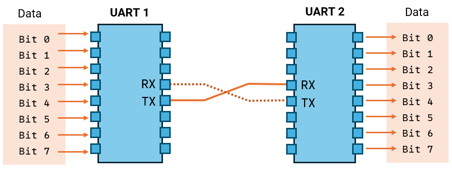
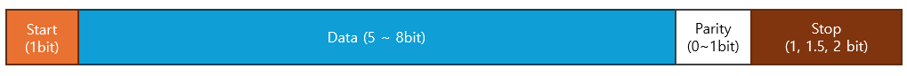
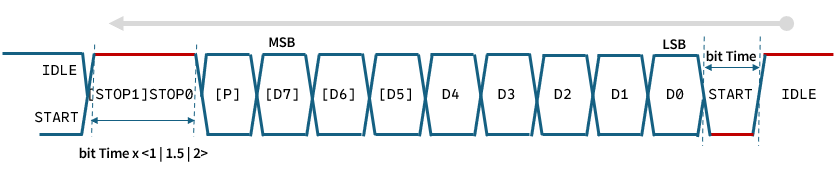
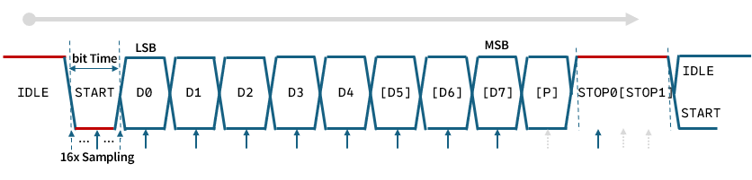
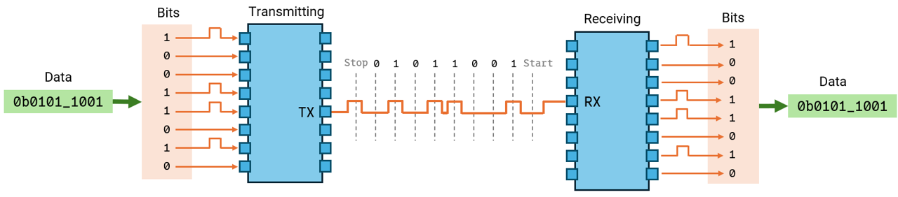
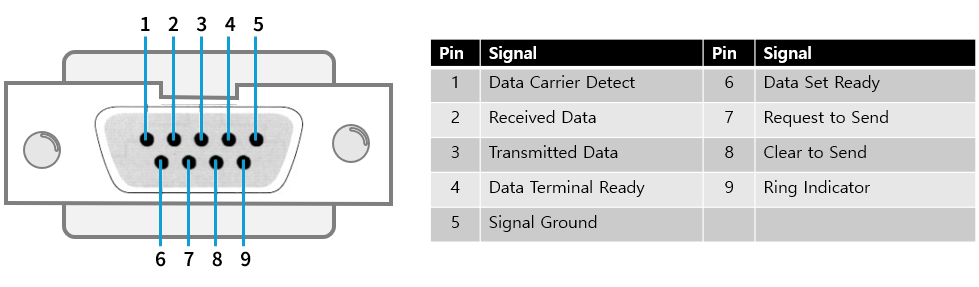
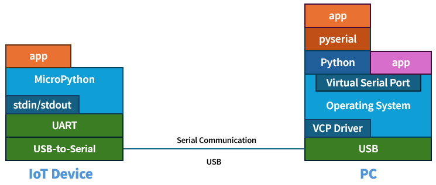
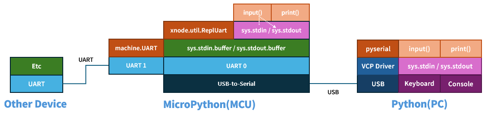
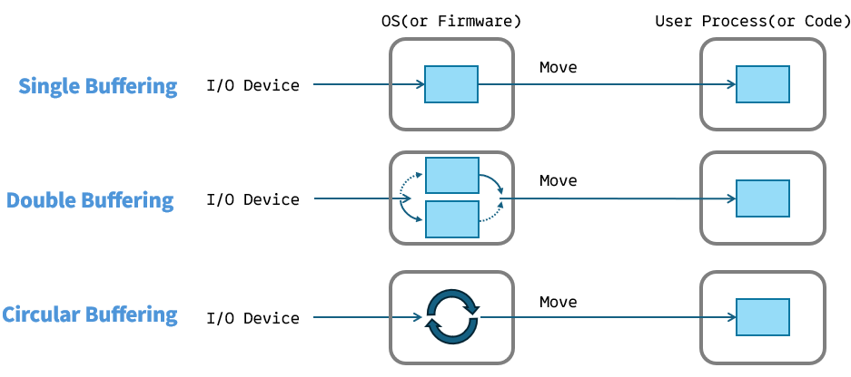

<style type='text/css'>
  [class*="shadow-box"] {
    border-radius: 10px;
    padding: 1.0em;
    box-shadow: 0 20px 50px -25px rgba(0, 0, 0, 0.7);
    display: flex;
    flex-direction: column;
    background-color: rgba(220, 220, 220, 0.01);
}
</style>

# 시리얼 통신
시리얼(Serial) 통신은 바이트 데이터를 한 비트씩 순차적으로 주고 받는 방식으로, 여러 비트를 동시에 주고 받는 병렬(Parallel) 통신과 대비됩니다. 시리얼 통신은 크게 비동기 방식과 동기 방식으로 나눠는데, 비동기 방식은 데이터를 보내는 쪽(Transmitter)과 받는 쪽(Receiver)이 별도의 클럭 신호를 공유하지 않고, 통신의 시작과 끝을 알리는 신호를 사용하여 데이터를 주고받습니다. 데이터 식별은 양쪽에 미리 설정된 정보를 이용하며, UART(Universal Asynchronous Receiver/Transmitter)가 대표적입니다. 반면 동기 방식은 별도의 클럭 신호 라인을 추가하여 양쪽이 공유하는 클럭 신호에 맞춰 데이터를 식별합니다.

<details>
<summary><b>시리얼 통신의 종류</b></summary>
<div class="shadow-box">
시리얼 통신은 임베디드 시스템, 산업 자동화, 통신 등 다양한 분야에서 핵심적인 역할을 수행하는 중요한 기술로 위에서 설명한 UART 외에도 다음과 같은 다양한 시리얼 통신 방식이 있습니다.

- RS-232: 과거에 PC에서 널리 사용되던 시리얼 통신 표준. 전압 레벨이 높고(±3V ~ ±15V) 노이즈에 강하지만, 전송 거리가 짧고 속도가 느림
- RS-485: RS-232보다 장거리, 고속 통신이 가능하며, 여러 장치를 하나의 버스에 연결할 수 있는(multi-drop) 특징이 있음. 산업 현장에서 많이 사용됨
- SPI (Serial Peripheral Interface): 동기식 시리얼 통신 방식으로, 마이크로컨트롤러와 주변 장치(센서, 메모리, 디스플레이 등) 간의 고속 통신에 사용. 4개의 선(MOSI, MISO, SCK, SS) 사용
- I2C (Inter-Integrated Circuit): 동기식 시리얼 통신 방식으로, SPI보다 속도는 느리지만, 2개의 선(SDA, SCL)만으로 여러 장치 연결. 주로 저속 주변 장치(EEPROM, RTC, 센서 등)와의 통신 사용
- CAN (Controller Area Network): 자동차 내부 네트워크에 주로 사용되는 시리얼 통신 프로토콜. 높은 신뢰성과 실시간성 제공
- USB (Universal Serial Bus): 현대의 PC에서 가장 널리 사용되는 통신 인터페이스. 고속 데이터 전송, 전원 공급, 다양한 장치 지원 등 여러 장점을 가지고 있음. 내부적으로는 RS-232나 UART와 같은 시리얼 통신 방식 사용.

</div>
</details>

## UART
통신 계층 모델인 OSI 7계층 관점에서 보면, UART는 주로 물리 계층과 데이터 링크 계층의 일부 기능에 걸쳐 있습니다. UART는 오랫동안 널리 사용되어 온 기술이지만, 단일 표준 문서로 정의되어 있지 않습니다. 대신, 다양한 제조사에서 각자의 UART 칩과 모듈을 구현해 왔습니다. 그럼에도 불구하고 일반적인 UART 통신은 양쪽이 미리 약속한 전송 속도를 기준으로, TX 라인을 통해 비트 단위의 데이터를 보내고 RX 라인을 통해 비트 단위의 데이터를 받습니다. 또한, 전이중(full-duplex) 통신을 지원하여 데이터를 보내면서 동시에 받는 것도 가능합니다. 이러한 통신 과정은 데이터 프레임과 흐름 제어 메커니즘을 통해 관리됩니다.

</br>

### 데이터 프레임
데이터 프레임은 UART 통신에서 데이터를 주고받을 때 사용되는 특정 형식의 데이터 구조입니다. 비동기 직렬 통신 방식인 UART는 공유하는 클럭 신호 없이 통신을 수행하기 때문에, 양쪽이 데이터를 올바르게 해석하기 위해 데이터 프레임이라는 약속된 형식을 사용합니다.

- 시작 비트 (Start Bit): 1비트로 데이터 전송의 시작을 알림
- 데이터 비트 (Data Bits): 실제 데이터로 5~8 비트
  - 일반적으로 8비트
- 패리티 비트 (Parity Bit): (선택 사항) 0 ~ 1비트로 오류 검출 용. 짝수(Even), 홀수(Odd), 또는 없음(None)
  - Even: 데이터 비트와 패리티 비트를 합쳐서 전체 비트열에서 '1'의 개수가 짝수가 되도록 패리티 비트 설정
    - 예: 데이터가 0b0110_0101 이면, 패리티 비트는 0. 데이터가 0b0011_0111 이면, 패리티 비트는 1
  - Odd: 데이터 비트와 패리티 비트를 합쳐서 전체 비트열에서 '1'의 개수가 홀수가 되도록 패리티 비트 설정
    - 예: 데이터가 0b0110_0101 이면, 패리티 비트는 1. 데이터가 0b0011_0111 이면, 패리티 비트는 0
  - None: 패리티 비트 사용 안함. 일반적으로 None
- 정지 비트 (Stop Bit): 1, 1.5, 또는 2 비트로 데이터 전송의 끝을 알림
  - 일반적으로 1비트

</br>

#### 전송 속도
보 레이트(Baud Rate)는 통신 채널에서 초당 전송되는 신호 변화 또는 심볼의 수를 나타내는 단위입니다. 좀 더 쉽게 설명하면, 1초 동안 통신 회선에서 상태가 몇 번 바뀌는지를 나타내는 속도 측정 단위입니다.

- 심볼: 전압, 주파수, 위상 등과 같이 통신 채널의 상태 변화를 나타내는 최소. 하나의 심볼은 1개 이상의 비트 정보를 나타낼 수 있음
- 신호 변화: 통신 선로의 상태 변화 (예: 전압 레벨의 변화, 주파수 변조, 위상 변조)

UART와 같은 바이너리 디지털 통신에서는, 각 심볼이 하나의 비트(0 또는 1)를 나타내므로 보 레이트와 비트 전송률(bit rate, bps - bits per second)이 동일합니다. 즉, 9600 Baud Rate는 초당 9600번의 신호 변화(또는 심볼 변화)가 있음을 의미하고, 각 신호 변화가 1비트를 나타내므로 초당 9600 비트(bps)를 전송하는 것과 같습니다. 1비트 전송 시간은 전송 속도의 역수로 계산되며, 이 시간을 기준으로 데이터 프레임 송수신을 제어합니다. 예를 들어, 9600bps 전송 속도에서 1비트 시간은 약 104µs(1 / 9600 ≈ 0.000104초)이며, 데이터 프레임의 각 비트는 이 시간 동안 유지됩니다. 과거 노이즈가 많은 환경에서는 1.5 또는 2 정지 비트를 사용하기도 했지만, 현재는 일반적으로 1 정지 비트를 사용합니다.

<details>
<summary><b>전송 속도와 1 비트 시간 관계</b></summary>
<div class="shadow-box">

전송 속도가 115200bps일 때, 1 비트 전송 시간은 1 / 115200 초, 즉 약 8.680555... 마이크로초(µs)입니다. 이것이 의미하는 바는 다음과 같습니다.

- 이상적인 경우와 실제 구현의 차이
  - 이론: UART 통신에서 각 비트는 정확히 8.680555... µs 동안 전송되어야 함
  - 실제: 디지털 시스템에서 무한 소수를 정확하게 표현하는 것은 불가능. 따라서 가장 가까운 값으로 1 비트 전송 시간 설정
- 클럭 오차의 원인
  - 1 비트 전송 시간을 정확하게 표현할 수 없기 때문에, 미세한 오차 발생. UART 통신에서 클럭 오차의 한 원인
  - 양쪽 모두 이러한 오차를 가지고 있고, 두 오차가 누적되면 데이터 오류가 발생할 확률이 높아짐
- 전송 속도 허용 오차
  - UART는 클럭 오차를 감안하여, 어느 정도의 오차 범위 내에서는 통신이 정상적으로 이루어지도록 설계됨
  - 일반적으로 ±2~3% 정도의 전송 속도 오차 허용
    - 115200bps로 설정했더라도, 실제 전송 속도가 이 범위 안에 있으면 통신 가능
</div>
</details></br>

**응용 문제**   
> 1. 전송 속도가 115200bps라면 1 비트 시간은 얼마인가?
> 2. 통신 설정 중 크기가 가변인 데이터 비트, 패리티 비트, 정지 비트를 8N1으로 표현하기도 합니다. 의미는?
> 3. 8N1일 때, 1바이트를 전송하는데 걸리는 시간은? 

<details>
<summary><b>정답</b></summary>
<div class="shadow-box">

1. 1/115200 ≈ 8.6805555555555555555555555555556e-6 = 약 8.6805 µs
2. 데이터 비트 8, 패리티 비트 None, 정지 비트 1
3. 1(시작) + 8(데이터) + 1(종료) = 8.6805 + (8 * 8.6805) + 8.6805 = 약 86.805 µs
</div>
</details></br>

전송 속도를 이해했다면, UART 통신에서 데이터 프레임이 어떻게 만들어지고, 보내고, 받고 해석되는지에 대해 보내는 쪽과 받는 쪽으로 나누어 자세히 알아보겠습니다.

#### 보내는 쪽 동작

먼저 보내는 쪽 동작은 다음과 같습니다.

1. 평상시 TX 라인은 일반적으로 높은 전압 레벨(로직 1)을 유지합니다. 이는 보낼 데이터가 없음을 나타냅니다. 
2. 보낼 데이터가 송신 버퍼를 거쳐 UART TX FIFO에 쌓이면 UART는 데이터 프레임을 구성하기 시작합니다. 이때 데이터 비트 수, 패리티 비트 사용 여부 및 종류, 정지 비트 수 등의 설정(일반적으로 8N1: 8 data bits, No parity, 1 stop bit)이 미리 지정되어 있어야 합니다.  
3. 데이터 전송을 시작하기 위해, UART는 TX 라인을 낮은 전압 레벨(로직 0)로 변경하여 시작 비트를 전송합니다. 시작 비트의 지속 시간은 미리 설정된 전송 속도에 의해 결정됩니다. (예: 9600 Baud Rate에서는 1 비트의 지속 시간은 약 1/9600 초 ≈ 104 µs).
4. 시작 비트 이후, UART는 최하위 비트(LSB: Least Significant Bit)부터 최상위 비트(MSB: Most Significant Bit) 순서로 데이터 비트를 순차적으로 전송합니다. 각 비트의 전압 레벨(0 또는 1)은 데이터 값에 따라 결정됩니다. 각 데이터 비트의 지속 시간도 전송 속도에 의해 결정됩니다.
5. 만약 패리티 비트가 설정되었다면 (None이 아닌 경우), UART는 데이터 비트 다음에 패리티 비트를 전송합니다. 패리티 비트는 짝수(Even) 또는 홀수(Odd) 패리티 설정에 따라 계산됩니다.
6. 데이터 비트(및 패리티 비트) 전송 후, UART는 TX 라인을 다시 높은 전압 레벨(로직 1)로 변경하여 정지 비트를 전송합니다. 정지 비트는 데이터 프레임의 끝을 알립니다. 정지 비트의 지속 시간은 설정에 따라 1, 1.5, 또는 2 비트 시간이 될 수 있습니다.
7. 전송할 다음 데이터가 있다면, 위 과정을 반복합니다. 그렇지 않으면 TX 라인은 높은 전압 레벨(대기 상태)을 유지합니다.

</br>


#### 받는 쪽 동작
다음은 받는 쪽 동작입니다.

1. 평상시 RX 라인은 일반적으로 높은 전압 레벨(로직 1)을 유지합니다.
2. RX 라인이 높은 전압 레벨에서 낮은 전압 레벨로 바뀌는 것(하강 에지, falling edge)을 감지하면, UART는 이를 시작 비트로 인식하고 데이터 수신을 준비합니다.
3. UART는 설정된 전송 속도에 맞춰 RX 라인의 전압 레벨을 주기적으로 샘플링(일반적으로 16배 오버샘플링 사용)합니다. 일반적으로 비트 지속 시간의 중간 지점에서 샘플링하여 노이즈의 영향을 최소화합니다.
4. 시작 비트 이후, UART는 설정된 데이터 비트 수만큼 RX 라인을 샘플링하여 데이터 비트를 수신합니다. LSB부터 MSB 순서로 비트를 조합하여 데이터를 복원합니다.
5. 만약 패리티 비트가 설정되었다면, UART는 수신된 패리티 비트를 확인하여 데이터 전송 중 오류가 발생했는지 검사합니다. 수신된 데이터의 패리티와 설정된 패리티가 일치하지 않으면 오류 플래그를 설정할 수 있습니다.
6. 데이터 비트(및 패리티 비트) 수신 후, UART는 RX 라인이 높은 전압 레벨(정지 비트)로 유지되는지 확인합니다. 정지 비트가 감지되지 않으면 프레이밍 오류(Framing Error)가 발생한 것으로 간주합니다.
7. 정상적으로 데이터 프레임을 수신하면, UART는 수신된 데이터를 수신 버퍼에 저장하고, 수신 완료 인터럽트 등을 발생시켜 프로세서(MCU 등)에게 데이터가 도착했음을 알립니다.
8. 이후, 위 과정을 반복하여 다음 데이터 프레임을 수신합니다.

</br>

<details>
<summary><b>오버샘플링</b></summary>
<div class="shadow-box">

오버샘플링은 비동기 통신에서 발생할 수 있는 클럭 오차, 위상 오차, 노이즈 등의 문제를 완화하고, 더 안정적이고 정확한 데이터 수신을 가능하게 합니다. UART에서 일반적으로 사용하는 16배 오버샘플링은 정확도와 복잡성 사이의 적절한 균형을 제공하는 일반적인 선택입니다. 더 높은 배수를 사용하면 정확도가 향상될 수 있지만, 하드웨어 복잡성과 전력 소비가 증가합니다.

16배 오버샘플링을 통해 얻는 장점은 다음과 같습니다.

- 정확한 비트 중앙 지점 샘플링: UART는 비동기 통신이므로 보내는 쪽과 받는 쪽 클럭이 완벽하게 일치하지 않음. (약간의 오차 발생)
  - 받는 쪽은 각 비트 시간 동안 16번의 샘플을 얻게 됨. 이 샘플들 중에서 비트의 중앙에 가장 가까운 지점 선택
    - 16개의 샘플 중 가운데 부근(예: 7, 8, 9번째 샘플)을 사용하여 값 결정. 이 중 다수결(majority vote)을 통해 최종 비트 값 결정.
  - 클럭 오차나 노이즈로 인한 오류 감소
- 시작 비트 감지 정확도 향상: 받는 쪽은 Idle 상태(High)에서 Low로 전환되는 시작 비트를 정확하게 감지해야 함
  - Low 신호의 시작점을 더 정밀하게 찾아낼 수 있음.
  - 여러 샘플을 확인하여 노이즈로 인한 잘못된 시작 비트 감지(false start) 방지
- 위상 오차(Phase Error) 보정: 보내는 쪽과 받는 쪽 클럭 주파수가 미세하게 다르면, 시간이 지남에 따라 샘플링 지점이 비트의 중앙에서 벗어나는 위상 오차 발생
  - 위상 오차를 초기에 감지하고 보정할 수 있는 여유가 생김
  - 받는 쪽은 샘플링 지점을 조금씩 조정하여 비트 중앙을 계속 추적할 수 있음
- 노이즈 내성
  - 여러 샘플 값들을 확인할 수 있어, 순간적인 노이즈에 의한 영향을 줄여 좀 더 안정적으로 비트값을 판단할 수 있음

</div>
</details></br>



### 흐름 제어

흐름 제어(Flow Control)는 양쪽의 데이터 처리 속도 차이로 인해 데이터가 손실되는 것을 방지하고 효율적인 통신을 가능하게 하는 메커니즘입니다. 크게 소프트웨어 방식과 하드웨어 방식으로 나뉘는데, 소프트웨어 방식은 별도의 신호 라인 없이 받는 쪽에서 보내는 쪽으로 자신의 수신 퍼버 상태에 따라 XOFF(Tramsmit Off) 또는 XON(Transmit On) 문자를 전송합니다.

- XOFF(ASCII 코드 19, DC3, Ctrl+S): 받는 쪽은 자신의 수신 버퍼가 거의 가득 차면, 보내는 쪽으로 XOFF 문자 전송
  - 보내는 쪽에서 XOFF 문자를 받으면, 데이터 전송 일시 중지
- XON(ASCII 코드 17, DC1, Ctrl+Q): 받는 쪽은 자신의 수신 버퍼에 충분한 여유 공간이 생기면, 보내는 쪽에게 XON 문자 전송
  - 보내는 쪽은 XON 문자를 수신하면, 데이터 전송 재개

<details>
<summary><b>데이터에 XON/XOFF 문자가 있다면?</b></summary>
<div class="shadow-box">

소프트웨어 흐름 제어인 XON/XOFF를 사용할 때 데이터에 XON(0x11) 또는 XOFF(0x13) 문자가 포함되어 있으면 흐름 제어 문자로 잘못 해석되어 통신에 문제가 발생할 수 있습니다. 이러한 문제를 방지하기 위해 사용하는 대표적인 방법은 DLE(Data Link Escape) 문자(0x10) 삽입(escaping) 입니다.

- 보내는 쪽
  - 데이터를 전송하기 전에 데이터 스트림 검사
  - 데이터에 XON(0x11) 또는 XOFF(0x13) 문자가 있으면, 그 앞에 DLE (0x10) 문자 추가
  - 데이터에 DLE 문자 자체가 있으면, DLE 문자 앞에 또 다른 DLE 문자를 추가합니다. (DLE, DLE)
- 받는 쪽
  - 데이터 스트림을 수신하면서 DLE 문자 확인
  - DLE 문자 바로 다음에 오는 문자가 XON, XOFF, 또는 DLE 중 하나이면, DLE 문자를 제거하고 원래의 문자로 해석
  - DLE 문자 다음에 다른 문자가 오면, DLE 문자를 제거하지 않고, 해당 문자를 일반 데이터의 일부로 처리

</div>
</details></br>

하드웨어 흐름 제어는 데이터 단말 장치(DTE: Data Terminal Equipment)와 데이터 회선 종단 장치(DCE: Data Circuit-terminating Equipment) 간의 데이터 흐름을 RTS/CTS, DTR/DSR과 같은 별도의 제어 신호 라인을 사용하여 제어하는 방식입니다. DTE에는 PC, 프린터, 터미널 등이 있고, DCE에는 모뎀, CSU/DSU(Channel Service Unit/Data Service Unit), 라우터(WAN 인터페이스) 등이 있습니다.

RTS/CTS 신호는 비교적 짧은 시간 동안 연속적으로 전송되는 데이터 묶음(데이터 버스트)을 전송할 때, 보내는 쪽(주로 DTE)이 데이터 전송 전 받는 쪽(주로 DCE)의 준비 상태를 확인하는 데 사용됩니다.

- RTS (Request To Send): 송신 요청
  - DTE가 DCE에게 데이터를 보낼 준비가 되었음을 알리는 신호
  - DTE는 RTS 신호를 활성화(일반적으로 High)하여 DCE에게 데이터 전송을 요청하고, DCE의 응답(CTS)을 기다림
- CTS (Clear To Send): 송신 허가
  - DCE가 DTE에게 데이터를 받을 준비가 되었음을 알리는 신호
  - DCE는 DTE의 RTS 신호를 받으면 CTS 신호를 활성화(일반적으로 High)하여 데이터 전송이 가능함을 알림. DTE는 CTS 신호를 확인한 후 데이터 전송

DTR/DSR 신호는 주로 연결 지향적인(connection-oriented) 통신에서 세션의 시작과 끝, 그리고 장치의 전반적인 가용성(준비 상태)을 나타내는 데 사용됩니다.

- DTR (Data Terminal Ready): 데이터 단말 준비 완료
  - DTE가 DCE에게 통신할 준비가 되었음을 알리는 신호
  - DTE는 DTR 신호를 활성화(일반적으로 High)하여 DCE에게 자신의 준비 상태를 알림
- DSR (Data Set Ready): 데이터 세트 준비 완료
  - DCE가 DTE에게 통신할 준비가 되었음을 알리는 신호
  - DCE는 DSR 신호를 활성화(일반적으로 High)하여 DTE에게 자신의 준비 상태를 알림

### TTL-UART와 RS232
TTL-UART와 RS-232는 UART의 물리 계층에서 정의하지 않은 신호 레벨를 비롯해 통신 거리, 노이즈 내성 등을 구제적으로 정의합니다. TTL-UART는 마이크로컨트롤러나 임베디드 시스템에서 주로 사용되며, TTL(Transistor-Transistor Logic) 신호 레벨을 사용하는 UART 통신입니다. TTL은 디지털 회로에서 널리 사용되는 로직 레벨로, 로직-1(High)은 +3.3V 또는 +5V, 로직-0(Low)은 0V(Ground)입니다. 통신 거리는 수십 cm 이내이고, 노이즈 내성은 약한 편입니다. 

RS-232는 미국전자공업협회(EIA)가 제정한 직렬 통신 인터페이스 표준으로, 과거 PC, 모뎀, PLC 등 산업용 장비에서 널리 사용되었습니다. RS-232는 통신에 필요한 전기적 신호 레벨(로직-1(Mark): -3V ~ -15V, 로직-0(Space): +3V ~ +15V)과 DB9 또는 DB25 커넥터와 같은 물리적 인터페이스를 정의합니다. 통신 거리는 수십 m로 비교적 길고, 노이즈 내성도 강합니다.

다음은 RS232에서 정의한 DB9 커넥터에 할당된 신호 라인을 보여줍니다. 

</br>

TTL-UART와 RS232는 신호 레벨(전압)이 다르기 때문에 직접 연결하면 장비 손상이나 통신 오류가 발생합니다. 따라서 TTL-UART와 RS-232 간의 통신을 위해서는 반드시 MAX232과 같은 레벨 변환(Level Shifting) IC를 사용하여 안전하고 안정적인 통신을 구축하는 과정이 필요합니다.

**응용 문제**   
> 1. UART 로직-1에 대해 TTL-UART와 RS232의 전압은 얼마인가?
> 2. 통신 대기 상태일 TTL-UART와 RS-232의 데이터 라인에 흐르는 전압은 얼마인가?
> 3. 시작 비트를 전송할 때 TTL-UART와 RS-232의 데이터 라인에 흐르는 전압은 얼마인가? 

<details>
<summary><b>정답</b></summary>
<div class="shadow-box">

1. UART 로직-1에 대해 TTL-UART는 +3.3V 또는 +5V, RS232는 -3V ~ -15V (일반적으로 -12V) 
2. 대기 상태일 때 UART는 로직-1을 유지하므로, TTL-UART는 +3.3V 또는 5V, RS232는 -3V ~ -15V (일반적으로 -12V)
3. UART는 시작 비트를 로직-0으로 정의하므로, TTL-UART는 0V, RS232는 +3V ~ +15V (일반적으로 +12V)

</div>
</details></br>

### USB-to-Serial 변환 칩
최근 PC는 RS-232 통신용 DB9 또는 DB25 커넥터를 제공하지 않는 추세입니다. 따라서 마이크로컨트롤러나 임베디드 시스템은 CP210x, CH340과 같은 USB-to-Serial 변환 칩을 내장하여 TTL-UART 신호와 USB 신호를 상호 변환합니다. 이 칩들은 PC의 USB 포트를 통해 시리얼 통신 장치(UART, RS-232, RS-422, RS-485 등)를 사용할 수 있도록 전압 레벨 변환도 함께 수행합니다.

대부분의 MicroPython 개발 보드(실습 장비 포함)는 USB 포트를 통해 PC와 연결되며, 이 USB 포트는 전원 공급뿐만 아니라 내장된 USB-to-Serial 변환 칩을 통해 PC와의 시리얼 통신도 지원합니다. 따라서 USB 케이블 하나만 연결하면 간편하게 PC와 시리얼 통신을 할 수 있습니다.

----

## PC 시리얼 통신 환경
PC에서 파이썬으로 시리얼 통신이 이루어지는 과정은 복잡하게 얽혀 있지만, 크게 하드웨어, 운영체제, `pyserial` 라이브러리, 응용 프로그램으로 나눌 수 있습니다. 하드웨어인 RS232(UART)나 가상 시리얼을 지원하는 USB는 전기 신호 레벨에서서 물리적인 데이터 송수신을 담당하며, 운영체제는 시리얼(RS232) 또는 가상 시리얼(USB) 포트 드라이버를 통해 하드웨어를 제어하고, 응용 프로그램이 시리얼 통신 서비스를 이용할 수 있도록 시스템 호출과 시리얼 포트 이름(예: COM3, /dev/ttyUSB0)을 제공합니다. 시스템 호출은 운영체제가 제공하는 저수준 함수입니다. `pyserial` 라이브러리는 시스템 호출을 파이썬에서 사용하기 쉽도록 추상화한 API를 제공하며, 사용자는 `pyserial` 라이브러리를 이용하여 시리얼 통신 프로그램을 작성합니다.

실습 장비의 UART는 USB-to-Serial 변환 칩을 통해 PC의 USB 포트에 USB 케이블로 연결되어 있으므로, 시리얼 통신에는 USB 하드웨어가 사용됩니다

</br>

### 시리얼 포트 드라이버 
시리얼 포트 드라이버는 운영체제가 시리얼 통신을 수행하는 하드웨어를 제어하는데 필요한 저수준 소프트웨어로 일반적인 시리얼 포트 드라이버는 운영체제에 기본적으로 내장되어 있지만, 실습 장비처럼 USB를 이용하는 환경에서는 해당 칩 제조사에서 제공하는 가상 시리얼 포트(VCP: Virtual COM Port) 드라이버를 설치해야 합니다. 다행히 최근에는 이러한 드라이버가 사전 설치되어 있거나, 인터넷을 통해 자동 설치되지만, 여전히 구형 Windows나 macOS는 사용 중인 USB-to-Serial 변환 칩에 따라 Silicon Labs (CP210x) 또는 WCH (CH340) 웹사이트에서 드라이버를 직접 다운로드하여 설치해야 할 수 있습니다. 참고로 실습 장비에 내장된 칩은 CP210x입니다. 

CP210x: [Silicon Labs](https://www.silabs.com/developer-tools/usb-to-uart-bridge-vcp-drivers?tab=downloads)

VCP 드라이버가 설치되며, 운영체제는 시리얼 장치를 PC에 연결할 때마다 응용 프로그램을 위해 식별된 장치에 대응하는 시리얼 포트 이름을 할당합니다. Windows에서는 장치 관리자, Linux/macOS에서는 ls /dev/tty* 명령을 사용하여 연결된 시리얼 포트 이름을 확인할 수 있습니다. 앞서 소개한 upy의 scan 명령은 MicroPython 인터프리터가 실행 중인 장치만 검색하므로 더 편리합니다.

```sh
upy scan
```

<details open>
<summary><b>주의</b></summary>
<div class="shadow-box">

PC에 헤드셋, 스피커, 키보드, 마우스 등 다양한 Bluetooth 장치를 연결할 때 VCP를 통해 연결되는 경우가 많습니다. 이는 기존 시리얼 통신 애플리케이션이 Bluetooth 장치와 쉽게 통합될 수 있도록 하기 위함입니다. 하지만 VCP를 사용하면 PC에 여러 시리얼 포트 이름이 할당될 수 있어, 사용자가 어떤 포트가 실습 장비에 해당하는지 식별하기 어려울 수 있습니다. 이런 환경에서 upy의 scan 기능은 실습 장비만 정확하게 찾아주므로, 사용자는 다른 장치의 시리얼 포트 이름에 혼동되지 않고 실습 장비와 안정적으로 통신할 수 있습니다.

</div>
</details></br>

`pyserial` 라이브러리로 시리얼 통신 프로그램을 작성하는 방법을 알아보기 전에 매우 중요한 개념인 양쪽의 송신 버퍼와 수신 버퍼 사이를 흐르는 데이터의 직렬화와 각각의 데이터를 구분하는 데이터 경계에 대해 먼저 알아보겠습니다.

### 직렬화
파이썬은 str(문자열), bytes, list, tuple, int, float 등 다양한 객체 타입을 사용합니다. 하지만 시리얼 통신은 bytes만 주고받을 수 있습니다. 따라서 시리얼 통신으로 데이터를 보내기 전에는 다른 타입의 객체를 bytes로 변환해야 하고, 받은 데이터(bytes)는 필요에 따라 원래의 타입으로 변환해야 하는데, 이를 직렬화(serialization)와 역직렬화(deserialization)라 합니다. 예를 들어, 문자열 "Hello"는 b"Hello" 또는 b"\x68\x65\x6c\x6c\x6f", 정수 65는 b"\x41", 실수 3.14는 b"\xc3\xf5\x48\x40"(float) 또는 b"\x1f\x85\xeb\x51\xb8\x1e\x09\x40"(double)으로 직렬화해 보내고, 받은 쪽에서는 이를 다시 역직렬화해 원래의 "Hello", 65, 3.14 등으로 바꿔야 합니다. 

직렬화는 시리얼 통신뿐만 아니라, 인터넷, 데이터베이스, 파일에서도 사용합니다.

<details>
<summary><b>데이터 타입</b></summary>
<div class="shadow-box">

파이썬의 데이터 타입은 크게 다음과 같이 분류할 수 있습니다.

1. 숫자형 (Numeric Types)
   - int (정수): 소수점이 없는 수 (정수 크기는 제한이 없음. 메모리가 허용하는 한)
     - -1, 0, 100 등
   - float (실수): 소수점을 포함하는 수 또는 지수 표기법으로 표현되는 수. IEEE 754 표준의 배정밀도(double-precision) 부동 소수점 숫자
     - 3.14, -2.5, 1.0e-5 등
   - complex (복소수): 실수부와 허수부로 구성된 수. 허수부는 숫자 뒤에 j 또는 J를 붙여서 표현
     - 2 + 3j, 1 - 1j 등

2. 시퀀스 타입 (Sequence Types): 순서가 있는 요소들의 집합
   - list (리스트): 가변(mutable) 객체로 생성 후 요소를 추가, 삭제, 변경할 수 있음. 다양한 타입의 요소 포함
     - [1, 2, 'a', 'b']
   - tuple (튜플): 불변(immutable) 객체로 생성 후에는 요소를 변경할 수 없음. 리스트보다 일반적으로 더 빠르고 메모리 효율적
     - (1, 2, 'a', 'b')
   - str (문자열): 유니코드 문자들의 시퀀스. 불변 객체
     - "hello", 'world'
   - bytes (바이트): 0-255 사이의 정수(바이트)들의 시퀀스입니다. 불변 객체로 바이너리 데이터를 표현하는 데 사용
     - b'hello', b"\x41\x42\x43"
   - bytearray (바이트 배열): bytes와 유사하지만 가변 객체로 바이트 값 변경 가능
     - bytearray(b'hello')
   - memoryview: 연속된 바이트 시퀀스를 복사하지 않고 접근할 수 있게 해주는 객체. 큰 데이터 덩어리의 일부분을 효율적으로 다룰 때 유용
     - memoryview(b'abcd')

3. 매핑 타입 (Mapping Types)
   - dict (딕셔너리): 키(key)-값(value) 쌍의 집합. 가변 객체로 (키는 불변 객체) 값은 어떤 타입이든 가능 (파이썬 3.7부터는 삽입 순서가 유지되지만, 이전 버전에서는 순서가 무작위)
     - {'name': 'Alice', 'age': 30} 와 같이 중괄호({})로 묶어서 표현

4. 집합 타입 (Set Types)
   - set (세트): 중복되지 않는 요소들의 순서 없는 집합. 가변 객체로 수학의 집합 연산(합집합, 교집합, 차집합 등) 지원
     - {1, 2, 3} 와 같이 중괄호({})로 묶어서 표현
   - frozenset (프로즌세트): set과 같지만 불변 객체. 딕셔너리의 키나 다른 세트의 요소로 사용
     - frozenset({1, 2, 3})

5. 불 타입 (Boolean Type)
   - bool (불): 참/거짓을 나타내는 논리 값 
     - True 또는 False 두 가지 값 중 하나를 가짐
     - 0, None, 빈 시퀀스(빈 리스트, 튜플, 문자열 등), 빈 딕셔너리, 빈 세트 등은 False로 간주되고, 그 외의 값은 일반적으로 True로 간주

6. 기타 타입
   - NoneType: None 값을 가지는 특별한 타입. 값이 없음을 나타내는 데 사용
   - 함수: 호출 가능한 객체. lambda 표현식을 사용하여 익명 함수를 만들 수도 있음
     - def my_function(): ... 와 같이 정의 
   - 클래스: 객체를 생성하기 위한 틀
     - class MyClass: ... 와 같이 정의
   - 모듈: 파이썬 코드를 담고 있는 .py 파일

</div>
</details>

#### 문자열 데이터
통신 데이터가 모두 문자열로 구성되었다면, 직렬화 과정은 간단합니다. 데이터를 보낼 때는 `str.encode()` 메서드를 호출하여 문자열을 지정된 인코딩 방식(예: UTF-8)에 따라 bytes로 변환하고, 데이터를 받으면 `bytes.decode()` 메서드를 호출하여 bytes를 지정된 디코딩 방식(예: UTF-8)에 따라 다시 문자열로 변환합니다. `str.encode()`과 `bytes.decode()`의 인코딩과 디코딩 방식은 기본적으로 UTF-8이므로 생략해도 됩니다.

통신 데이터가 모두 문자열이라면 직렬화는 간단합니다. 데이터를 보낼 때는 `str.encode()`로 문자열을 바이트(bytes)로 변환하고 (주로 UTF-8 인코딩 사용), 받을 때는 `bytes.decode()`로 바이트를 다시 문자열로 변환합니다 (UTF-8 디코딩). `str.encode()`와 `bytes.decode()`는 기본적으로 UTF-8을 사용하므로 인자를 생략해도 됩니다.

```python
data = "Hello World"
send_data = data.encode("utf-8")   # "utf-8"은 기본값이므로 생략 가능
```

```python
recv_data = b"Hello World"
data = recv_data.decode("utf-8")   # "utf-8"은 기본값이므로 생략 가능
```

<details>
<summary><b>UTF-8</b></summary>
<div class="shadow-box">

UTF-8은 유니코드 표준을 따르는 문자 인코딩 방식 중 하나로 웹, 이메일, 데이터베이스 등 다양한 분야에서 널리 사용되는 사실상의 표준 인코딩입니다. 문자에 따라 1바이트에서 4바이트까지 가변 길이로 문자를 표현하는데, 영문자, 숫자, 기호 등은 1바이트, 한글, 한자 등은 2~3바이트, 이모지 등은 4바이트로 표현됩니다. 이는 메모리 사용을 효율적으로 만듭니다. 

UTF-8은 ASCII 코드와 완벽하게 호환됩니다. ASCII 문자는 UTF-8에서 1바이트로 표현되므로, 기존 ASCII 기반 시스템과의 호환성을 유지할 수 있습니다. 

</div>
</details>

#### 구조화된 데이터
통신 데이터가 단순 문자열이 아닌 숫자, 불리언 등 여러 종류의 데이터를 포함하는 경우, 데이터를 주고받는 양쪽이 그 의미를 정확하게 해석하기 위해 구조화된 직렬화가 필요합니다. 파이썬(MicroPython 포함)은 이러한 구조화된 데이터의 직렬화를 위해 표준 모듈인 `struct`와 `json`을 제공합니다. `struct`는 C언어의 구조체와 호환되는 바이트 단위의 원시적인 데이터 처리에, `json`은 사람이 읽기 쉬운 텍스트 형식의 고수준 데이터 처리에 유용합니다. `struct`는 엄밀히 말하면 객체를 직접 직렬화하는 모듈은 아니지만, 바이트 수준에서 데이터를 표현하고 조작하는 데 사용되므로, 넓은 의미에서 직렬화의 한 형태로 볼 수 있습니다. 그에 반해 `json`은 더 추상화된 수준에서 객체를 직렬화하는 데 사용됩니다.

다음은 구조화된 데이터의 간단한 데이터 변환 예로 여러 개의 int 요소로 구성된 list와 bytes사이 변환 방법을 보여주는데, 정수처럼 하나의 데이터가 2바이트 이상으로 표현될때는 엔디안 규칙도 중요합니다. 또한 데이터를 주고 받는 양쪽은 정수 크기와 엔디안 규칙을 사전에 공유하고 동일하게 사용해야 합니다. 만약 서로 다른 포맷 문자열을 사용하면 직렬화 결과가 달라져 데이터를 올바르게 해석할 수 없습니다.  

```python
data = [10, 20, 30] # 정수 리스트

send_data = bytearray() # 바이트 배열(bytes와 유사하나, 변경 가능) 초기화
for d in data:
    # 1. d.to_bytes(2, 'little'):
    #    - 정수 d를 2바이트(16비트)로 표현.
    #    - 'little': 리틀 엔디안(Little-Endian) 바이트 순서 사용.
    #      - 리틀 엔디안: 낮은 자리 바이트가 메모리의 앞 주소에 옴.
    #      - 예: 10 (0x000A) -> b'\x0a\x00' (\x0a가 낮은 자리, \x00이 높은 자리)
    #    - 빅 엔디안(Big-Endian): 높은 자리 바이트가 메모리의 앞 주소에 옴.
    #      - 예: 10 (0x000A) -> b'\x00\x0a'
    # 2. send_data.extend(...): 변환된 2바이트를 send_data (bytearray)에 추가.
    send_data.extend(d.to_bytes(2, 'little'))


recv_data = []
# send_data에서 2바이트씩 읽어서 정수로 변환
for i in range(0, len(send_data), 2):
    # 1. send_data[i:i+2]: send_data에서 2바이트씩 슬라이싱.
    # 2. int.from_bytes(..., byteorder='little'):
    #    - 2바이트를 리틀 엔디안 정수로 변환.
    #    - 예: b'\x0a\x00' -> 10
    #    - 만약 byteorder='big' (빅 엔디안)을 사용하면:
    #      - b'\x0a\x00' -> 2560 (0x0a00)
    # 3. recv_data.append(...): 변환된 정수를 recv_data 리스트에 추가.
    recv_data.append(int.from_bytes(send_data[i:i+2], byteorder='little'))

print(data) # 원본 데이터
print([hex(n) for n in send_data])  # 바이트 데이터를 16진수로 출력
print(recv_data) # 복원한 데이터
```

하지만 위와 같은 방식은 코드가 복잡하고, 리스트의 모든 요소가 정수여야만 적용 가능하다는 단점이 있습니다.

struct 모듈의 `pack()`과 `unpack()` 함수는 통신 양쪽이 사전에 공유할 [포맷 문자열](https://docs.python.org/3.13/library/struct.html#format-strings)을 사용하여 숫자형(bool, int, float)과 bytes 간의 직렬화와 역직렬화를 수행합니다. 포맷 문자열은 바이트 순서, 데이터 타입, 데이터 개수와 같이 직렬화와 역직렬화 방법을 지정합니다. `pack()` 함수의 반환값은 bytes이고, `unpack()` 함수의 반환값은 tuple 객체입니다.

```python
import struct

data = [10, 20, 30]  

# data 리스트의 각 요소를 리틀 엔디안(<), 2바이트 정수(h) 형식으로 묶음(packing)
send_data = struct.pack("<3h", *data)
# 1. "<3h": 포맷 문자열
#    - '<': 리틀 엔디안 바이트 순서
#    - '3h': 2바이트(short) 정수(h) 3개
# 2. *data:  data 리스트의 요소들을 unpack() 함수의 인자로 전달 (개별 인자, unpacking)
#    -  data가 [10, 20, 30] 이라면, struct.pack("<3h", 10, 20, 30)과 같음.
# 3. send_data:  b'\0a\x00\x14\x00\x1e\x00' (바이트 객체)
#    - 10: 0x000a -> \x0a\x00 (리틀 엔디안)
#    - 20: 0x0014 -> \x14\x00 (리틀 엔디안)
#    - 30: 0x001e -> \x1e\x00 (리틀 엔디안)

# send_data (바이트 객체)를 리틀 엔디안(<), 2바이트 정수(h) 3개로 풀어(unpacking) 튜플로 반환
recv_data = struct.unpack("<3h", send_data)
# "<3h":  pack()에서 사용한 포맷 문자열과 동일해야 함.
# recv_data: (10, 20, 30) (튜플)

print(data)  
print([hex(n) for n in send_data]) 
print(recv_data) 
```

`json` 모듈의 `dumps()`와 `loads()` 함수는 데이터 구조를 JSON(JavaScript Object Notation) 형식 안에 자체적으로 표현하기 때문에 `struct` 모듈에서 요구하는 포맷 문자열이 필요 없습니다. `dumps()` 함수는 dict 또는 list와 같은 객체를 JSON 형식의 문자열(str)로 직렬화하고, `loads()` 함수는 JSON 형식의 문자열을 다시 원래의 객체로 역직렬화합니다. 단, `dumps()`의 반환값은 문자열이므로, 데이터를 전송하기 전에 bytes로 인코딩하고, 수신한 데이터는 bytes이므로 이를 문자열(str)로 디코딩한 후에 `loads()` 함수를 호출합니다.

```python
import json

data = [10, 20, 30]

# 직렬화 (Serialization): Python 객체 -> JSON 문자열 -> 바이트열
send_data = json.dumps(data).encode()
# 1. json.dumps(data):  리스트 data를 JSON 형식의 문자열로 변환
#    - 출력: '[10, 20, 30]' (문자열)
# 2. .encode(): JSON 문자열을 바이트열(bytes)로 인코딩 (기본값: UTF-8)
#    -  send_data: b'[10, 20, 30]' (바이트열)

# 역직렬화 (Deserialization): 바이트열 -> JSON 문자열 -> Python 객체
recv_data = json.loads(send_data.decode())
# 1. send_data.decode(): 바이트열 send_data를 문자열로 디코딩 (기본값: UTF-8)
#    - 출력: '[10, 20, 30]' (문자열)
# 2. json.loads(...): JSON 형식의 문자열을 Python 객체(여기서는 리스트)로 변환
#    - recv_data: [10, 20, 30] (Python 리스트)

print(data) 
print([hex(n) for n in send_data])  
print(recv_data) 
```

<details>
<summary><b>JSON</b></summary>
<div class="shadow-box">

JSON은 사람이 읽고 쓰기 쉬우며, 기계가 파싱하고 생성하기도 쉬운 경량의 데이터 교환 형식입니다. 텍스트 기반이므로 다양한 프로그래밍 언어에서 쉽게 사용할 수 있어, 웹 환경에서 클라이언트(브라우저)와 서버 간 데이터 교환에 널리 사용됩니다.  또한, 웹 API, 설정 파일 등 다양한 분야에서 활용됩니다.

JSON의 특징은 다음과 같습니다.

- JSON은 순수한 텍스트 형식. 텍스트를 처리할 수 있는 모든 환경(프로그래밍 언어, 운영체제 등)에서 사용 가능
- 들여쓰기와 명확한 구조 덕분에 사람이 쉽게 읽고 이해할 수 있음
- 구조가 단순하고 규칙적이어서 컴퓨터가 데이터를 빠르고 효율적으로 분석(파싱)할 수 있음
- Python, Java, C++, PHP, Ruby 등 대부분의 프로그래밍 언어에서 JSON을 처리하는 라이브러리나 내장 기능 제공

JSON은 다음과 같은 데이터 타입과 구조를 지원합니다.

- 객체: "이름(key): 값(value)" 쌍의 집합으로 구성. 이름은 문자열, 값은 JSON이 지원하는 모든 데이터 타입. (Python의 딕셔너리와 호환됨)
- 배열: 대괄호 []로 둘러싸여 있으며, 순서가 있는 값들의 목록. 값은 JSON이 지원하는 모든 데이터 타입. (Python의 리스트와 호환됨됨)
- 문자열: 큰따옴표 ""로 묶인 유니코드 문자열
- 숫자: 정수 또는 실수
- 불리언: true 또는 false 값
- null: null 값 (값이 없음을 의미)

```json
{
  "name": "박기현",
  "age": 30,
  "address": {
    "city": "분당",
    "zipcode": "12345"
  },
  "hobbies": ["독서", "음악", "게임"],
  "isStudent": true,
  "profile": null
}
```

</div>
</details></br>

`json` 모듈을 사용하면 데이터를 JSON 형식으로 쉽게 직렬화할 수 있습니다. 특히 딕셔너리(dict) 객체를 다룰 때 키를 통해 값에 직접 접근하므로 데이터 처리 로직이 간결하고 빨라집니다. 하지만 `struct` 모듈을 이용한 직렬화에 비해 결과물(bytes)의 크기가 훨씬 커지는 단점이 있습니다. 이로 인해 더 많은 메모리를 사용하고 전송 시간이 길어지며, 수십 KB 이상의 큰 데이터를 다룰 때는 메모리 오류가 발생할 수 있으므로 주의해야 합니다.

#### 바이너리 직렬화
`json` 모듈의 대안으로 서드파티 라이브러리인 `MessagePack`을 고려할 수 있습니다. `MessagePack`은 JSON과 유사하지만 더 효율적인 바이너리 직렬화 형식을 사용하여 동일한 데이터를 더 작게 표현합니다. 따라서 저장 공간 절약 및 네트워크 전송 효율을 높일 수 있습니다. 또한 바이너리 형식이므로 JSON보다 파싱 및 생성 속도가 빨라 리소스가 제한적인 임베디드 시스템이나 모바일 환경에서 유리합니다. C, C++, Java, Python, Ruby, JavaScript, Go, Rust 등 다양한 프로그래밍 언어를 지원하여 이기종 시스템 간 데이터 교환에도 적합합니다. 다만, 현재 실습 장비에는 마이크로파이썬용 `MessagePack` (`u-msgpack-python`)에서 필요로 하는 `collections` 및 `datetime` 모듈이 포함되어 있지 않아 사용이 불가능합니다.

### 데이터 경계
데이터 경계(Data Boundary)는 데이터 통신 또는 데이터 저장 시에, 하나의 데이터 단위(패킷, 프레임, 메시지, 레코드 등)가 시작하고 끝나는 지점입니다. 쉽게 말해, 여러 데이터 조각들이 섞여 있을 때, 각각의 데이터 조각을 식별하고 구분하는 기준점 또는 구분 방법을 말합니다. UART 통신 과정에서 데이터는 연속적인 흐름(stream) 또는 덩어리(chunk) 형태로 전송 및 저장됩니다.  이때 받는 쪽은 이 연속적인 흐름에서 의미 있는 단위로 데이터를 잘라내야(parsing) 합니다. 데이터 경계가 없다면, 어디서부터 어디까지가 하나의 데이터인지 알 수 없기 때문에 데이터를 올바르게 해석할 수 없습니다.

ASCII 제어 문자는 UART 통신에서 오랫동안 사용자 데이터의 시작과 끝을 구분하고, 정확한 데이터 교환을 보장하는 데이터 경게용 구분자(delimiter)로 사용되어 왔습니다. 또한, 이러한 제어 문자는 에러 검출이나 흐름 제어와 같은 통신 프로토콜의 일부로 사용되기도 합니다.

- CR (Carriage Return, '\r', ASCII 13): 커서를 줄의 맨 앞으로 이동. macOS 9과 이전 버전에서 사용되던 줄바꿈 문자
- LF (Line Feed, '\n', ASCII 10): 커서를 다음 줄로 이동. 주로 Linux, macOS에서 사용되는 줄바꿈 문자
- CRLF ('\r\n'): Windows에서 사용되는 줄바꿈 문자
- SOH (Start of Heading, '\x01'): 텍스트의 헤더 시작
- STX (Start of Text, '\x02'): 텍스트 본문 시작
- ETX (End of Text, '\x03'): 텍스트 본문 끝
- EOT (End of Transmission, '\x04'): 전송 끝

데이터 경계를 설정하는 방식은 통신 양쪽에서 반드시 동일해야 합니다. 문자열 데이터는 일반적으로 줄바꿈 문자(CR, LF, 또는 CRLF)를 사용하여 경계를 구분합니다. 반면, 구조화된 데이터는 bytes로 변환한 후, SOH, STX, ETX, EOT와 같은 제어 문자를 사용하여 경계를 구분합니다. 하지만 데이터 자체에 이러한 제어 문자가 포함될 수 있으므로, 이스케이프 처리(escaping)를 통해 다른 문자(또는 문자열)로 변환해야 합니다.

RFC 1055에 정의된 SLIP(Serial Line Internet Protocol)은 바이트 객체 간의 데이터 경계를 명확하게 하는 간단하면서도 효과적인 방법을 제공합니다. SLIP은 데이터의 시작과 끝에 END(0xC0) 문자를 추가하고, 데이터 내에 END 또는 ESC(0xDB) 문자가 나타날 경우, ESC 문자를 사용하여 이스케이프 처리합니다. 예를 들어, 데이터 내의 END는 ESC + ESC_END(0xDC)로, ESC는 ESC + ESC_ESC(0xDD)로 대체됩니다. 이러한 이스케이프 처리는 데이터 내의 특수 문자가 경계 구분자로 오인되는 것을 방지합니다.

앞서 upyboard를 설치할 때 genlib 라이브러리도 자동으로 함께 설치되는데, slip 모듈에는 SLIP 인코더와 디코더를 구현한 함수들이 포함되어 있습니다. 실습 장비에도 동일한 기능이 구현되어 있으므로 데이터 경계를 포함하는 데이터를 주고받아야 하는 경우, PC에서는 genlib에 포함된 SLIP 기능을 사용하면 됩니다.

#### SLIP 인코딩
UART 송신 버퍼에 쓰기 전에 bytes를 SLIP로 인코딩하는 것은 간단합니다. bytes를 `genlib` 모듈의 `slip.encode()` 함수에 전달하면 인코딩한 결과가 bytes로 반환됩니다.  

```python
import struct
from genlib import slip

original_data = [10, 20, b"hello", 3.14]  # struct.pack()에서 문자열은 bytes 타입만 허용

"""
< : 리틀 엔디안
2l: 4바이트 정수 2개 (i는 시스템마다 다를 수 있음) 
5s: 5바이트 문자열 (bytes)
f : 4바이트 float
"""
packed_data = struct.pack("<2l5sf", *original_data)
encoded_data = slip.encode(packed_data)

print([hex(n) for n in packed_data])
print([hex(n) for n in encoded_data])
```

#### SLIP 디코딩
UART 수신 버퍼에서 읽은 데이터가 SLIP로 인코딩된 bytes라면 `genlib` 모듈의 `slip.decode()` 함수에 전달해 디코딩할 수 있습니다. 반환결과는 디코딩된 bytes를 요소로 갖는 list 객체입니다.  

```python
decoded_data = slip.decode(encoded_data)[0]  # encoded_data는 앞서 인코딩한 결과 재사용
unpack_data = struct.unpack("<2l5sf", decoded_data)    

print([hex(n) for n in decoded_data])
print(unpack_data)  # (10, 20, b'hello', 3.140000104904175)
```

SLIP 프로토콜은 UART 통신 환경에서 데이터 프레임을 안정적으로 전송하기 위해 사용됩니다. 하지만 논블로킹 방식으로 수신 버퍼에서 데이터를 읽을 경우, 한 번의 읽기 작업으로 완전한 SLIP 프레임(하나의 bytes)을 수신한다는 보장이 없습니다. 보내는 쪽에서 여러 개의 데이터를 SLIP로 인코딩하여 연속적으로 전송했더라도, 받는 쪽의 버퍼 상태나 통신 상황에 따라 데이터가 조각나서 도착할 수 있습니다.

예를 들어, 보내는 쪽에서 다음과 같은 여러 개의 문자열 데이터를 SLIP로 인코딩하여 전송했다고 가정해 보겠습니다.

```python
"""
start...
hello
apple
banana
pear
orange
strawberry
"""
```

만약 받는 쪽 프로그램이 보내는 쪽보다 늦게 실행을 시작했다면, 수신 버퍼에는 첫 번째 데이터("Start...")의 뒤 일부분만 들어 있을 수 있습니다.  또한, 논블로킹 읽기는 수신 버퍼에 있는 데이터의 양에 따라 가변 길이의 바이트 데이터를 반환합니다. 따라서 다음과 같이 데이터가 여러 정크(chuck)로 분할되어 수신될 수 있습니다.

```python
chunk1 = b"rt...\xC0"  # 첫번째 데이터의 뒤 일부분만 수신
chunk2 = b"\xC0hel"  # 두번째 데이터의 앞 부분일부만 수신   
chunk3 = b"lo\xC0" # 두번째 데이터의 나머지 수신
chunk4 = b"\xC0apple\xC0\xC0bana"  # 세번째 데이터와 네번째 데이터의 앞 일부분만 수신
chunk5 = b"na\xC0\xC0pear\xC0\xC0orange\xC0\xC0strawberry\xC0" # 네번째 데이터 나머지와 다섯번째, 여섯번째, 일곱번째 데이터 수신
```

`slip.decode()` 함수는 이러한 분할된 수신 상황을 처리할 수 있도록 설계되었습니다. 내부 상태 변수를 사용하여, 불완전한 정크를 버퍼링하고, 다음 가 도착했을 때 이전 청크의 데이터와 결합하여 완전한 데이터를 구성합니다.

다음은 slip.decode()를 사용하여 위 정크들을 처리하는 예시입니다.

```python
from genlib import slip

result1 = slip.decode(chunk1)
result2 = slip.decode(chunk2)
result3 = slip.decode(chunk3)
result4 = slip.decode(chunk4)
result5 = slip.decode(chunk5)

print(result1)  # []
print(result2)  # []
print(result3)  # [b'hello']
print(result4)  # [b'apple']
print(result5)  # [b'banana', b'pear', b'orange', b'strawberry']
```

### pyserial 라이브러리
`pyserial` 라이브러리는 운영체제의 시스템 호출을 이용하여 시리얼 포트 통신 기능을 제공하므로, PC에서 MCU나 다른 장치와의 시리얼 통신을 쉽게 구현할 수 있습니다. Windows, Linux, macOS 등 다양한 운영체제를 지원하며, RS-232, RS-485, USB-to-Serial 등 다양한 시리얼 하드웨어를 통해 일관된 방식으로 통신할 수 있습니다. 다만, `pyserial`의 UART 통신은 bytes 데이터 형식을 사용하므로, 직렬화 및 데이터 경계 설정은 사용자가 직접 구현해야 합니다.

앞서 소개한 `upyboard` 툴도 내부에서 `pyserial`을 사용하므로 여러분의 PC에는 이미 설치되어 있겠지만, 만약 설치되어 있지 않다면 다음과 같이 설치합니다. -U 옵션을 추가하면 낮은 버전이 이미 설치되어 있어도 이를 제거하고 최신 버전으로 업그레이드합니다.

```sh
pip install -U pyserial
```

`pyserial`이 설치되었는지 확인하는 명령은 다음과 같습니다. 첫 번째 명령은 Windows에서 두 번째는 Linux나 macOS에서 실행합니다.
```sh
pip list | findstr "pyserial"
```
또는
```sh
pip list | grep pyserial
```

> 설치되어 있다면 버전이 함께 출력되는데, 만약 pyserial이 업그레이드 되었다면 버전이 더 높게 표시될 수 있습니다.
```out
pyserial           3.5
```

#### Serial 클래스
`pyserial` 라이브러리에는 여러 모듈들이 포함되어 있습니다. 그 중 가장 중요한 것은 `serial`이며, 시리얼 통신 프로그램을 작성할 때는 주로 이 모듈에 포함된 `Serial` 클래스를 이용합니다.

다음은 `Serial` 클래스가 제공하는 주요 메서드들입니다. 이 메서드들을 호출하는 과정에서 통신 문제가 발생하면 `serial.SerialException` 예외가 발생합니다.

```doc
- Serial(port=None, baudrate=9600, bytesize=8, parity="N", stopbits=1, timeout=None, xonxoff=False, rtscts=False, write_timeout=None, dsrdtr=False, inter_byte_timeout=None, exclusive=None): 시리얼 통신 객체 생성
  - 모든 매개변수는 프로퍼티로도 접근 가능 (세부 설명은 아래 프로퍼티 참고)
- open(): 생성자의 port 매개변수가 None(기본값)일 때, port 프로퍼티로 설정한 시리얼 포트 열기
  - 이미 열린 포트를 다시 열면 serial.SerialException 예외 발생
- read(size=1): size만큼 수신 버퍼에서 데이터 읽기
  - size: 읽을 바이트 수. 기본값은 1
  - 반환값은 bytes  
- write(data): bytes 타입의 data를 송신 버퍼에 쓰기
  - data: 전송할 bytes
  - 반환값은 전송한 바이트 수
- readline(size=-1): 수신 버퍼에서 size만큼 또는 줄바꿈 문자가 포함된 문자열(bytes 타입) 읽기
  - size: 읽을 바이트 수. 기본값은 -1로 size는 무시하고 구분자만 사용
  - 반환값은 줄바꿈 문자까지 또는 줄바꿈 문자가 빠진 bytes
- readlines(hint=-1): 여러 번 읽기
  - hint: 최소한 이 라인 수만큼 읽으려고 시도. 기본값은 -1로 최대한 많이
  - 반환값은 줄바꿈 문자까지 또는 줄바꿈 문자가 빠진 bytes를 요소로 갖는 list 객체   
- read_until(expected=b"\n", size=None): 수신 버퍼에서 size만큼 또는 expected(구분자)가 포함된 데이터 읽기
  - expected: bytes 타입의 구분자(예: 줄바꿈 문자). 기본값은 b"\n"
  - size: 읽을 바이트 수. 기본값은 None으로 size는 무시하고 expected만 사용
  - 반환값은 구분자까지 또는 구분자가 빠진 bytes 
- read_all(): 수신 버퍼에서 모든 데이터 읽기
  - 반환값은 bytes
- flush(): 지연 알고리즘 없이 송신 버퍼의 데이터가 모두 전송될 때까지 기다림
- reset_input_buffer(): 수신 버퍼를 모두 비움
- reset_output_buffer(): 송신 버퍼를 모두 비움
- close(): 열려있는 시리얼 포트를 닫음
```

#### 시리얼 포트 객체

다음과 같이 `Serial` 클래스의 생성자를 호출해 만든 객체를 시리얼 포트 객체라고 부릅니다. 

``` python
import serial

ser = serial.Serial()  # serial.Serial 클래스 생성자 호출
```

#### 프로퍼티와 통신 속성
`Serial` 클래스는 데이터 프레임, 흐름 제어, 타임아웃, 송수신 버퍼, 그리고 시리얼 포트 공유 등과 관련된 다양한 속성을 프로퍼티(property)로 제공합니다. 이 프로퍼티들은 `in_waiting`과 `out_waiting`을 제외하면 생성자의 매개변수와 같은데, 이들을 이용하면 실행 중인 응용 프로그램의 통신 상태를 파악하거나 특정 속성을 바꿀 수 있습니다.

```doc
- 데이터 프레임 
  - port: 연결할 시리얼 포트의 이름 또는 경로
    - Windows: "COM1", "COM2", "COM3", ...
    - Linux/macOS: "/dev/ttyUSB0", "/dev/ttyACM0", "/dev/ttyS0", ...
    - None: 기본값으로, 객체(예: ser)를 만든 후 ser.port = 'COMx' 와 같이 설정하고 ser.open() 메서드를 호출하여 연결
  - baudrate: 통신 속도. 초당 전송되는 바이트 수와 일반적으로 동일하게 사용
    - 9600(기본값), 19200, 38400, 57600, 115200 ... 중 하나
  - bytesize: 한 번에 전송할 데이터 비트 수
    - 5, 6, 7, 8(기본값) 중 하나
  - parity: 데이터 전송 시 오류 검출을 위해 사용되는 패리티 비트(Parity bit) 설정
    - 'N': 사용 안함 (기본값)
    - 'E': 짝수 패리티 비트 
    - 'O': 홀수 패리티 비트
    - 'M': 마크(항상 1)
    - 'S': 스페페이스(항상 0)
  - stopbits: 데이터 프레임의 끝을 알리는 정지 비트(Stop bit)의 수
    - 1(기본값), 1.5, 2 중 하나
- 흐름 제어
  - xonxoff: 소프트웨어 흐름 제어(XON/XOFF) 사용 여부 설정
    - True(사용 함)로 설정하면, 수신 버퍼가 가득 차면 XOFF(송신 중지) 문자를 보내고, 버퍼에 여유가 생기면 XON(송신 재개) 문자를 보내 상대방의 데이터 전송을 제어함
    - 기본값은 False(사용 안함)
  - rtscts: 하드웨어 흐름 제어(RTS/CTS) 사용 여부 설정
    - True(사용 함)로 설정하면, RTS(Request To Send)와 CTS(Clear To Send) 신호를 사용하여 데이터 흐름을 제어
      - 보내는 쪽은 데이터를 보내기 전에 RTS 신호를 보내고, 받는 쪽은 데이터를 받을 준비가 되면 CTS 신호를 보냄
    - 기본값은 False(사용 안함)
  - rts: RTS (Request To Send) 신호 상태
  - cts: CTS (Clear To Send) 신호 상태
  - dsrdtr: 하드웨어 흐름 제어(DSR/DTR) 사용 여부 설정
    - True(사용 함)로 설정하면, DTR(Data Terminal Ready)과 DSR(Data Set Ready) 신호를 사용하여 데이터 흐름 제어 (일반적으로 모뎀에 사용)
    - 기본값은 False(사용 안함)
  - dsr: DSR (Data Set Ready) 신호 상태
  - dtr: DTR (Data Terminal Ready) 신호 상태
- 타임아웃
  - timeout: read()와 같은 읽은 메서드 호출 시, 데이터 수신을 기다리는 최대 시간(초)
    - None: 기본값으로 데이터가 수신될 때까지 무한정 기다람. (블록킹 모드)
    - 0: 데이터가 없으면 즉시 반환 (논 블로킹 모드)
    - \> 0: 지정된 시간(초) 만큼 기다림. 기다려도 수신한 데이터가 없으면 빈 데이터 반환
  - write_timeout: write() 함수 호출 시, 데이터 전송을 완료할 때까지 기다리는 최대 시간(초)
    - None: 기본값으로 전송이 완료될 때까지 무한정 기다림 (블로킹 모드)
    - 0: 즉시 반환 (논 블로킹 모드). 내부에서는 전송 중.
    - \> 0: 지정된 시간(초)이 지나도 전송이 완료되지 않으면 serial.SerialTimeoutException 예외 발생
  - inter_byte_timeout: read() 함수 호출 시, 바이트와 바이트 사이의 대기 시간(초)
    - 이 시간 내에 다음 바이트가 수신되지 않으면 read() 함수는 읽기를 중단하고 현재까지 수신된 데이터 반환
      - 첫 바이트는 timeout 설정을 따르고, 두번째 바이트부터 inter_byte_timeout 설정을 따름
    - None: 기본값으로 바이트 사이의 대기 시간을 제한하지 않음
    - \> 0: 지정된 시간 동안 기다림
- 송수신 버퍼 상태
  - in_waiting: 수신 버퍼에 저장된 바이트 수
  - out_waiting: 송신 버퍼에 남아있는 바이트 수
- 시리얼 포트 공유
  - exclusive: 시리얼 포트에 대한 독점 액세스(exclusive access) 설정. (주로 Linux)
    - True: 다른 프로세스나 스레드가 해당 시리얼 포트를 동시에 열 수 없음
    - False: 독점 불가
    - None: 기본값으로 시스템 설정을 따름
  - 매개변수가 범위를 벗어나면 ValueError 예외 발생 (예: 통신 속도, 데이터 비트 등)
```

<details>
<summary><b>프로퍼티</b></summary>
<div class="shadow-box">

객체지향 개념에서 속성(Attribute)은 객체의 상태나 특성을 나타내는 데이터(값)이며 변수 형태로 표현됩니다. 메서드(Method)는 객체가 수행할 수 있는 동작 또는 행위로 함수 형태로 표현됩니다. 파이썬에서는 메서드의 첫 번째 매개변수로 항상 객체 자신(self)을 받습니다.

프로퍼티는 파이썬에서 @property 데코레이터를 사용하여 정의하는 특별한 종류의 속성입니다. 프로퍼티는 겉으로 보기에는 일반적인 속성처럼 보이지만, 실제로는 값을 읽거나(getter), 설정하거나(setter), 삭제할 때(deleter) 호출되는 메서드입니다. 이를 통해 속성 접근을 제어하거나, 값을 계산하여 반환하거나, 부수 효과(side effect)를 발생시키는 등의 동작을 수행할 수 있습니다.

다은은 파이썬 클래스에서 프로퍼티를 정의하는 예입니다.
```python
class Circle:
    def __init__(self, radius):
        self._radius = radius  # 실제 데이터는 _radius에 저장

    @property
    def radius(self):  # Getter
        return self._radius

    @radius.setter
    def radius(self, value):  # Setter
        if value < 0:
            raise ValueError("Radius cannot be negative")
        self._radius = value

    @property
    def area(self): #읽기 전용
        return 3.14159 * self._radius * self._radius
```

사용 예는 다음과 같습니다.
```python
circle = Circle(5)
print(circle.radius)  # 5
circle.radius = 10  # Setting radius to 10
print(circle.radius) # 10

try:
    circle.radius = -5  # Setting radius to -5
except ValueError as e:
    print(e)  # Radius cannot be negative

print(circle.area) # 78.53975
```

</div>
</details></br>

#### 통신 오류
`pyserial` 라이브러리의 `serial.SerialException`은 시리얼 통신 중 발생하는 다양한 오류를 나타내는 예외 클래스입니다. `SerialException`이 발생하는 일반적인 상황 중 하나는 포트 열기 실패입니다. 이는 지정한 시리얼 포트가 실제로 존재하지 않거나, 다른 프로그램이 이미 해당 포트를 사용하고 있을 때 발생합니다. 또한, Linux와 같은 운영체제에서는 사용자에게 시리얼 포트 접근 권한이 없는 경우에도 포트 열기 실패가 발생할 수 있는데, 예를 들어 일반 사용자가 /dev/ttyUSB0와 같은 장치 파일에 접근 권한이 없는 경우입니다. 잘못된 포트 이름을 사용하는 경우, 예를 들어 존재하지 않는 COM 포트 번호를 지정하거나 /dev/ 경로에 오타가 있는 경우에도 `SerialException`이 발생합니다.

`SerialException`은 시리얼 포트를 열 때 전송 속도, 데이터 비트, 정지 비트, 패리티 등 하드웨어에서 지원되지 않는 값을 설정한 경우에도 발생합니다. 시리얼 케이블 분리, 연결된 장치의 전원 꺼짐과 같이 물리적인 연결이 끊어지면 읽기/쓰기 오류가 발생하며, 이때는 `SerialTimeoutException`이 발생할 수 있습니다. UART 칩 자체의 문제나 수신 버퍼 오버플로우 같은 하드웨어적인 오류 역시 `SerialException`을 발생시키는 원인입니다. 만료 시간 설정을 통해 지정된 시간 안에 데이터 송수신이 완료되지 않으면 `SerialTimeoutException`이 발생하는데, 이는 `SerialException`의 하위 클래스입니다. 시리얼 드라이버 문제와 같은 운영체제 수준의 오류 또한 `SerialException`으로 이어질 수 있습니다.

추가적으로, 시리얼 포트 객체의 `close()` 메서드를 호출하여 포트를 닫은 후 닫힌 포트에 대해 읽기 또는 쓰기 작업을 시도하면 `SerialException` (또는 `PortNotOpenError`)이 발생합니다. 시리얼 포트 객체의 메서드에 잘못된 매개변수를 사용하는 경우, 예를 들어 `write()` 메서드에 bytes 타입이 아닌 다른 타입의 데이터를 전달하는 경우에도 `SerialException`이 발생할 수 있습니다.

### 시리얼 포트 열기
운영체제가 할당한 시리얼 포트를 사용하려면, 해당 포트를 명시적으로 "열어야" 합니다. `serial.Serial` 클래스는 시리얼 포트를 여는 두 가지 방법을 제공합니다. 첫 번째는 생성자를 사용하여 시리얼 포트 객체를 생성하면서 동시에 포트를 여는 것이고, 두 번째는 빈 시리얼 포트 객체를 생성한 후 `open()` 메서드를 호출하여 포트를 여는 것입니다. 어떤 방법을 사용하든, 시리얼 포트가 성공적으로 열리면 운영체제는 해당 응용 프로그램이 시리얼 통신을 할 수 있도록 송수신 버퍼 등 필요한 자원을 할당합니다.

#### Serial 생성자로 열기
`Serial` 클래스의 생성자를 호출할 때 시리얼 포트 이름과 전송 속도를 각각 `port`와 `baudrate`에 전달하면 시리얼 포트 객체 생성과 동시에 해당 포트를 열 수 있습니다. 이때, 통신 속도와 패리티 비트, 정지 비트는 반드시 상대 쪽과 같아야 합니다. 예를 들어, 실습 장비는 통신 속도가 115200bps, 데이터 프레임 속성은 8N1이므로 시리얼 포트 객체도 이와 같아야 합니다. 해당 포트가 존재하지 않거나, 다른 프로그램에서 이미 사용 중이라면 객체 생성 시점에 `serial.SerialException` 예외가 발생합니다.

```python
import serial

def main()
    try:
        ser = serial.Serial('COM3', 115200)  # 패리티 비트와 정지 비트는 기본값인 None과 1 사용
    except serial.SerialException as e:
        print(e)
```

#### open() 메서드로 열기
`Serial` 클래스 생성자의 `port` 인자를 생략하면(기본값인 None 사용) "빈 시리얼 포트 객체"가 생성됩니다. 이후 `port` 프로퍼티에 해당 시리얼 포트 이름을 대입한 다음 `open()` 메서드를 호출하면 시리얼 포트가 열립니다. 이 방법은 주로 여러개의 포트를 열고 닫는 코드를 작성할 때 유용한데, 객체 생성과 포트 열기를 분리할 수 있으므로 포트 설정 값을 동적으로 변경하거나, 조건에 따라 포트를 열고 닫는 등의 유연한 처리가 가능합니다. 

```python
import serial

SERIAL_PORT = 'COM3'

def main():
    ser = serial.Serial()
    try:
        ser.port = SERIAL_PORT
        ser.baudrate = 115200
        ser.open()
    except serial.SerialException as e:
        print(e)
```

#### 통신 속성
생성된 시리얼 포트 객체는 다양한 통신 속성들을 프로퍼티로 제공합니다. 이 속성들을 통해 데이터 프레임 속성(데이터 비트 수, 패리티, 정지 비트 등), 하드웨어/소프트웨어 흐름 제어(RTS/CTS, XON/XOFF 등), 타임아웃(읽기 타임아웃, 쓰기 타임아웃, 바이트 간 타임아웃)과 관련된 설정을 확인하거나 변경할 수 있습니다. 아래 `print_attributes()` 함수는 이러한 속성들의 현재 값을 출력하는 예시입니다. 

**pc_serial_create.py**
```python
import serial

SERIAL_PORT = 'COM3'

def print_attributes(ser):
    print(f"DataFrame: \t{ser.port=}, {ser.baudrate=}, {ser.bytesize=}, {ser.parity=}, {ser.stopbits=}")
    print(f"FlowControll: \t{ser.xonxoff=}, {ser.rts=}, {ser.cts=}, {ser.dsr=}, {ser.dtr=}, {ser.exclusive=}")
    print(f"TimeOut: \t{ser.timeout=}, {ser.write_timeout=}, {ser.inter_byte_timeout=}")

def main():
    ser = serial.Serial()
    try:
        ser.port = SERIAL_PORT
        ser.baudrate = 115200
        ser.open()        
    except serial.SerialException as e:
        print(e)
        return  # Exit the program
    
    print_attributes(ser)
    
if __name__ == "__main__":
    main()
```

> 실행 결과는 다음과 같으며, PC 환경에 따라 다를 수 있습니다.
```out
DataFrame:      ser.port='COM3', ser.baudrate=115200, ser.bytesize=8, ser.parity='N', ser.stopbits=1
FlowControll:   ser.xonxoff=False, ser.rts=True, ser.cts=False, ser.dsr=False, ser.dtr=True, ser.exclusive=None
TimeOut:        ser.timeout=None, ser.write_timeout=None, ser.inter_byte_timeout=None
```

<details open>
<summary><b>주의</b></summary>
<div class="shadow-box">

통신 속성 중 `port`는 시리얼 포트를 열고나면 열린 포트를 `close()` 메서드로 닫을 때까지는 변경할 수 없습니다.

</div>
</details></br>

### 시리얼 포트 닫기
대부분의 시리얼 통신은 bytes 타입 데이터를 계속 주고받는 형태이며, 통신이 끝나면 즉시 `close()` 메서드를 호출하여 시리얼 포트를 닫아야 합니다. `close()` 메서드는 시리얼 포트 사용을 위해 할당되었던 자원들을 운영체제에 반환하며, 이렇게 반환된 자원은 다른 프로그램에서 해당 시리얼 포트를 사용할 수 있도록 해 줍니다. 주의할 점은, `close()` 메서드 호출은 시리얼 포트의 논리적인 연결 해제를 의미하며, 케이블 분리와 같은 물리적인 연결 해제나 시스템 재시작과는 다릅니다. 따라서 `close()` 호출만으로는 상대 측이 연결 종료를 즉시 인지할 수 없습니다.

#### 프로그램 종료
시리얼 포트를 닫지 않고 프로그램을 종료하면 운영체제가 자동으로 시리얼 포트 자원을 회수하여 닫아줍니다. 하지만 운영체제가 자원을 완전히 정리하고 다른 프로그램이 해당 시리얼 포트를 사용할 수 있게 되기까지 어느 정도 시간이 걸릴 수 있습니다. 따라서 프로그램 종료 시에도 `close()` 메서드를 직접 호출하여 이러한 지연을 방지하고, 자원을 즉시 반환하는 것이 좋습니다.

#### 프로그램 강제 종료
프로그램이 실행되는 동안 사용자가 Ctrl+C 키를 누르면, 운영체제는 해당 프로그램에 인터럽트 신호(SIGINT)를 보냅니다. 파이썬 인터프리터가 이 신호를 받으면 `KeyboardInterrupt` 예외를 발생시키고 프로그램의 정상적인 실행을 중단, 종료 절차를 밟게 됩니다. 하지만 예외가 발생할 위치에 `try...except KeyboardInterrupt:` 구문을 추가하면, `KeyboardInterrupt` 예외가 발생했을 때 (즉, 프로그램이 강제 종료되기 직전에) 시리얼 포트를 안전하게 닫는 것과 같은 필수적인 마무리 작업을 수행할 수 있습니다. 이렇게 하면 프로그램이 예기치 않게 종료되더라도 시리얼 포트 자원이 제대로 해제되어 다른 프로그램에서 사용할 수 있게 됩니다.

다음 예제는 while 루프를 사용하여 특정 작업을 지속적으로 수행하는 도중, 사용자가 Ctrl+C를 눌러 `KeyboardInterrupt` 예외가 발생할 때 시리얼 포트를 안전하게 닫고 프로그램을 종료하는 방법을 보여줍니다.

**pc_serial_close.py**  

```python
import serial

SERIAL_PORT = 'COM3'

def do_something(ser):
    pass  
    
def main():
    ser = serial.Serial()
    try:
        ser.port = SERIAL_PORT
        ser.baudrate = 115200
        ser.open()        
    except serial.SerialException as e:
        print(e)
        return  #

    try:
        while True:
            do_something(ser)
    except KeyboardInterrupt:
        print("\nExit the program")
    finally:  # 예외 발생 여부와 관계없이 항상 실행
        if 'ser' in locals() and ser.is_open:  # ser 객체가 있고, 열려 있으면
            ser.close()
            print(f"Closed {ser.portstr} port")

    do_something(ser)
    
if __name__ == "__main__":
    main()
```

### 데이터 읽기
USB 케이블(UART의 RX 라인)을 통해 시리얼 데이터가 수신되면, 먼저 USB 컨트롤러 내부에 있는 RX FIFO(수백 바이트에서 수 KB 크기)에 저장됩니다. 이후 이 데이터는 비동기적으로 운영체제의 가상 시리얼 포트 드라이버가 관리하는 수신 버퍼(수십에서 수백 KB 크기)로 옮겨집니다. 사용자가 시리얼 데이터를 읽는다는 것은 이 수신 버퍼에서 데이터를 가져오는 것을 의미하며, 읽은 데이터는 수신 버퍼에서 제거됩니다. 수신 버퍼는 RX FIFO보다 용량이 훨씬 커서 여러 번에 걸쳐 수신된 데이터를 순차적으로 보관할 수 있지만, 버퍼가 가득 차면 데이터 손실을 막기 위해 더 이상 데이터를 수신하지 않거나 오류를 발생시킵니다.

수신 버퍼에서 데이터를 읽을 때는 `read()` 메서드를 사용합니다. `read(size)` 형태로 호출하면, 수신 버퍼에서 `size` 만큼의 데이터를 한 번에 읽어옵니다. 이 메서드는 동기적으로 작동하여 데이터를 읽을 때까지 기다린 후, 읽은 데이터를 bytes 형태로 반환합니다. 수신 버퍼에 남아 있는 데이터의 양은 `in_waiting` 속성을 통해 확인할 수 있습니다. `in_waiting` 값이 0이면, 수신 버퍼에 더 이상 읽을 데이터가 없다는 의미입니다.

`readline()`, `readlines()`, `read_until()`과 같은 다른 메서드들도 내부적으로는 `read()` 메서드를 이용하여 데이터를 읽습니다.

- readline(): 읽기 조건으로 `size` 외에 내부적으로 구분자(일반적으로 b'\n') 사용. 줄 단위 문자열 읽기에 적합 
- readlines(): readline()을 `hint` 만큼 적용. 기본값은 -1로 최대한 많이. 반환값은 list 객체
- read_until(): readline()과 같으나, `expected`로 구분자 지정 가능. 기본값은 b'\n'.   
 
`read()` 메서드를 포함한 모든 읽기 동작은 읽기 타임아웃(`timeout`)에 의존합니다. 이 속성은 시리얼 통신에서 발생할 수 있는 지연, 데이터 손실, 응답 없음 등의 상황에 대처하기 위한 것으로 `timeout`에 따른 읽기 동작은 다음과 같습니다.

- timeout = None (블로킹 모드): 무한 대기. 기본값으로 `size`를 만족하지 않으면 만족할 때까지 대기
  - 항상 수신 버퍼에서 `size` 만큼 읽은 bytes 반환
  - 단, 통신 오류가 발생하면 수신 버퍼의 상태에 따라 `size`보다 작거나 b''가 반환될 수 있음 
- timeout = 0 (논 블로킹 모드): 대기 없음. 수신 버퍼에서 읽은 bytes 즉시 반환
  - 수신 버퍼의 상태에 따라 `size`보다 작거나 b''가 반환될 수 있음
- timeout > 0 (타임아웃 모드): 유한 대기. timeout 안에 읽은 bytes 반환
  - timeout 전에 수신 버퍼에 `size` 크기의 데이터가 있으면 `size` 만큼 읽은 bytes 반환  
  - timeout이 지나면 수신 버퍼의 상태에 따라 `size`보다 작거나 b''가 반환될 수 있음

데이터에 경계 바이트(예: 줄바꿈 문자, SLIP 인코딩)가 포함된 경우에는 `read()`보다 `read_until()` 메서드를 사용하는 것이 더 효율적입니다. `read_until()`은 기본적으로 설정된 `expected`(기본값: \n)를 만날 때까지 읽지만, `size`를 통해 읽을 최대 바이트 수를 지정할 수도 있습니다.

```python
ser.read_until(size=10)
```

위 코드는 최대 10바이트까지 읽습니다. 하지만 10바이트를 읽기 전에 `expected`를 만나면, `expected`까지 읽고 즉시 반환합니다. `timeout`이 설정되지 않은 경우(timeout=None, 기본값), `size` 또는 `expected`를 만날 때까지 무한히 대기합니다. `timeout`이 설정된 경우(예: timeout > 0), 지정된 시간 안에 `size` 만큼의 데이터를 읽지 못하거나 `expected`를 만나지 못하면, 그때까지 읽은 데이터를 반환하고 읽기를 중단합니다. 이 경우 타임아웃이 발생해도 `SerialTimeoutException` 예외는 발생하지 않습니다.

<details>
<summary><b>inter_byte_timeout</b></summary>
<div class="shadow-box">

`read_until()`과 같은 읽기 동작에는 `timeout` 외에 `inter_byte_timeout` 속성도 영향을 미칩니다. `timeout`이 첫 바이트 수신까지의 최대 대기 시간이라면, `inter_byte_timeout`은 연속된 바이트 수신 간의 최대 대기 시간입니다.

- inter_byte_timeout = None: 기본값으로 바이트 간 시간 간격에 제한이 없음. 모든 바이트가 도착할 때까지 대기
- inter_byte_timeout = 0: 의미가 없음. timeout 설정을 따름
- inter_byte_timeout > 0: 지정된 시간 동안 다음 바이트가 도착하지 않으면, 현재까지 수신된 데이터 반환

`timeout`와 `inter_byte_timeout`을 상황에 맞게 설정하면, 불필요한 지연을 줄이고 응답성을 높여 읽기 성능을 최적화할 수 있습니다. 일반적으로 데이터가 꾸준히 들어오는 일반적인 상황이라면 `timeout`만 사용해도 됩니다. `timeout`을 적절히 설정(예: 0.5초, 1초)하여, 통신이 끊기거나 장치가 멈추는 상황에서 무한정 대기하지 않도록 합니다. 하지만 데이터가 불규칙하게 들어오는 경우에는 `timeout`과 `inter_byte_timeout`을 조합하여 더 세밀하게 제어해야 합니다. 먼저 데이터가 몰려서 오다가 끊기는 경우는 `inter_byte_timeout`을 짧게(예 0.01~0.1초) 설정하고, timeout은 넉넉하게(예 1~5초) 설정하는 것이 유용합니다. 데이터 스트림 사이의 간격이 길어지면 빠르게 읽기를 종료하여 다른 작업을 수행할 수 있기 때문입니다. 또 다른 경우는 느리게 한 바이트씩 들어올 때인데, 이 때는 `inter_byte_timeout`을 사용하지 않고(None), `timeout`만 적절히 설정합니다.

실시간성이 중요한 경우에는 `timeout`을 짧게 설정(예: 0.01초, 0.1초)하고, `read()` 메서드의 반환값을 확인하여 데이터가 충분히 수신되었는지 확인하거나 `timeout=0`으로 설정한 다음 수신 버퍼에 데이터가 있는지 `in_waiting`으로 확인하고, 데이터가 있을 때만 `read()` 함수를 호출합니다. 

다음은 `timeout`과 `inter_byte_timeout`을 모두 고려한 읽기 동작입니다.

timeout | inter_byte_timeout |	동작 방식
--------|--------------------|---------------------------------------
None	  | None	             | 데이터를 수신할 때까지 무한정 대기.  나, 통신 오류가 발행하면 반환
None	  | > 0                | 첫 번째 바이트를 받을 때까지 무한정 대기. 첫 바이트를 받은 후에는, inter_byte_timeout 시간 안에 다음 바이트가 들어오지 않으면 즉시 반환. 요청한 바이트 수보다 적게 읽을 수 있음
0	      | None	             | 즉시 반환. 읽을 수 있는 데이터가 있으면 읽고, 없으면 b'' 반환
0	      | > 0	               | 즉시 반환. inter_byte_timeout 설정 무시
\> 0    | None	             | timeout 시간 동안 대기. timeout 시간 안에 요청한 바이트 수만큼 읽으면 반환. timeout 시간이 지나도 데이터를 다 읽지 못하면, 그때까지 읽은 데이터를 반환. 또는 b'' 반환 
\> 0    | \>0	               | 요청한 바이트 수만큼 읽음, inter_byte_timeout 시간 동안 새 바이트가 도착하지 않거나(우선 적용) timeout 시간이 초과하면 그때까지 읽은 데이터 반환

</div>
</details></br>

실습 장비에서 4바이트 크기의 정수 데이터(빅 엔디안)를 1초 주기로 전송할 때, PC에서 이를 읽는 코드를 구현해 보겠습니다.   

#### 시리얼 포트 객체 생성과 읽기 타임아웃 지정 

`main()` 함수는 `opne()` 메서드로 실습 장비가 연결된 시리얼 포트를 열고, 실습 장비가 전송한 데이터를 충분한 시간을 갖고 읽을 수 있도록 `timeout`을 2초로 설정합니다. 이후 지속적으로 수신 버퍼에서 데이터를 읽기 위해 while 루프에서 사용자가 정의한 `read_data()` 함수를 지속적으로 호출합니다.

```python
import serial

SERIAL_PORT = 'COM3'

def main():
    ser = serial.Serial()
    try:
        ser.port = SERIAL_PORT
        ser.baudrate = 115200
        ser.open()        
    except serial.SerialException as e:
        print(e)
        return
    
    try:
        ser.timeout = 2  # 읽기 타임아웃을 2초로 설정
        while True:
            read_data(ser)  # 시리얼 포트 객체를 이용해 수신 버퍼에서 데이터 읽기기
    except KeyboardInterrupt:
        print("\nExit the program")
    finally:
        if 'ser' in locals() and ser.is_open:
            ser.close()
            print(f"Closed {ser.portstr} port")
```
 
#### 읽기 구현

수신 버퍼에서 데이터를 읽는 `read_data()` 함수를 정의합니다. 4바이를 읽어야 하므로 이를 인자로 `read()` 메서드를 호출합니다. `payload`에는 최대 2초 동안 읽은 bytes가 저장됩니다.

```python
def read_data(ser):
    payload = ser.read(4)
```

`payload`의 트루시니스 평가가 True이면, `struct.unpack(">I", payload)`를 호출하여 빅 엔디안 4바이트 정수로 변환한 결과를 출력합니다.

```python
    if payload:
        print(struct.unpack(">I", payload)[0]) 
    else:
        print("No data")
```

<details>
<summary><b>트루시니스 평가</b></summary>
<div class="shadow-box">

트루시니스 평가는 파이썬에서 어떤 값이 True 또는 False로 간주되는지를 판단하는 방식을 말합니다. if, while 문과 같은 조건문이나 논리 연산자(and, or, not)에서, 명시적으로 True 또는 False (boolean 타입)가 아닌 값이라도 문맥에 따라 True 또는 False로 해석됩니다.

Truthy (참으로 간주되는 값)은 다음과 같습니다.

- True: Boolean True
- Non-empty sequences/collections: 비어 있지 않은 문자열, 리스트, 튜플, 딕셔너리, 집합 등
  - 예: "hello", [1, 2, 3], (1,), {'key': 'value'}, {1, 2}
- Non-zero numbers: 0이 아닌 숫자 (정수, 실수, 복소수)
  - 예: 1, -5, 3.14, 2 + 3j
- Non-None objects: None이 아닌 객체
- User-defined objects: 사용자 정의 클래스의 객체 (특별한 경우가 아니면 일반적으로 True)

Falsy (거짓으로 간주되는 값)는 다음과 같습니다.

- False: Boolean False
- Empty sequences/collections: 비어 있는 문자열, 리스트, 튜플, 딕셔너리, 집합 등
  - 예: "", [], (), {}, set()
- Zero of any numeric type: 모든 숫자 타입의 0
  - 예: 0, 0.0, 0j
- None: None 객체
- User defined objects(특정 조건) : 사용자 정의 객체가 __bool__() 또는 __len__() 특수 메서드를 구현하고 있고, 이 메서드들이 False나 0을 반환하는 경우.

</div>
</details>

#### 전체 코드
위의 코드 조각들을 결합한 전체 코드는 다음과 같습니다. 

**pc_serial_read.py**  

```python
import struct
import serial

SERIAL_PORT = 'COM3'

def read_data(ser):
    payload = ser.read_until(size=4)
    if payload:
        print(struct.unpack(">I", payload)[0]) 
    else:
        print("No data")
        
def main():
    ser = serial.Serial()
    try:
        ser.port = SERIAL_PORT
        ser.baudrate = 115200
        ser.open()        
    except serial.SerialException as e:
        print(e)
        return
    
    try:
        ser.timeout = 2  
        while True:
            read_data(ser)
    except KeyboardInterrupt:
        print("\nExit the program")
    finally:
        if 'ser' in locals() and ser.is_open:
            ser.close()
            print(f"Closed {ser.portstr} port")

        
if __name__ == "__main__":
    main()
```

<br> 

**응용 문제: 실습 장비에서 보낸 데이터를 PC에서 읽기까지, 0.8 ~ 1.8초 정도 걸린다고 가정합니다.**   
> 1. timeout=2는 2초마다 데이터를 읽는다는 뜻인가요?
> 2. timeout=10 이면 읽기 동작은 어떻게 될까요?  
> 3. timeout=1 이면 읽기 동작은 어떻게 될까요?  

<details>
<summary><b>결과</b></summary>

<div class="shadow-box">

1. 아뇨. 최대 2초까지 읽기를 시도한단(기다림) 뜻입니다.  
2. 기존과 차이가 없습니다. 실제 1.8초 이내에 수신한 데이터를 읽으므로 이 보다 큰 시간 동안 기다리는 것은 의미가 없습니다.
3. 처음에는 몇 번은 정상적으로 출력되다가, 이후 "No data"를 출력하거나, 4바이트를 읽지 못헤 struct.unpack()에서 struct.error 예외를 발생시킵니다. 

</div>
 
</details>

### 데이터 쓰기
데이터를 전송할 때, 사용자는 전송할 bytes 데이터를 운영체제가 관리하는 가상 시리얼 포트 드라이버의 송신 버퍼(수십~수백 KB 크기)에 동기적으로 씁니다. 그러면 이 데이터는 비동기적으로 USB 컨트롤러 내의 TX FIFO(수백 바이트~수 KB 크기)로 이동하고(송신 버퍼에서는 제거됨), USB 케이블(UART의 TX 라인)을 통해 전송됩니다. TX FIFO가 가득 차면, 송신 버퍼에서 TX FIFO로의 데이터 전송은 일시 중단됩니다. 이후 TX FIFO에 여유 공간이 생기면 데이터 전송이 다시 시작됩니다. 송신 버퍼는 TX FIFO보다 용량이 훨씬 크므로, 사용자는 한 번에 많은 양의 데이터를 쓰거나 여러 번 나누어 쓸 수 있습니다. 이 과정에서 송신 버퍼가 가득 차면, 쓰기 작업이 블로킹되거나 오류를 발생시켜 데이터 손실을 막습니다.

송신 버퍼에 데이터를 쓸 때는 bytes 형태의 데이터를 인자로 `write()` 메서드 호출합니다. `write()` 메서드는 전달받은 데이터를 송신 버퍼에 복사하고, 복사된 바이트 수를 반환하는데, 이 반환 값은 실제로 전송된 데이터의 크기와는 다를 수 있습니다. 송신 버퍼에 남아있는 데이터 양은 `out_waiting` 속성을 통해 확인할 수 있으며, `out_waiting`이 0이면 송신 버퍼가 비었다는 의미입니다. 

`write()` 메서드를 호출했을 때 송신 버퍼에 데이터를 쓸 공간이 충분하다면 즉시 반환되지만, 그렇지 않은 경우에는 쓰기 타임아웃(`write_timeout`) 속성에 따라 다르게 동작합니다.

- write_timeout = None (블로킹 모드): 무한 대기. 기본값으로 송신 버퍼에 충분한 공간이 확보될 때까지 무한정 대기 
  - 반환값은 송신 버퍼에 복사된 바이트 수. (항상 전달한 데이터 길이와 같음)
- write_timeout = 0 (논 블로킹 모드): 대기 없음. 송신 버퍼에 저장할 수 있는 만큼만 데이터를 쓰고, 나머지는 버림
  - Windows: 송신 버퍼에 쓰여진 바이트 수 반환. 버퍼가 가득 차 있었다면, 이 값은 0이거나 전달한 데이터의 길이보다 작을 수 있음
  - Linux, macOS: 전달한 데이터의 전체 길이 반환. 송신 버퍼에 얼마나 쓰여졌는지는 보장하지 않음
- write_timeout > 0 (타임아웃 모드): 유한 대기. 송신 버퍼에 여유 공간이 생기기를 지정된 write_timeout 시간 동안 기다립
  - write_timeout 안에 공간이 생기면, 반환값은 송시 버퍼에 쓰여진 바이트 수로 0이거나 전달한 데이터의 길이보다 작을 수 있음
  - write_timeout 안에 공간이 생기지 않으면, SerialTimeoutException 예외 발생

`write_timeout`을 0보다 크게 설정하면(타임아웃 모드), 데이터를 전송할 때 여러 요인이 복합적으로 작용합니다. 송신 버퍼의 상태, TX FIFO의 상태, 그리고 데이터를 받는 쪽의 상태 등이 모두 영향을 주어, `SerialTimeoutException` 예외가 발생할 수 있으며, 실제 전송되는 데이터의 크기도 달라질 수 있습니다. 따라서 `write_timeout` 값은 기본값(None)을 사용하거나 최소 0.1초보다 큰 값을 권장합니다.

실습 장비가 줄바꿈 문자('\r')가 포함된 문자열을 받도록 설정되어 있을 때, PC에서 이 문자열을 보내는 코드를 구현해 보겠습니다.

#### 시리얼 포트 객체 생성과 쓰기 타임아웃 지정
`main()` 함수는 시리얼 포트 객체를 생성한 후 `write_timeout`을 0.1초로 설정합니다. 이는 전송할 데이터가 작거나 실습 장비가 수신 데이터를 빠르게 처리한다는 가정 하에 설정한 값입니다. 또한 while 루프 내에서 문자열을 보내는 사용자 정의 함수 `write_data()`를 지속적으로 호출합니다.

```python
import serial

SERIAL_PORT = 'COM3'

def main():
    ser = serial.Serial()
    try:
        ser.port = SERIAL_PORT
        ser.baudrate = 115200
        ser.open()        
    except serial.SerialException as e:
        print(e)
        return
    
    try:
        ser.write_timeout = 0.1  # 쓰기 타임아웃을 0.1초로 설정
        while True:
            write_data(ser)  # 시리얼 포트 객체를 이용해 송신 버퍼에 데이터 쓰기
    except KeyboardInterrupt:
        print("\nExit the program")
    finally:
        if 'ser' in locals() and ser.is_open:
            ser.close()
            print(f"Closed {ser.portstr} port")
```

#### 쓰기 구현
`write_data()` 함수는 다음과 같이 정의됩니다.  `input()` 함수로 사용자에게서 데이터를 입력받아 `encode()` 메서드로 bytes로 인코딩합니다. 여기에 줄바꿈 문자(b'\r')를 추가한 후 `write()` 메서드드를 호출하여 송신 버퍼에 쓴 다음 결과를 출력합니다.

```python
def write_data(ser):
    data = input("Data: ").encode()  # 기본값은 'utf-8'
    ret = ser.write(data + b'\r')
    print(f"Sent: {data}, {ret} bytes")
```

`write_timeout` 안에 데이터를 보내지 못할 경우를 대비해 송신 버퍼에 데이터를 쓰고 결과를 출력하는 구문에 `try: ... except serial.SerialTimeoutException:`를 추가합니다.

```python
    try:
        ret = ser.write(data.encode('utf-8') + b'\r')
        print(f"Sent: {data}, {ret} bytes")
    except serial.SerialTimeoutException as e:
        print(e)
```

#### 전체 코드
위의 코드 조각들을 결합한 전체 코드는 다음과 같습니다. 

**pc_serial_write.py**  

```python
import serial

SERIAL_PORT = 'COM3'

def write_data(ser):
    data = input("Data: ").encode()
    
    try:
        ret = ser.write(data + b'\r')
        print(f"Sent: {data}, {ret} bytes")
    except serial.SerialTimeoutException as e:
        print(e)
        
def main():
    ser = serial.Serial()
    try:
        ser.port = SERIAL_PORT
        ser.baudrate = 115200
        ser.open()        
    except serial.SerialException as e:
        print(e)
        return  
        
    try:
        ser.reset_output_buffer()
        ser.write_timeout = 0.1 
        while True:
            write_data(ser) 
    except KeyboardInterrupt: 
        ser.close()
        print("\nSerial port closed")
        
if __name__ == "__main__":
    main()
```

</br>

**응용 문제: 115200bps, 8N1으로 작은 크기의 데이터를 지속적으로 전송한다고 가정합니다.**   
> 1. 초 당 얼마나 많은 데이터를 보낼 수 있습니까? (데이터는 사용자 데이터만 의미함)
> 2. write_timeout = 0.1 인 조건에서 1300bytes 크기의 데이터를 write()에 전달하면 결과는 어떻게 될까요?  
> 3. 20bytes 크기의 데이터를 write()로 보낼 때, SerialTimeoutException 예외가 발생하지 않도록 하려면 write_timeout은 최소 얼마로 설정해야 할까요?

<details>
<summary><b>결과</b></summary>

<div class="shadow-box">

1. 약 11520 bytes/second 이며, 다음과 같이 계산합니다.
   1. 프레임 당 총 비트 수: 1(시작 비트) + 8(데이터 비트) + 1(종료 비트) = 10bit, 
   2. 초당 전송 가능한 프레임 수: 115200bps / 10 bits/frame = 11520 frames/second
   3. 실제 사용자 데이터 전송 속도: 11520 frames/second * 8 bits/frame = 92160 bps / 8 = 11520 bytes/second
2. 정상적으로 전송되다가 간혈적으로 serial.SerialTimeoutException 예외가 발생합니다.
   1. 1300 bytes 전송에 필요한 시간: 1300 bytes / 11520 bytes/second = 약 0.1128 seconds
   2. 전송에 필요한 최소 시간은 약 0.1128초. 하지만 write_timeout은 0.1초이므로 간혈적으로 serial.SerialTimeoutException 예외 발생
3. write_timeout은 최소 0.002보다 켜야 합니다. 
   1. 20 bytes / 11520 bytes/second = 약 0.0017361

</div>
 
</details></br>

### 데이터 읽고 쓰기
지금까지 UART 통신에서 데이터를 받는(`read()`) 방법과 보내는(`write()`) 방법을 분리해서 살펴보았습니다.  이번에는 `write()`와 `read_until()` 메서드를 함께 사용하여, 줄바꿈 문자를 데이터 경계로 하는 문자열 통신을 구현해 보겠습니다.  PC가 데이터를 보내고 실습 장비가 이를 처리하여 응답하는 상황을 생각해 봅시다. PC에서 데이터를 전송한 직후 바로 수신 버퍼를 읽으려고 하면, 실습 장비의 응답이 아직 도착하지 않았을 수 있습니다. 이때 `timeout` 설정을 통해 읽기 작업을 적절히 대기시킬 수 있습니다. 또한, 실습 장비는 b'\r', PC는 b'\n'을 줄바꿈 문자로 사용하므로, 이 차이점을 코드에 반영해야 합니다.

이제 실습 장비가 문자열 형태의 계산식을 입력받아 그 결과를 다시 보내주는 경우를 가정하여, PC에서 이 통신을 처리하는 코드를 작성해 보겠습니다

#### 시리얼 포트 객체 생성과 타임아웃 지정

`main()` 함수는 시리얼 포트 객체를 생성함과 동시에 포트 이름, 전송 속도, `timeout`을 인자로 전달하여 시리얼 포트를 엽니다. 이 방법은 빈 시리얼 객체를 생성하는 것보다 간단하지만, 통신 속성을 동적으로 변경해야 하는 환경에서는 앞서 소개한 빈 시리얼 포트 객체를 `open()`하는 방법을 권장합니다. `main()` 함수는 또한 while 루프 내에서 사용자 정의 함수 `write_read_data()`를 지속적으로 호출합니다.

```python
import serial

SERIAL_PORT = 'COM3'

def main():
    try:
        ser = serial.Serial(port=SERIAL_PORT, baudrate=115200, timeout=2)  # 읽기 타임아웃을 2초로 설정
    except serial.SerialException as e:
        print(e)
        return  
        
    try:
        while True:
            write_read_data(ser) # 송신 버퍼에 데이터를 쓰고, 수신 버퍼에서 데이터 읽기
    except KeyboardInterrupt: 
        ser.close()
        print("\nSerial port closed")
        
```

#### 작업 구현
사용자 정의 함수 `write_read_data()`는 다음과 같이 동작합니다. 먼저, `input()` 함수를 사용하여 사용자로부터 계산식을 문자열 형태로 입력받습니다. 입력받은 문자열은 `encode()` 메서드를 통해 bytes로 변환됩니다. 여기에 실습 장비에서 사용하는 줄바꿈 문자(b'\r')를 덧붙여 `write()` 메서드를 통해 전송합니다. 그 후, `read_until()` 메서드를 사용하여 실습 장비로부터 응답 데이터를 읽어 Result 변수에 저장합니다. `read_until()`은 기본적으로 b'\n'을 만날 때까지 읽으므로, PC 환경에서는 별도의 지정 없이 사용할 수 있습니다. `Result` 변수에는 bytes 데이터가 저장되므로, `decode()` 메서드를 사용하여 str로 변환합니다. 마지막으로, rstrip() 메서드를 호출하여 문자열 오른쪽 끝에 있는 모든 공백 문자를 제거합니다.

```python
def write_read_data(ser):
    expression = input("Expression: ")
    
    try:
        ser.write(expression.encode() + b'\r')  # 실습 장비의 줄바꿈 문자는 b'\r'
        Result = ser.read_until()  # PC의 줄바꿈 문자는 b'\n'이며, expected 매개변수의 기본값은 b'\n'이므로 생략
        Result = Result.decode()   # bytes를 str로 디코딩(UTF-8이 기본값이므로 생략)
        Result = Result.rstrip()   # 오른쪽 모든 공백 문자('\r', '\n', '\t', ' ') 제거
    except serial.SerialTimeoutException as e:
        print(e)
```

다음과 같이 `read_until()`부터 `rstrip()`까지를 한 줄로 차례로 연결하면 메서드 호출이 단순해지면서 가독성도 높아지는데, 이를 메서드 체이닝(method chaining)이라고 부릅니다. 

```python
        Result = ser.read_until().decode().rstrip()
```

최종적으로 `Result`가 빈 문자열이 아니라면 `print`로 출력합니다. 이는 통신 환경에 따라 `read_until()`가 b''를 반환할 수 있기 때문입니다.

```python
        if Result:
            print(f"{Result = }")
```

#### 전체 코드
위의 코드 조각들을 결합한 전체 코드는 다음과 같습니다. 

**pc_serial_write_read.py**

```python
import serial

SERIAL_PORT = 'COM3'

def write_read_data(ser):
    expression = input("Expression: ")
    
    try:
        ser.write(expression.encode() + b'\r')
        Result = ser.read_until().decode().rstrip()
        if Result:
            print(f"{Result = }")
    except serial.SerialTimeoutException as e:
        print(e)
        
def main():
    try:
        ser = serial.Serial(port=SERIAL_PORT, baudrate=115200, timeout=2)
    except serial.SerialException as e:
        print(e)
        return  
    
    try:
        while True:
            ser.reset_input_buffer()
            write_read_data(ser) 
    except KeyboardInterrupt: 
        ser.close()
        print("\nSerial port closed")
        
if __name__ == "__main__":
    main()
```

</br>

**응용 문제: pc_serial_write_read.py는 타임아웃 모드를 사용합니다. 다음과 같은 조건으로 수정해 보세요.**   
> 1. pc_serial_write_read.py를 pc_serial_write_read_nonblocking.py로 복사합니다.
> 2. 논블로킹 모드로 빈 시리얼 객체를 생성합니다. 
> 3. open()으로 시리얼 포트를 엷니다.
> 4. 논블로킹 모드에 맞춰 write_read_data() 함수를 수정합니다.    
> 5. 논블로킹 모드의 문제점은 무엇일까요?

<details> 
<summary><b>결과</b></summary>

<div class="shadow-box">

**pc_serial_write_read_nonblocking.py**  
```python
import serial

SERIAL_PORT = 'COM3'

def write_read_data(ser):
    expression = input("Expression: ")
    
    try:
        ser.write(expression.encode() + b'\r')
        Result = ser.read_until().decode().rstrip()  # read until '\n'
        print(f"{Result = }")
    except serial.SerialTimeoutException as e:
        print(e)
        
def main():
    ser = serial.Serial()  # timeout is None
    try:
        ser.port = SERIAL_PORT
        ser.baudrate = 115200
        ser.open()         
    except serial.SerialException as e:
        print(e)
        return  

    try:
        while True:
            ser.reset_input_buffer()
            write_read_data(ser) 
    except KeyboardInterrupt: 
        ser.close()
        print("\nSerial port closed")
        
if __name__ == "__main__":
    main()
```

실습 장비가 b'\n'을 보내지 않으면 `read_until()`은 무한히 대기합니다. 이때 Ctrl+C로는 종료할 수 없고, 통신 오류(USB 케이블 제거, 장비 전원 리셋 등)만이 유일한 탈출 방법입니다.

</div>
 
</details></br>

-----

## MicroPython 시리얼 통신 환경
대부분의 MCU는 일반적으로 두 개 이상의 UART 하드웨어를 내장하고 있으며, 각 UART는 해당 하드웨어 레지스터를 통해 통신을 수행합니다. MicroPython에서 첫 번째 UART(UART 0)는 보통 REPL(Read-Eval-Print Loop)에 사용되는 표준 입출력 스트림 객체에 연결되어 있으며, 나머지 UART의 사용 가능 여부는 하드웨어 설계에 따라 달라집니다. 실습 장비에서는 첫 번째 UART만 사용하지만, 다른 UART를 사용할 때는 `machine.UART` 클래스를 이용하여 송수신할 수 있습니다. 이 클래스는 PC의 pyserial 라이브러리에 있는 `serial.Serial` 클래스와 유사한 인터페이스를 제공합니다.

MicroPython은 부팅될 때 REPL과 연결된 표준 입출력 스트림 객체(`sys.stdin`, `sys.stdout`)를 자동으로 생성합니다. `input()`과 `print()` 같은 표준 입출력 함수들도 내부적으로 이 스트림 객체들을 사용합니다. 따라서 PC에서처럼 별도의 복잡한 설정 없이도, 이러한 함수들을 이용하여 PC를 포함한 외부 장치와 문자열 데이터를 주고받는 시리얼 통신 프로그램을 쉽게 작성할 수 있습니다. 실습 장비는 REPL에 연결된 UART를 통해 bytes 데이터를 사용할 수 있도록 `xnode.util.ReplUart` 클래스를 추가로 제공합니다. `xnode.util.ReplUart` 클래스 내부는 바이너리 스트림 객체인 `sys.stdin.buffer`와 `sys.stdout.buffer`를 이용하지만, 이는 MicroPython 구현체에 따라 달라질 수 있습니다. `sys.stdin.buffer`와 `sys.stdout.buffer`가 없는 구현체에서는 `sys.stdin`과 `sys.stdout` 자체가 직접 바이너리 스트림을 처리합니다.



</br>

<details>
<summary><b>MicroPython 구현체</b></summary>
<div class="shadow-box">

MicroPython은 파이썬 3 프로그래밍 언어를 마이크로컨트롤러와 임베디드 시스템에서 실행할 수 있도록 재설계하고 최적화한 버전입니다. 구현체라는 것은 이 마이크로파이썬을 특정 하드웨어나 환경에서 동작하도록 만든 구체적인 소프트웨어 빌드(build) 또는 포트(port)를 의미합니다.

다음은 주요 MicroPython 구현체들로 각 포트는 특정 하드웨어 플랫폼(칩, 보드)에 맞게 설계되었으므로, 지원하는 주변 장치, 핀 배치, 메모리 크기 등이 다릅니다. 또한 특정 하드웨어 기능을 활용하기 위한 내장 모듈을 추가로 제공하며, 일부 API는 특정 포트에서만 사용 가능하거나, 동작 방식이 약간 다를 수 있습니다.

- Pyboard (공식): STM32 마이크로컨트롤러를 기반 MicroPython 프로젝트에서 공식적으로 지원하는 개발 보드
- ESP32: Espressif Systems의 ESP32 칩을 위한 포트
- RP2040/2350: Raspberry Pi 재단에서 만든 pico(RP2040)/pico2(RP2350) 마이크로컨트롤러를 위한 포트입니다.
- STM32: STMicroelectronics의 STM32 마이크로컨트롤러 제품군을 위한 포트
- XBee: Digi의 IoT 제품군을 위한 포트
- nRF (Nordic Semiconductor): Nordic Semiconductor의 nRF51, nRF52 시리즈 칩을 위한 포트
- SAMD (Microchip/Atmel): Microchip(Atmel)의 SAMD21, SAMD51 시리즈 칩을 위한 포트
- Teensy: PJRC에서 만든 Teensy 개발 보드 시리즈를 위한 포트
- BBC micro:bit: BBC에서 교육용으로 만든 마이크로컨트롤러 보드를 위한 포트

</div>
</details></br>

### 표준 입출력 스트림 객체
표준 입출력은 프로그램과 사용자 또는 다른 프로그램 간의 기본적인 데이터 통신 채널로 데이터를 읽는 표준 입력, 데이터를 출력하는 표준 출력, 그리고 오류 메시지를 출력하는 표준 에러로 구성됩니다. 일반적으로 표준 에러는 표준 출력과 함께 처리됩니다.

UART 수신 버퍼에 연결된 `sys.stdin`은 입력 스트림 객체이고, 송신 버퍼에 연결된 `sys.stdout`은 출력 스트림 객체입니다. MicroPython은 CPython에서 이들은 모두 추상 기반 클래스(ABC: Abstract Base Class)인 `_IOBase`를 상속하는, 미리 열려 있는 스트림 객체이므로 공통 메서드를 통해 스트림을 조작할 수 있습니다. `_IOBase`는 스트림을 다루는 모든 입출력 클래스(`FileIO`, `TextIOWrapper`, `StringIO`, `BytesIO` 등)가 구현해야 할 메서드를 인터페이스로 정의합니다. 이를 통해 다양한 입출력 클래스들이 일관된 메서드를 제공하도록 보장합니다. 결과적으로, `_IOBase`를 따르는 스트림 객체들은 서로 다른 하드웨어(파일, UART, 네트워크 등)에 연결되어 있더라도, 동일한 방식으로(예: `read()`, `write()`) 사용될 수 있습니다. MicorPython은 `FileIO` 역시 `_IOBase`를 상속받아 이러한 메서드들을 구현합니다.

다음은 `_IOBase`에서 정의한 메서드들입니다. 

```doc
- read(size=-1): 스트림에서 최대 size 바이트만큼 읽어서 bytes로 반환
  - size: 읽은 바이트 수. 기본값인 -1은 스트림의 끝(EOF, End-of-File)까지 전체 데이터 읽기
  - 반환값은 읽은 bytes며, 읽을 데이터가 없으면 b'' 
- readinto(b): 미리 할당된 쓰기 가능한 bytearray 객체애 읽은 데이터 저장
  - b: 읽은 데이터를 저장할 bytearray 객체
  - 반환값은 읽은 바이트 수
- readline(size=-1): 스트림에서 size 바이트만큼 또는 한 줄을 읽어서 bytes로 반환
  - size: 읽을 바이트 수. 기본값인 -1은 한 줄
  - 반환값은 읽은 bytes며, 읽을 데이터가 없으면 b''
    - 줄바꿈 문자를 만나지 못하고 EOF에 도달하면 그때까지 읽은 데이터 
- readlines(hint=-1): readline()을 최대한 여러 번 수행
  - hint는 열마나 많은 줄을 읽을지를 나타냄. 기본값인 -1은 EOF에 도달할 때까지 읽음
- write(b): bytes를 스트림에 쓰기
  - b는 스트림에 쓸 bytes
  - 반환값은 쓴 바이트 수
- seek(offset, whence): 스트림의 현재 위치(파일 포인터) 변경
  - offset: 이동할 바이트 수
  - whence: 이동 기준 위치
    - 0 (기본값): 스트림의 시작 (SEEK_SET). offset은 양수
    - 1: 현재 위치 (SEEK_CUR). offset은 양수 또는 음수
    - 2: 스트림의 끝 (SEEK_END). offset은 일반적으로 음수
  - 반환값은 새로운 절대 위치(스트림 시작으로부터의 바이트 수)
- flush(): 쓰기 버퍼가 있는 경우 버퍼의 내용을 파일이나 장치에 반영
- close(): 스트림을 닫음. 더 이상 스트림을 사용할 수 없음
  - 이미 닫힌 스트림에 대해 close() 호출은 무시 (오류 없음)
```

#### 스트림
`stdin`, `stdout`에서 사용하는 스트림은 파일, 콘솔(터미널), 네트워크 연결, 메모리 버퍼 등 다양한 데이터 소스 및 목적지와의 통신을 추상화한 것입니다. 스트림은 입력 또는 출력되는 데이터 요소들이 연속적으로 이어지는 흐름을 나타내며, 다음과 같이 단방향성, 연속성, 추상화란 특징을 가집니다.

- 데이터는 항상 한 방향으로만 흐름. 입력 스트림은 데이터 읽기만, 출력 스트림은 데이터 쓰기만 담당함
- 데이터 요소들은 연속적으로 연결되어 있어 순서대로 처리됨. 중간 생략이나 역순 처리는 불가능
- 데이터의 실제 형태나 저장 위치를 추상화하여 다양한 데이터를 일관된 방식으로 처리

스트림에 저장되는 데이터는 궁극적으로 0과 1로 이루어진 바이너리 형태입니다. 이 바이너리 데이터를 어떤 형식으로 해석하느냐에 따라 텍스트 데이터가 될 수도, 바이너리 데이터가 될 수도 있습니다. 텍스트 데이터는 문자 인코딩 방식(예: ASCII, UTF-8, UTF-16)에 따라 각 문자가 특정 숫자(바이트 또는 워드)로 변환되어 저장됩니다. 텍스트 처리 프로그램은 저장된 숫자를 해당 인코딩 방식에 따라 다시 문자로 디코딩하여 화면에 표시합니다. 바이너리 데이터는 그 자체로는 의미를 가지지 않고, 특정 형식에 따라 해석되어야 합니다. 예를 들어, JPEG 이미지 파일은 JPEG 표준에 정의된 방식으로 압축된 데이터입니다. 텍스트 편집기로 JPEG 파일을 열면 사람이 이해할 수 없는 문자들만 보이지만, 이미지 뷰어는 JPEG 형식을 이해하고 올바른 이미지로 표시합니다.

스트림은 데이터를 처리하는 방식에 따라 다음과 같이 나눌 수 있습니다.

- 바이너리 스트림: 데이터를 바이트 단위로 처리. 텍스트, 이미지, 오디오 등 모든 종류의 데이터를 다룰 수 있으며, 텍스트 데이터의 경우에도 문자 인코딩/디코딩 없이 바이트 값을 그대로 처리
- 텍스트 스트림: 텍스트 데이터를 문자 단위로 처리. 내부적으로는 문자 인코딩(예: UTF-8, UTF-16)을 사용하여 바이너리 스트림을 텍스트 스트림으로 변환하거나, 그 반대로 변환
- 객체 스트림: 객체를 직렬화(serialization)하여 객체 단위로 데이터 처리

일반적으로 `sys.stdin`과 `sys.stdout`은 텍스트 스트림을 처리하는 `TextIOWrapper` 타입 객체이지만, 실습 장비에서는 메모리 사용량 절감을 위해 `FileIO` 타입 객체를 사용합니다. `sys.stdin`과 `sys.stdout`이 `FileIO` 객체임에도 불구하고, `read()` 및 `write()` 메서드는 `TextIOWrapper`처럼 여전히 텍스트 스트림을 처리하므로 `read()`의 반환값은 `str`이고 `write()`의 인자는 str와 bytes 모두 가능합니다. 만약 바이너리 스트림을 처리하려면 `sys.stdin.buffer.read()`와 같이 `.buffer`를 통해 접근합니다. 

```python
from usys import stdin, stdout

stdout.write(repr(type(stdin)) + "\n")
stdout.write(repr(type(stdout)) + "\n")
```

<details>
<summary><b>객체 직렬화</b></summary>
<div class="shadow-box">
객체는 클래스로부터 생성된 인스턴스(instance)로, 컴퓨터 메모리(RAM)에 존재하며 데이터(필드/속성)와 기능(메서드)을 가집니다. 객체는 프로그램 실행 중에만 존재하며, 프로그램이 종료되면 메모리에서 사라집니다.

객체 직렬화는 메모리에 있는 객체를 바이너리 스트림으로 변환하는 과정입니다. 이렇게 변환된 바이너리 스트림은 파일에 저장하거나 네트워크를 통해 전송할 수 있습니다. 직렬화된 바이너리 스트림을 다시 객체로 복원하는 과정을 역직렬화(Deserialization)라고 합니다.

파이썬에서는 주로 pickle 모듈을 사용하여 객체 직렬화를 수행합니다. pickle은 파이썬 객체 구조를 바이너리 스트림으로 변환(pickling)하고, 바이너리 스트림으로부터 다시 객체로 복원(unpickling)하는 기능을 제공합니다. 하지만 MicroPython은 리소스 제약과 보안 문제 등으로 pickle 모듈을 지원하지 않으므로 주의해야 합니다. 대신 텍스트 기반의 ujson (또는 json) 모듈을 사용하거나, MessagePack, Protocol Buffers, CBOR과 같은 제3자 라이브러리를 PC와 MicroPython 장비에 추가로 설치하여 사용할 수 있습니다.

</div>
</details></br>

#### 버퍼링
버퍼링(Buffering)은 데이터를 즉시 처리하거나 전송하지 않고, 임시 저장 공간인 버퍼에 일정량 또는 버퍼가 가득 찰 때까지 모아두었다가 한 번에 처리하는 방식입니다. 잦은 입출력 작업은 시스템에 부담을 주므로, 버퍼링을 통해 입출력 횟수를 줄여 성능을 향상시킬 수 있습니다. 특히 텍스트 처리에서 줄 버퍼링(line buffering)은 새 줄 문자(\n, \r, 또는 \r\n)를 만날 때까지 데이터를 버퍼에 저장하여 줄 단위 데이터 처리를 편리하게 합니다.

MicroPython의 모든 스트림 객체 자체는 향후 제한적인 버퍼링이 추가될 수 있지만, 현재는 버퍼링을 사용하지 않습니다. 그러나 UART 통신의 경우, 하드웨어 드라이버 수준에서 순환 버퍼링이 적용되어 응용 프로그램은 여전히 버퍼링의 이점을 누릴 수 있습니다. 순환 버퍼링은 고정된 크기의 메모리 공간을 사용하므로 메모리 할당/해제 오버헤드가 적습니다. 또한, 사용자 코드와 UART 하드웨어(또는 저수준 드라이버)는 비동기적으로 동작할 수 있습니다. 즉, 사용자 코드가 데이터를 버퍼에 쓰거나 읽는 동안, UART 하드웨어는 백그라운드에서 데이터를 송수신할 수 있습니다. 결과적으로, MicroPython 코드의 처리 속도와 시리얼 통신 속도 간의 차이로 인한 데이터 손실을 방지하고 흐름 제어를 할 수 있습니다.

<details>
<summary><b>버퍼링 종류</b></summary>
<div class="shadow-box">
버퍼링에는 다음과 같은 종류가 있습니다.

- 단일(Single) 버퍼링: 하나의 버퍼만 사용하는 가장 기본적인 버퍼링 방식
  - 데이터 생산자(Producer)가 버퍼에 데이터를 채움
  - 버퍼가 가득 차면, 데이터 소비자(Consumer)가 버퍼의 데이터 처리
  - 소비자가 데이터를 처리하는 동안 생산자는 대기
  - 버퍼가 비워지면, 생산자가 다시 데이터를 채우는 과정 반복
- 이중(Double) 버퍼링: 두 개의 버퍼를 번갈아 가면서 사용하는 방식
  - 생산자는 첫 번째 버퍼에 데이터를 채움
  - 첫 번째 버퍼가 가득 차면, 생산자는 두 번째 버퍼에 데이터를 채우기 시작
  - 동시에 소비자는 첫 번째 버퍼의 데이터 처리
  - 첫 번째 버퍼의 처리가 완료되고 두 번째 버퍼가 가득 차면, 생산자와 소비자는 역할 전환
- 순한(Circular) 버퍼링: 고정된 크기의 버퍼를 원형 큐(Circular Queue)처럼 사용하는 방식
  - 생산자는 버퍼의 시작부터 데이터를 채워 나감
  - 버퍼가 가득 차면, 다시 버퍼의 처음으로 돌아가서 데이터를 덮어씀 (오래된 데이터부터 덮어씀)
  - 소비자는 생산자가 데이터를 채우는 위치와 다른 위치에서 데이터를 읽어 처리
  - 생산자와 소비자는 각각 읽기 포인터(Read Pointer)와 쓰기 포인터(Write Pointer)를 사용하여 버퍼 내 위치를 추적

</br>  
</div>
</details>

### 줄 단위 문자열 쓰기
`stdout.write()` 메서드를 호출하면, 전달된 문자열은 지정된 문자열 인코딩(예: UTF-8)을 사용하여 바이트 형태로 변환됩니다. 이 바이트 데이터는 UART 송신 버퍼에 저장된 후 TX 라인을 통해 상대측 장치로 전송됩니다. 전송할 문자열의 길이가 가변적인 경우, 보내는 쪽에서는 각 문자열의 끝에 줄바꿈 문자를 추가하고, 받는 쪽에서는 이 줄바꿈 문자를 기준으로 줄 단위로 데이터를 읽는 방식이 일반적으로 사용됩니다.

앞서 PC 측에서 구현한 [데이터 읽기](#시리얼-포트-객체-생성과-읽기-타임아웃-지정)와 짝을 이루도록, 이번에는 실습 장비에서 `stdout.write()`로 문자열을 PC로 전송하는 기능을 구현해 보겠습니다. 전송할 문자열은 0부터 시작해 1초 주기로 1씩 증가하는 숫자 형식입니다.

#### 줄 구문자 정의
상대측(PC)이 줄 단위로 문자열을 읽을 수 있도록 상대측에서 사용하는 줄바꿈 문자를 상수로 정의합니다. (Windows는 '\r\n', Linux와 macOS는 '\n')

```python
TERMINATOR = '\r\n'
```

#### 주기 검사용 클로저 생성 및 전송할 데이터 초기화
1초마다 1씩 증가하는 정수 값을 전송하는 기능을 구현하기 위해, `xnode.util` 모듈의 `intervalChecker` 팩토리 함수를 호출합니다. 이 함수는 지정된 시간 간격(여기서는 1000ms, 즉 1초)을 검사하는 클로저(`is_interval_1000`)를 반환합니다. 또한 주기적으로 전송할 `data` 변수도 함께 초기화합니다.

```python
import xnode.util as util

is_interval_1000 = util.intervalChecker(1000)
data = 0
```

#### 데이터터 전송 구현
`loop()` 함수는 `is_interval_1000`이 True일 때마다 `write()` 메서드를 사용하여 `data`를 전송하고 1씩 증가시킵니다. 이때, `data`는 정수값이므로 표준 함수 `str()`을 사용하여 문자열로 변환합니다. 변환된 문자열에 앞서 정의한 `TERMINATOR`를 추가하여 텍스트 출력 스트림에 쓰면, 이 데이터는 UART의 TX 라인을 통해 상대측 장치(PC)로 전송됩니다.

```python
from usys import stdout

def loop():
    global data  # 전역 변수 변경 허용
    
    if is_interval_1000():    
        stdout.write(str(data) + TERMINATOR)
        data += 1
```

#### 전체 코드 (serial_write.py) 
위의 코드 조각들을 합쳐서 완전한 코드를 구성하면 다음과 같습니다.

```python
from usys import stdout
import xnode.util as util

TERMINATOR = '\r\n'

is_interval_1000 = util.intervalChecker(1000)
data = 0

def setup():        
    pass
    
def loop():
    global data
    
    if is_interval_1000():    
        stdout.write(str(data) + TERMINATOR)
        data += 1
    

if __name__ == "__main__":
    setup()
    while True:
        loop()
```

#### 실행 절차

실습 장비와 PC용 코드의 실행 절차는 다음과 같습니다.

1. upy로 -n 옵션과 함께 `serial_write.py`를 실행합니다.
   ```sh
   upy -n serial_write.py
   ```

2. python 명령으로 앞서 작성한 `pc_serial_read.py`를 실행합니다.

   ```sh
   python pc_serial_read.py
   ```

**응용 문제**   
> 1. upy에서 -n 옵션의 의미는 무엇입니까?
> 2. -n 옵션 없이 `serial_write.py`를 실행하면 어떻게 됩니까?
> 3. PC에서 `pc_serial_read.py`를 실행하면 값이 출력되는데, 이 값의 의미는 무엇입니까?  
> 4. 실습 장비는 0부터 차례로 전송하지만, PC에 출력되는 값은 대부분 1보다 큰데, 이유는 무엇입니까?  
> 5. 실행 중인 `pc_serial_read.py`를 \<Ctrl>+C로 중단한 후 다시 실행하면 어떻게 됩니까? 

<details>
<summary><b>결과</b></summary>

<div class="shadow-box">

1. -n 옵션은 실습 장비에서 MicroPython 코드의 실행이 시작되면 자동으로 시리얼 포트를 닫고, 프로그램을 종료하므로 다른 프로그램(예: PC용 프로그램)이 시리얼 포트를 사용할 수 있습니다.
2. upy가 종료하지 않고 실습 장비에서 전송한 데이터를 읽어 출력합니다. 이 상태에서는 upy가 시리얼 포트를 점유하고 있으므로 새로운 터미널 창에서 `pc_serial_read.py`를 실행하더라도 포트 오류가 발생합니다.
3. 실습 장비에 1초 주기로 전송한 정수 형식의 문자열입니다.
4. 실습 장비에서 `serial_write.py`가 실행된 후 PC에서 `pc_serial_read.py`를 실행할 때까지 몇 초의 시간이 흘렀기 때문입니다.
5. `serial_write.py`는 실습 장비에서 계속 실행 중이므로, `pc_serial_read.py`를 다시 실행할 때까지 지연된 시간만큼 증가한 값부터 계속 출력됩니다.
</div>
 
</details> 

### 줄 단위 문자열 읽기
UART의 RX 라인을 통해 수신된 바이트 데이터는 먼저 수신 버퍼에 저장됩니다. 이 데이터에 줄바꿈 문자가 포함되어 있다면, `stdin.readline()` 메서드를 사용하여 읽을 수 있습니다. `readline()` 메서드는 지정된 바이트 디코딩 방식(예: UTF-8)을 사용하여 수신된 바이트 데이터를 문자열 형태로 변환합니다.  MicroPython은 스트림에서 짧은 읽기/쓰기를 지원하지 않습니다. 즉, 사용자가 요청한 것보다 적은 양의 데이터를 읽거나 쓰는 작업을 허용하지 않습니다. 따라서 `stdin.readline()` 메서드는 줄바꿈 문자가 수신될 때까지 블로킹 상태가 됩니다. 이러한 짧은 읽기/쓰기 제한은 코드의 복잡성을 줄이고, 메모리 자원이 제한적인 MCU 환경에서 보다 효율적으로 동작하기 위한 것입니다.

앞서 PC 측에서 구현한 [데이터 쓰기](#시리얼-포트-객체-생성과-쓰기-타임아웃-지정)와 짝을 이루도록, PC에서 전송한 문자열을 실습 장비에서 `stdin.readline()`으로 읽은 후 LED를 켜거나 끄는 기능을 구현해 보겠습니다. 상대측은 줄 단위로 'on' 또는 'off'와 같은 문자열을 전송한다고 가정합니다. 

#### Led 객체 생성
수신한 문자열에 따라 LED를 켜거나 끄기 위해 Led 객체를 생성합니다.

```python
import xnode.mote as mote

led = mote.Led()
```

#### 데이터 수신 구현
`loop()` 함수는 `readline()` 메서드를 호출하여 UART의 RX 라인을 통해 들어오는 문자열을 줄 단위로 읽어 `cmd` 변수에 저장합니다. 그 후, `cmd` 변수에 'on' 또는 'off' 문자열이 포함되어 있는지 확인하고, 해당 문자열에 따라 `Led` 객체의 `on()` 또는 `off()` 메서드를 호출하여 LED를 켜거나 끕니다.

```python
def loop():
    cmd = stdin.readline()

    if 'on' in cmd:
        led.on()
    elif 'off' in cmd:
        led.off()
```

#### 전체 코드 (serial_read.py) 
위의 코드 조각들을 합쳐서 완전한 코드를 구성하면 다음과 같습니다.

```python
from usys import stdin
import xnode.mote as mote

led = mote.Led()

def setup():        
    pass
    
def loop():
    cmd = stdin.readline()

    if 'on' in cmd:
        led.on()
    elif 'off' in cmd:
        led.off()
   
if __name__ == "__main__":
    setup()
    while True:
        loop()
```

#### 실행 절차
실습 장비와 PC용 코드의 실행 절차는 다음과 같습니다.

1. upy로 -n 옵션과 함께 `serial_read.py`를 실행합니다.
   ```sh
   upy -n serial_read.py
   ```

2. python 명령으로 앞서 작성한 `pc_serial_write.py`를 실행합니다.

   ```sh
   python pc_serial_write.py
   ```

3. 프롬프트가 표시되면 'on' 또는 'off'와 같은 문자열을 입력합니다.
   ```out
   Data: on
   Sent: on, 4 bytes
   Data: off
   Sent: off, 5 bytes
   Data: on off
   Sent: on off, 8 bytes
   Data:
   ```

**응용 문제**   
> 1. 'on'을 입력했는데, 4바이트를 전송한 이유는 무엇입니까?
> 2. 'on' 또는 'off'를 입력하면 실습 장비의 LED는 어떻게 됩니까?
> 3. 'on off'를 입력하면 실습 장비의 LED는 어떻게 됩니까?
> 4. 'on', 'off' 외에 다른 문자열을 입력하면 어떻게 됩니까?

<details>
<summary><b>결과</b></summary>

<div class="shadow-box">

1. 실습 장비의 줄 바꿈 문자('\r\n') 2바이트가 추가되었기 때문이니다.
2. 실습 장비는 'on'을 읽으면 LED를 켜고, 'off'를 읽으면 끕니다.
3. if 문에서 'on'을 먼저 검사하므로 LED를 켭니다.
4. if 문에서 'on'과 'off' 외에는 실행하는 구문이 없으므로 아무일도 일어나지 않습니다. 즉, 기존 상태를 유지합니다.
</div>

</details> 

### 줄 단위 문자열 읽고 쓰기
양방향 데이터 교환을 위해 `stdin.readline()`와 `stdout.write()`를 함께 사용할 수 있지만 실습 장비는 멀티스레딩을 지원하지 않으므로 데이터를 동시에 읽고 쓰는 것은 불가능합니다. 따라서 읽기와 쓰기 작업은 순차적으로 처리되어야 합니다. 

앞서 PC 측에서 구현한 [데이터 읽고 쓰기](#데이터-읽고-쓰기)와 짝을 이루도록,PC에서 전송한 계산식 문자열을 `stdin.readline()`으로 읽어 계산한 후, 그 결과를 `stdout.write()`로 다시 PC에 전송하는 기능을 구현해 보겠습니다. 

#### 줄 구문자 정의
상대측(PC)이 줄 단위로 문자열을 읽을 수 있도록 상대측에서 사용하는 줄바꿈 문자를 상수로 정의합니다. 

```python
TERMINATOR = '\r\n'  # Windows
```

#### 데이터 수신과 송신 구현
`loop()` 함수는 앞서 설명한 데이터 수신 및 송신 기능을 결합한 것입니다. 먼저 `stdin.readline()`을 사용하여 수신된 문자열을 `expression` 변수에 저장합니다. 그런 다음 내장 함수인 `eval()`을 사용하여 `expression` 문자열을 계산하고, 그 결과를 `ret` 변수에 저장합니다. 마지막으로 `ret` 값을 문자열로 변환하고 `TERMINATOR`를 추가하여 `stdout.write()`를 통해 전송합니다.

```python
from usys import stdin, stdout

def loop():
    expression = stdin.readline()
    ret = eval(expression)
    stdout.write(str(ret) + TERMINATOR)
```

`eval()` 함수는 유효하지 않은 형태의 문자열(예를 들어 문법 오류가 있는 수식)을 처리하려고 할 때 예외를 발생시키고, 이로 인해 프로그램이 예기치 않게 종료될 수 있습니다. 이러한 상황을 방지하기 위해 `try ... except` 문을 사용하여 예외 처리 로직을 추가합니다. 이렇게 하면 예외가 발생하더라도 프로그램이 중단되지 않고, 오류 메시지를 전송하는 등의 적절한 처리를 계속할 수 있습니다.

```python
    try: 
        ret = eval(expression)
        stdout.write(str(ret) + TERMINATOR)
    except:
        pass
```

#### 전체 코드 (serial_read_write.py) 
위의 코드 조각들을 합쳐서 완전한 코드를 구성하면 다음과 같습니다.

```python
from usys import stdin, stdout

TERMINATOR = '\r\n'

def setup():        
    pass
    
def loop():
    expression = stdin.readline()
    try: 
        ret = eval(expression)
        stdout.write(str(ret) + TERMINATOR)
    except:
        pass
        
if __name__ == "__main__":
    setup()
    while True:
        loop()
```

#### 실행 절차
실습 장비와 PC용 코드의 실행 절차는 다음과 같습니다.

1. upy로 -n 옵션과 함께 `serial_read_write.py`를 실행합니다.
   ```sh
   upy -n serial_read_write.py
   ```

2. python 명령으로 앞서 작성한 `pc_serial_write_read.py`를 실행합니다.

   ```sh
   python pc_serial_write_read.py
   ```

3. 프롬프트가 표시되면 문자열 식을 입력합니다.
   ```out
   Data: 2**6
   echo_data='>>> 2**6'
   recv_data='64'
   Data: 3///4
   echo_data='>>> 3///4'
   recv_data='Traceback (most recent call last):'
   Data: 1++2
   echo_data='  File "<stdin>", line 1'
   recv_data='SyntaxError: invalid syntax'
   Data: 1+2
   echo_data='>>> 1++2'
   recv_data='3'
   Data:
   ```

**응용 문제**   
> 1. 'on'을 입력했는데, 4바이트를 전송한 이유는 무엇입니까?
> 2. 'on' 또는 'off'를 입력하면 실습 장비의 LED는 어떻게 됩니까?
> 3. 'on off'를 입력하면 실습 장비의 LED는 어떻게 됩니까?
> 4. 'on', 'off' 외에 다른 문자열을 입력하면 어떻게 됩니까?

<details>
<summary><b>결과</b></summary>

<div class="shadow-box">

1. 실습 장비의 줄 바꿈 문자('\r\n') 2바이트가 추가되었기 때문이니다.
2. 실습 장비는 'on'을 읽으면 LED를 켜고, 'off'를 읽으면 끕니다.
3. if 문에서 'on'을 먼저 검사하므로 LED를 켭니다.
4. if 문에서 'on'과 'off' 외에는 실행하는 구문이 없으므로 아무일도 일어나지 않습니다. 즉, 기존 상태를 유지합니다.
</div>

</details> 


하지만 논블로킹도 함께 지원하는데, `size`가 기본값(-1)이면, 문자(str 타입)1개를 읽을때 텍스트 입력 스트림이 비어있으면 즉시 `None`을 반환합니다. 


PC에서 필요할 때마다 실습 장비로 텍스트를 전송한다는 가정하에 텍스트 입출력 스트림으로 데이터를 송수신하는 코드를 작성해 보겠습니다. 1000ms 주기로 지정된 메시지와 줄바꿈 문자를 텍스트 출력 스트림에 출력합니다.  동시에, 텍스트 입력 스트림에서 논블로킹 방식으로 한 문자(`str` 타입)를 읽는데, 읽은 데이터가 있으면, 해당 데이터와 줄바꿈 문자를 텍스트 출력 스트림에 출력합니다.

다음 코드는  프로그램을 실행하면  줄바꿈 문자는 운영체제에 따라 다릅니다. (Windows: `\r\n`, Linux/macOS: `\n`)

**serial_stream_text.y**  

```python
from usys import stdin, stdout
from xnode.util import intervalChecker

TERMINATOR = '\r\n'

is_interval_1000 = intervalChecker(1000)

def setup():
    stdout.write("Start..." + TERMINATOR)
    
def loop():
    data = stdin.read()
    if data:
        stdout.write(data + TERMINATOR)
    if is_interval_1000():      
        stdout.write("ok" + TERMINATOR)
  
if __name__ == "__main__":
    setup()
    while True:
        loop()
```  


`sys.stdin`과 `sys.stdout`은 `_IOBase`를 상속한 스트림 객체이며, MicroPython에서는 UART 송수신 버퍼에 연결되어 텍스트 데이터를 읽고 쓰는 데 사용됩니다. 표준 함수인 `input()`과 `print()`는 내부적으로 각각 `sys.stdin`과 `sys.stdout`을 사용합니다. 따라서 MicroPython에서 `input()` 함수를 호출하면 UART로 수신된 문자열을 읽고, `print()` 함수를 호출하면 UART로 문자열을 전송합니다.

다음 코드를 CPython에서 실행하면 키보드로부터 읽은 문자열을 콘솔에 출력하지만, MicroPython에서는 UART로 수신한 데이터를 다시 UART를 통해 전송합니다.

```python
data = input()  # 텍스트 스트림에서 데이터 읽기
print("Received {}".format(data))  # 텍스트 스트림에 데이터 쓰기
```

`input()` 함수는 입력 피드백을 위해 문자를 읽을 때마다 `sys.stdin`에서 읽은 내용을 `sys.stdout`으로 출력(복사) 합니다. 따라서 MicroPython에서 `input()`을 호출하면, 상대 측에서 한 문자를 전송할 때마다 해당 문자가 에코(echo) 되어 다시 상대 측으로 전송됩니다.


따라 다르지만 실습 장비처럼 사용하지 않을 수 있습니다. 실습 장비처럼 하며, RX 핀과 TX 핀을 다른 UART 장치와 연결하면 장비에서 시리얼 포트로 데이터를 송수신할 때는 표준 함수인 `input()`, `print()` 또는 `machine.UART` 클래스를 사용합니다. `machine.UART` 클래스는  기능을 제공합니다. `xnode.util.Uart` 클래스를 대신 사용합니다.

`xnode.util` 모듈에서 제공하는 `Uart.read()`, `Uart.readLine()`, `Uart.write()` 같은 정적 메서드를 사용합니다. 

### 데이터 송수신
`print()`와 `input()`은 파이썬의 표준 입출력 함수입니다. `print()` 함수는 문자열 출력 결과를 표준 출력 버퍼(`STDOUT`)로 보내고, `input()` 함수는 표준 입력 버퍼(`STDIN`)에서 마지막 줄바꿈 문자(<ENTER>)를 포함하는 문자열을 읽습니다.

PC에서 STDOUT과 STDOUT은 운영체제가 관리하는데, 프로그램이 특정 장치(키보드, 콘솔)에 종속되지 않고 표준 입출력을 통해 다양한 장치와 상호 작용할 수 있도록 추상화된 인터페이스를 제공합니다. 예를 들어 사용자가 키보드를 통해 데이터를 입력하면, 운영체제는 키 입력을 STDIN 버퍼에 저장하는데, 사용자가 엔터 키를 누를 때까지 입력을 관리합니다. 

지연된 처리를 비롯해 다양한 알고리즘이 적용되어 있습니다. 저장된 문자열은 그래픽 어댑터를 통해 명령 프롬프트나 텍스트 출력창에 표시됩니다.
 STDIN 또한 운영체제가 관리하며, 키보드로 <ENTER>를 누르기 전까지 입력된 문자들은 STDIN에 저장됩니다.

MicroPython의 경우, STDOUT은 그래픽 어댑터 대신 UART의 출력 버퍼로 전달됩니다. 따라서 print() 함수를 호출하면 문자열은 시리얼 통신을 통해 전송됩니다. STDIN은 키보드 대신 UART의 입력 버퍼에 연결되어 있어, input() 함수는 시리얼 통신으로 수신된 데이터를 읽습니다.

------

## PC와 실습 장비 사이 데이터 교환

### 에코 테스트
PC에서 전송한 문자열을 실습장비가 다시 PC로 전송함으로써 정상적으로 통신이 수행됨을 확인

1. PC에서 실습장비를 위한 새 파일(serial_xnode.py)을 만든 후 다음 코드 입력
```python
from xnode.pop.core import Uart

def setup():
    pass

def loop():
    cmd = Uart.readLine()
    Uart.write(cmd)
        
if __name__ == "__main__":
    setup()
    while True:
        loop()
```

- MicroPython의 input(), print() 대신 pop 라이브러리의 Uart.readLine()과 Uart.write() 권장
  - input(), print()는 PC에서 pyserial로 데이터를 주고 받을 때 추가 처리 필요
    
2. xnode 툴의 run 명령으로 작성할 파일을 실행한 후 오류가 없는지 결과 확인
```sh
xnode --sport com11 run -in serial_xnode.py
```
- 문자열을 입력한 후 \<Enter>를 누르면, 실습장비에서 수신한 문자열을 다시 PC로 전송함
- 오류가 없으면 \<Ctrl>+c를 눌러 xnode 툴 종료 

3. xnode 툴을 강제로 종료한 후 다시 run -n 명령으로 작성한 파일을 실습장비에 실행 및 xnode 툴 종료
```sh
xnode --sport com4 run -n serial_xnode.py
```

4. PC를 위한 새 파일(serial_pc.py)을 만든 후 다음 코드 입력
```python
from serial import Serial 

ser = Serial("COM4", 115_200)

while True:
    data = input(">")
    ser.write((data + '\n').encode())
    ret = ser.readline().decode()
    print(ret)
```

5. 작성한 파일을 python 인터프리터로 PC에서 실행
```sh
python serial_pc.py
```
- 문자열을 입력한 후 \<Enter>를 누르면 실습장비로 문자열이 전송되고, 실습장비에서 다시 PC 보낸 문자열을 읽어 화면에 표시

----

## 시리얼 통신 응용
실습장비의 확장 포트에 IMU 확장을 꼽은 후 PC에서 시리얼 통신으로 실습장비의 가속도 센서값을 읽은 후 필요한 응용 구현  
관성 센서는 가속도(3축), 각속도(3축), 지자기(3축)으로 구성되며, 자동차, 드론 등에서 충격 감지, 자세 제어 등에 활용 
- 가속도(액설러미터): 해당 축 방향에 가해진 순간 충격 또는 기울기
- 각속도(자이로스코프): 해당 축 방향으로 순간 회전한 각도 
- 지자기(마그네틱): 해당 축 방향의 자성 세기

축은 직선 방향을 나타내며 XNode 모트를 바닦에 놓은 상태에서 x, y 축은 IMU 확장에 인쇄된 그램으로 확인, z축은 하늘과 땅을 잇는 선  

### 실습장비의 IMU 센서값을 PC에서 읽기
  
**실습장비(imu_xnode.py)**
```python
from xnode.pop.core import Uart
from xnode.pop.ext import IMU 
from time import sleep_ms

imu = IMU() 
imu.init()  #초기화(반드시 필요함!)

while True:
    x, y, z = imu.read(IMU.ACCELERATION)
    Uart.write(x, y, z) #바이트 문자열이 PC로 전달됨. (예: b"-0.4 -0.1 9.4\r\n")
    sleep_ms(20) #20ms
```

**PC(imu_pc.py)**
```python
from serial import Serial 
from time import sleep

ser = Serial("com4", 115_200)

while True:
    ret = ser.readline().decode()
    x = abs(float(ret.split(' ')[0])) 
    if x < 1.0:
        print("small")
    elif x < 5.0:
        print("medium")
    elif x < 10.0:
        print("large") 
    else:
        print("xxx")
        
    sleep(20/1000)
```

### 프로세싱 구조 적용
아두이노에서 채택한 프로세싱 구조는 미디어아트를 위한 프로그래밍 방식 중 하나로 이미지를 출력하는 draw() 대신 범용 무한루 프인 loop() 사용
  
**실습장비(imu_processing_xnode.py)**
```python
from xnode.pop.core import Uart
from xnode.pop.ext import IMU 
import time 

imu = IMU()

def setup():
    imu.init() 
 
def loop():
    x, y, z = imu.read(IMU.ACCELERATION)
    Uart.write(x, y, z)
    time.sleep_ms(20)

if __name__  == '__main__':
    setup()
    while True:
        loop()
```

**PC(imu_processing_pc.py)**
```python
import sys
import signal
from serial import Serial
from time import sleep

ser = Serial("com4", 115_200)

def setup():
    pass
    
def loop():
    ret = ser.readline().decode()
    
    x = abs(float(ret.split(' ')[0])) 
    if x < 1.0:
        print("Safety")
    elif x < 5.0:
        print("Caution")
    elif x < 10.0:
        print("Danger") 
    else:
        print("Calamity")
        
    sleep(20/1000)

def cleanup(*args):
    ser.close()
    sys.exit(0)

if __name__  == '__main__':
    signal.signal(signal.SIGINT, self.cleanup)
    setup()
    while True:
        loop()
```

### 클래스로 확장
가속도 값의 크기에 따라 PC에서 해당 음악 재생  
음악 재생을 위해 다음과 같이 playsound 라이브러리를 설치한 후 재생할  MP3 음악 파일 준비

```sh
pip install playsound=1.2.2
```

**실습장비(imu_class_xnode.py)**
```python
from xnode.pop.core import Uart
from xnode.pop.ext import IMU
import time

class Processing:
    def __init__(self):
        self.setup()
        while True:
            self.loop()
    
    def setup(self):
        self.imu = IMU()
        self.imu.init()
    
    def loop(self):
        x, y, z = self.imu.read(IMU.ACCELERATION)
        Uart.write(x, y, z)
        time.sleep_ms(20)

if __name__ == "__main__":
    Processing()
```

**PC(imu_class_pc.py)**
> 클래스 상속을 통한 오버라이딩 기법 적용

```python
import sys
import time
import signal
import playsound
from serial import Serial
from multiprocessing import Process

class Processing:
    def __init__(self):
        signal.signal(signal.SIGINT, self.cleanup)
        self.setup()
        while True:
            self.loop()
    
    def setup(self):
        print("call setup")

    def loop(self):
        print("call loop")
        time.sleep(1)

    def cleanup(self, *args):
        sys.exit(0)

class SimpleMp3Player(Processing):
    def __init__(self):
        super().__init__()
    
    def setup(self):
        self.ser = Serial("com4", 115_200)
        self.flags = 0.0
        self.process = None
    
    def loop(self):   # "-0.14 0.15 1.5\r\n" --> ["-0.14", "0.15", "1.5\r"]
        x = abs(float(self.ser.readline().decode().split(" ")[0]))
        if self.flags != x:
            self.flags = x
            
        if 5.0 < self.flags <= 7.0:
            if self.process:
                self.process.terminate()
            self.process = Process(target=playsound.playsound, args=("beatles_yellow_submarine.mp3",))
            self.process.start()
        elif 7.0 < self.flags <= 10.0:
            if self.process:
                self.process.terminate()
            self.process = Process(target=playsound.playsound, args=("led_zeppelin_stairway_to_heaven.mp3",))
            self.process.start()
        elif 10.0 < self.flags:
            if self.process:
                self.process.terminate()
            self.process = Process(target=playsound.playsound, args=("acdc_thunderstruck.mp3",))
            self.process.start()

    def cleanup(self, *args):
        ser.close()
        suprt().cleanup()
            
if __name__ == "__main__":
    SimpleMp3Player()
```
