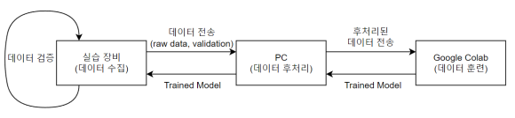

# 시작하기
AutoCar3의 기본 제어 방법을 익혔다면 이제 Pop 라이브러리에 포함된 인공지능 기능을 이용해 트랙을 자율주행하는 방법을 소개합니다.
본 실습을 위해서는 다음과 같이 구글 계정이 추가로 필요합니다. 
- 구글 계정
  - AutoCar3에서 수집한 트랙 데이터셋은 PC에서 라벨링한 후 구글 클라우드 서비스 중 하나인 코랩을 통해 학습 진행
  - PC와 구글 코랩 사이 파일 공유는 구글 드라이브 사용

실습 준비가 완료되었으면 본문 내용을 하나씩 천천히 따라가주시길 바랍니다.

  
*실습 환경 구성*

# 트랙 제작 (30분)
하나의 트랙은 높이 1.4m 이상, 넓이 0.7m 이상의 공간이 필요하므로, 이를 고려해 사전에 충분한 공간을 확보합니다.  
트랙은 실습장비의 주행에 필요한 차선을 포함합니다.

## 트랙 사양
트랙에 대한 기본 사양은 다음과 같습니다.

### 두 차선 폭
- 권장 폭: 32cm  
  - 간격이 더 좁을 경우 선을 밟는 경우가 생길 수 있습니다.  
  - 간격이 더 넓을 경우 카메라의 차선 인지 정확도가 떨어질 수 있습니다.  


### 차선 굵기
- 권장 굵기: 2cm  
  - 굵기가 더 얇을 경우 카메라의 차선 인지 정확도가 떨어질 수 있습니다.  


### 차선 곡률
- 권장 곡률: 3.125m^(-1) (차선 반경의 반지름 0.64m)  
  - 곡률이 더 클 경우 차선을 이탈할 수 있습니다.  
  - 차선 폭을 고려해야 합니다.  


### 기타 고려 사항
- 다른 트랙과의 간격은 최소 1m로 합니다.
- 바닥과 차선의 색이 서로 대비되는 것을 권장합니다. (보색 관계의 색)
- 트랙 주변은 최대한 정돈하여 사용하는 것을 권장합니다.

## 제작
타원형 트랙 제작을 기준으로 다음과 같이 진행합니다.

### 기준 차선 잡기
테이프로 먼저 직선 차선의 기준선을 잡습니다.  


### 반대편 차선 잡기
다음은 두 차선폭에 맞춰 테이프를 짧게 잘라 반대편 차선에 마킹해 둡니다.


### 곡선 트랙 마킹 잡기
곡선 트랙을 잡을 때는 실 또는 줄자와 연필을 이용해 마킹할 곡선을 미리 그려두는 것이 좋습니다.  
역시 테이프를 짧게 잘라 적당한 간격으로 마킹해 둡니다.


### 마킹 따라 테이핑하기
트랙의 전체 윤각이 잡히면 마킹한 곳을 따라 전체를 테이핑합니다.  


### 트랙 완성
완성된 트랙은 다음과 같습니다.

  

<br>

# 데이터 수집과 후처리 
수집할 데이터는 AutoCar3의 카메라로 트랙 주행 과정을 저장한 수 많은 사진들입니다. 
따라서 트랙 위에 AutoCar3를 올려 놓고 수동으로 조작하면서 카메라를 통해 트랙 데이터를 수집합니다.  

> 2023년 8월 이전에 배포된 pop 라이브러리를 사용하고 있다면 Pilot.py의 Data_Collector 클래스 패치 필요  
> 패치 파일을 AutoCar3에 다운로드한 후 진행
  ```sh
  cd ~/Downloads
  wget https://raw.githubusercontent.com/PlanXStudio/openlab/main/Pilot_patch.sh
  sudo chmod +x Pilot_patch.sh
  ./Pilot_patch.sh
  rm Pilot_patch.sh
  cd -
  ```

## 데이터 수집
데이터 수집은 Pop 라이브리의 **Data_Collector** 클래스를 사용합니다.
이 클래스로 데이터를 수집할 때 GUI는 **IPyWidgets**을 사용하므로 주피터 노트북 환경이 필요합니다.   

### 데이터 수집 실행
VSCode로 AutoCar3에 원격 접속한 후 다음과 같이 진행합니다.
- **/home/soda/Project/python**을 작업공간으로 선택합니다.
- 새 하위 폴더로 **track**를 만듦니다.
- 이 곳에 새 파일로 **data_collector.ipynb**를 만듦니다. 
- 아래 실행 결과를 참조해 3개의 셀에 다음 코드를 입력한 후 실행합니다.  
  ```python
  from pop import Pilot, Camera

  cam = Camera(300,300)
  dc = Pilot.Data_Collector("Track_Follow", cam)

  dc.show()
  ```

실행 결과는 다음과 같습니다.  


VSCode에서 데이터 수집 코드를 실행하는데 문제가 발생하면 다음과 같이 웹브라이저를 사용합니다.  
- 웹 브라우저를 실행합니다. 크롬 또는 엣지를 권장합니다.
- URL은 AutoCar3 주소와 8888 포트 번호입니다. 
  - 예: http://192.168.101.101:8888
- 처음 주피터랩에 접속하면 패스워드를 물어보는데 **soda**를 입력합니다.
- 런처에서 Python3 선택 후 새 파일이 만들어지면 데이터 수집 코드를 실행합니다.

### 주행 데이터 수집
AutoCar3를 앞서 만든 트랙 위에 올려 놓고 화면에 표시된 조이스틱을 활용하여 먼저 주행 연습을 수행합니다.
어느 정도 익숙해져 수집할 준비가 되면 다음과 같이 주행 데이터를 수집합니다.
- **Auto Collect** 버튼 클릭하여 자동 수집을 활성화합니다 
  - 자동 저장 활성화시 어두운 붉은색 혹은 초록색으로 변합니다.
- 조이스틱을 활용하여 트랙을 주행하며 데이터 수집합니다 
  - 최대한 트랙을 따라가되 트랙을 나가도 손으로 차량을 들어 트랙안으로 옮기지 않습니다.
- 2~3회 반복하면 더 많은 데이터를 수집할 수 있습니다.
- 데이터 수집이 끝나면 다시 **Auto Collect** 버튼 클릭하여 자동 수집을 비활성화합니다 
- 현재 폴더에서 다음 명령어를 실행해 수집한 데이터들을 압축합니다
  ``` python
  !zip -r track_data.zip ./track_dataset
  ```

압축이 완료되면 다음과 같이 track_data.zip 파일을 확인할 수 있습니다.


## 데이터 후처리
수집한 데이터를 PC로 옮긴 후 인공지능이 학습과정에서 정답으로 인식할 레이블을 작성합니다.

다음과 같이 데이터 후처리를 준비합니다.
- **track_dataset.zip**을 우클릭하여 pc에 다운로드합니다.
- 압축을 풀어 생성된 track_dataset 폴더와 제공되는 **Image_Classifier.exe**를 같은 위치로 옮깁니다.
- **Image_Classifier.exe**을 실행합니다.

실행 결과는 다음과 같습니다. (실행 시 약 15초 정도 소요)


### 레이블링
**Image_Classifier.exe**가 실행되면 다음과 같이 레이블링을 수행합니다.
- 차선과 초록색 점선이 만나는 2점을 클릭합니다
- 2개의 점이 정상적으로 생성되었으면 청록색의 점으로 그 결과 위치를 확인할 수 있습니다.
- 차선이 이미지 밖으로 나가 점선과 교차하지 않는다면 이미지 끝을 선택합니다.
- 레이블링 된 데이터들은 new_dataset 폴더에 저장됩니다.


# 데이터 훈련 & 결과 확인

데이터를 훈련하기 전, 위에서 만든 new_dataset 폴더를 우클릭하여 압축합니다.

**※ Google 계정이 없으신 분은 다음 과정을 진입하기 전에 Google 계정을 생성해주세요.**

## Google Drive 업로드

Google에 로그인 한 후 <https://drive.google.com/drive/my-drive> 링크로 접속합니다.
위에서 압축한 **new_dataset.zip** 파일을 다음과 같이 웹페이지 위로 드래그하면 파일을 놓아 업로드를 할지 물어봅니다.
<br>

위와 같은 화면이 확인되면 파일을 놓아 MyDrive에 new_dataset.zip을 업로드합니다.

## Google Colab 환경에서 모델 훈련

업로드가 완료됬으면 다음의 링크로 들어가 앞에서 수집한 데이터로 자율주행 모델을 만듭니다
<https://colab.research.google.com/drive/1Tw9scMUOqHO0KAgDhwmxJN5YDhYobWod?usp=sharing>

접속이 완료되었으면 다음과 같이 Drive로 복사를 눌러 Colab 파일을 Mydrive로 가져와서 사용을 하거나 viewer 권한으로 모델을 훈련시킵니다.


MyDrive로 가져왔을 경우 Google Drive 페이지에서 Track_Follow_Model.ipynb의 사본을 더블 클릭하여 실행한 후 다음 단계를 따라갑니다.


모델을 훈련하기 위한 모든 준비가 완료되었으면 각 셀에서 <Shift+Enter>를 입력하여 셀을 실행합니다. 모든 셀의 실행이 완료되면 다음과 같이 나만의 모델이 완성된 것을 확인할 수 있습니다.

  

**※ 모델 훈련 시 주의 사항**

* **new_dataset.zip**를 찾지 못 한다고 나오면 **new_dataset.zip**이 MyDrive에 제대로 업로드 됬는지 확인하거나 다음과 같이 새로고침을 누릅니다.  
  
  
* 훈련 속도가 너무 느릴 시, 런타임 유형이 gpu인지 확인합니다.  


## 모델 확인하기

**Track_model_S.h5** 를 우클릭하여 pc에 다운로드 받은 후 AutoCar3의 작업공간에 업로드합니다.


업로드가 완료되었으면 다음과 같이 코드를 입력하고 실행하여 모델을 검증합니다.

``` python
  from pop import Pilot, AI, Camera

  tf = AI.Track_Follow_TF(cam)
  tf.load_model("Track_Model_S.h5")
  tf.run_TF(cam.value)
  tf.show()
```

tf.run의 x 값과 tf.show()의 이미지를 비교하여 tf.run의 x 값이 타당한지 확인합니다. tf.run의 x 값이 양수이면 조향이 오른쪽이고 음수이면 왼쪽입니다. 또한 그 값이 클수록 조향각도 커집니다.


tf.run 값이 타당하다고 생각되면 다음 셀에 다음과 같은 명령어를 입력하고 실행하여 트랙 자율주행을 시작합니다.

``` python
  car = Pilot.AutoCar()
  car.forward(35)

  while True:
      img1 = cam.value
      
      try:
          ret_tf = tf.run_TF(img1)
          
          steer = (ret_tf["x"]) * 0.75
          steer = max(-1, min(1, steer))
          car.steering = steer
      except KeyboardInterrupt:
          car.stop()
          car.steering = 0 
          break
```

**※ 모델 검증 시 주의 사항**

* 주행이 특정 구간에서 불안정할 시, 해당 구간의 데이터가 부족한 것이므로 해당 구간의 데이터를 더 수집한 후 기존의 데이터에 추가하여 모델을 다시 훈련시킵니다.
* 모델이 안정적이지 못한 주행을 보일 경우 차량의 속도를 줄이거나 데이터를 추가로 수집해주십시요.
* 어느 정도 데이터의 경향이 파악되시는 분은 steer의 값을 수정하여 안정적인 주행을 유도할 수도 있습니다.
