# 시작하기
본 실습은 오픈소스 기반 통합개발환경인 VSCode를 PC에 이동 가능한 포터블 모드로 설치한 후 리눅스가 설치된 실습장치에 원격 접속하는 과정을 소개합니다.  
이를 위해 다음과 같이 인터넷에 연결된 PC와 공유기, 전원 멀티탭 및 실습장치로 AutoCar3가 필요합니다.

- PC 
  - 윈도우 PC로 VSCode와 SSH 확장을 통해 AutoCar3에 원격 접속
  - 이동성을 고려해 Wi-Fi가 내장된 노트북 권장
    - 이더넷 어댑터는 AutoCar3에 포함된 USB 이더넷 어댑터 사용
- 공유기
  - PC와 AutoCar3를 Wi-Fi로 연결
  - "인원수 * 2(PC, AutoCar3)" 만큼 동시 접속 가능한 고성능 공유 필요
- 전원 멀티탭
  - "인원수 * 2(PC, AutoCar3)" 만큼 연결할 전원 멀티탭 필요
- AutoCar3
  - 우분투 리눅스로 운영되며 GPU 가속을 지원하는 인공지능 자율주행차 실습장치  
    - 이더넷, Wi-Fi 등 TCP/IP 네트워크(인터넷) 지원

실습 준비가 완료되었으면 본문 내용을 하나씩 천천히 따라가길 바랍니다.

<br>

# VSCode 통합 개발 환경 
VSCode는 마이크로소프트에서 개발한 오픈소스 기반 확장 가능한 편집기입니다.  
인터넷 저장소를 통해 원하는 확장을 설치하면 통합 개발 환경으로 사용할 수 있습니다.  
단, 컴파일러나 인터프리터는 외부에 설치된 것을 사용합니다.
> 통합 개발 환경(IDE: Integrated Development Environment)
>> 코딩, 번역, 실행, 디버그, 테스트 등 프로그램 개발에 관련된 모든 작업을 하나의 프로그램에서 처리하는 소프트웨어

## VSCode 포터블 설치 
VSCode는 다운받은 설치 프로그램을 실행해 PC에 설치하거나, 단순히 압축 파일을 다운받은 후 이를 풀어 사용합니다.  
두 번째 방법을 포터블 모드라고 부르는데, 파일시스템에 대한 의존성이 없어 전문 개발자들이 선호하는 방식입니다.
> 첫 번째 방법: 전용 설치 프로그램이 하나의 폴더와 숨겨진 다른 경로의 폴더에 파일들을 배치  
> 두 번째 방법: 압축을 풀면 하나의 폴더 안에 관련 폴더와 파일들이 모두 들어 있음

웹 브라우저를 실행한 후 다음 주소로 이동합니다.

```sh
https://code.visualstudio.com/
```

페이지 가장 아래에서 플랫폼 별 압축 파일을 선택해 다운로드합니다.   
우리는 윈도우 PC를 사용하므로 .zip 항목의 x64 링크를 누릅니다. 
> Mac과 리눅스도 절차는 같음

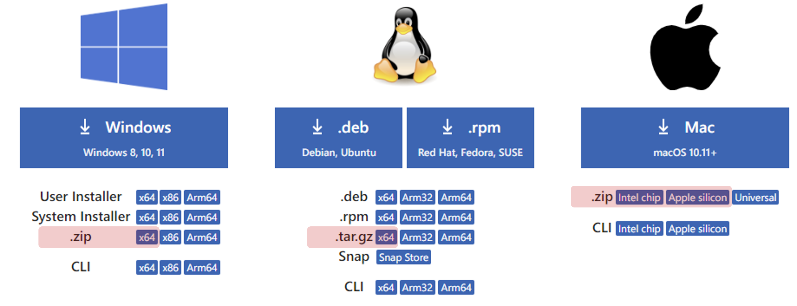 <br><br>


다운로드가 완료되면 원하는 위치에 압축을 푸는데, 탐색기에서 접근하기 쉽도록 C:\ 경로를 권장합니다.  
> 작업을 완료한 후에는 폴더 전체를 다른 경로 또는 외장 드라이브 등으로 이동 가능

압축을 풀면 폴더 이름이 길기 때문에 **VSCode** ① (이하 VSCode 루트)로 바꾸고 그 아래 **data** ② 란 이름의 빈 폴더를 만듭니다.

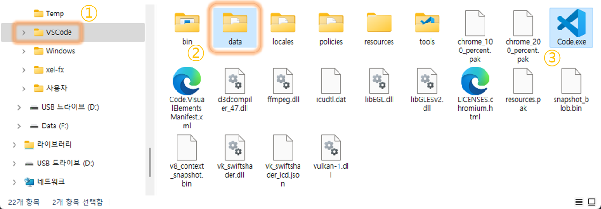

실행은 탐색기에서 **VSCode 루트**의 **Code.exe** ③ 또는 하위 **bin\code.cmd** 중 하나를 더블 클릭합니다.


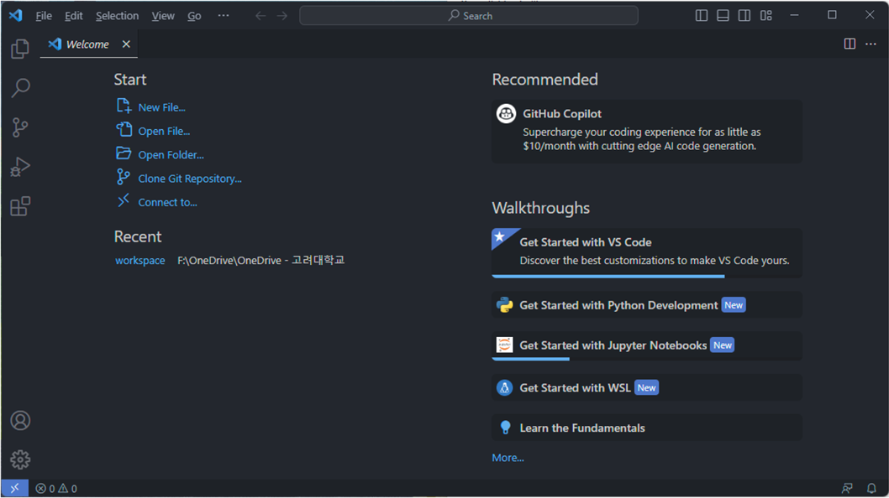

색상 변경은 다음과 같이 **Manage** ① 의 **Themes** ② 를 이용합니다.
- **Color Theme** ③ 를 선택합니다.
- 위쪽에 **Color Theme** 목록 ④ 이 표시되면 밝은 또는 어두운 테마 중 하나를 선택합니다.
- 만약 새로운 테마를 원하면 첫 번째 항목의 **Browse Additional Color Themes** ⑤ 를 통해 추가합니다.
  > 컬러 테마 추가는 다음에 소개하는 **Extensions**를 사용합니다.  

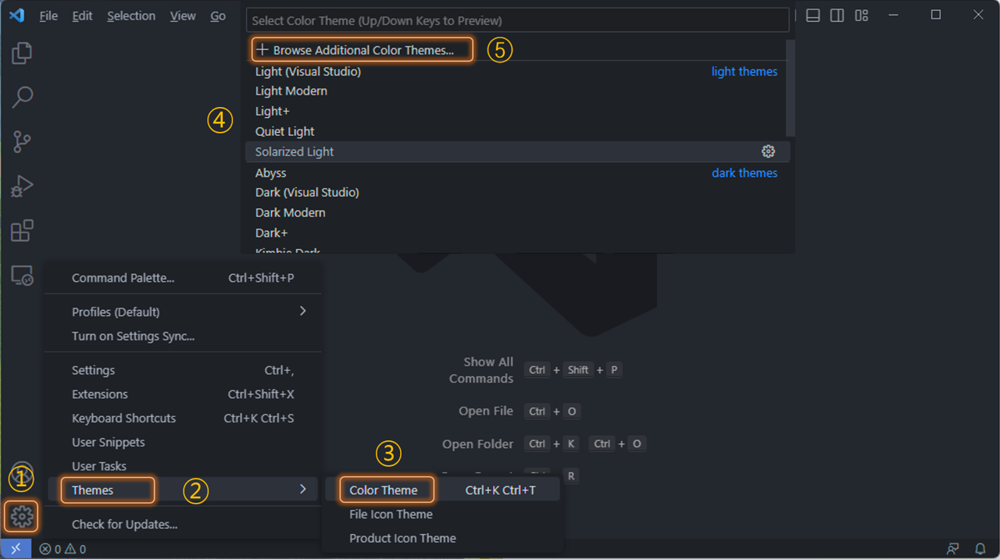

## 확장 설치
VSCode 자체는 가벼운 편집기지만 Microsoft를 비롯해 전세계 많은 개발자들이 배포하는 수많은 무료 확장이 있으므로 이중 원하는 확장을 선택해 설치하면 자신만의 통합개발환경으로 꾸밀 수 있습니다.

Microsoft에서 배포하는 **Remote SSH** 확장은 SSH를 통해 PC를 AutoCar3의 터미널로 만듦며 이를 원격 접속이라 합니다.  
터미널은 키보드와 모니터의 입출력을 통신을 통해 다른 곳에 있는 컴퓨터에 연결해주는 장치나 소프트웨어입니다.

> SSH(Secure Shell)는 표준 인터넷 서비스 중 하나로 암호화된 터미널 기능 제공  
> 서버-클라이언트 구조로 리눅스와 Mac, 윈도우 11은 클라이언트 프로그램(ssh)이 기본 설치되어 있음

VSCode를 실행하고 왼쪽 사이드바에서 **Extensions** ① 를 선택한 후 다음 순서대로 확장을 설치합니다.
- 검색 상자에  **Remote SSH** ② 를 입력합니다.
- 목록에 관련 패키지들이 표시되면 Microsoft에서 배포하는 **Remote - SSH** ③을 선택합니다.
- 오른쪽 편집 영역에 열린 소개 페이지에서 **Install** ④ 을 선택하면 설치를 시작합니다.
  - 목록의 **Remote - SSH** 항목에 표시된 **Install**을 눌러 설치해도 됩니다.
- 설치가 끝나면 사이드바에 새로운 **Remote Explorer** ⑤ 항목이 추가됩니다.

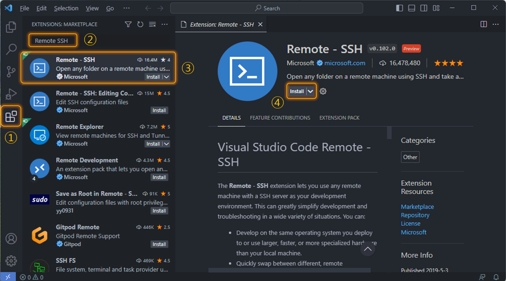


개발자들에게 인기 있는 컬러 테마 중 하나인 binaryify의 **One Dark Pro**를 추가해 봅니다.
- 검색 상자에  **One Dark Pro** ① 를 입력합니다.
- 목록에서 배포자가 **binaryify** ② 인 항목을 선택합니다.
- 열린 페이지에서 **Install** ③ 을 선택해 설치를 시작합니다.
- 설치가 끝나면 컬러 테마 선택 목록이 표시되는데 이곳에서 **One Dark Pro** ④ 를 선택합니다.
  > 앞서 소개한 **Manage > Themes > Color Theme** 또는 단축키로 **\<Ctrl\>+K+T**를 통해 변경 가능합니다.

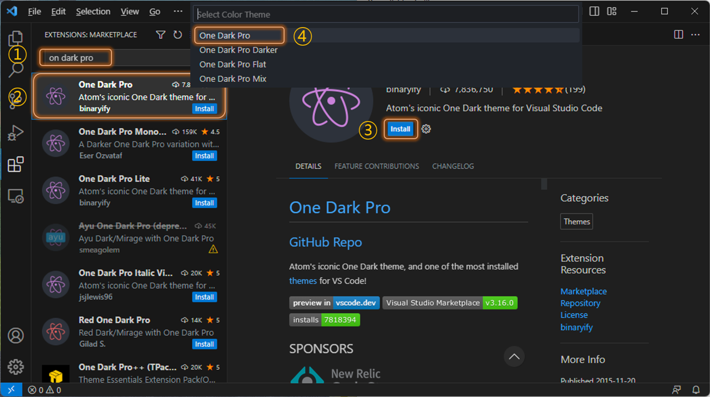

<br>

# PC와 AutoCar3 연결 
PC와 AutoCar3는 TCP/IP 네트워크를 통해 서로 통신하며, 처음 시작할 때는 이더넷 케이블을 사용합니다.

## AutoCar3 구조
AutoCar3에는 바퀴나, 모터, 프레임과 같은 기구물 외에 많은 전자장치가 포함되어 있습니다.  
- 전원부: 동작에 필요한 전원을 안정적으로 공급
- 서브 모듈: 각종 센서와 액추에이터를 직접 제어
  - DC모터, 서보 모터, 부저, LED, 초음파 센서, IMU 센서, 빛 센서 제어
  - ST마이크로일렉트로닉스의 고성능 MCU(STM32F4) 사용. FreeRTOS로 운영
- 메인 모듈: 서브 모듈에 제어 명령을 내리고 인공지능 학습 및 예측 실행
  - 카메라, 오디오, 커넥티비티(이더넷, Wi-Fi, 블루투스), 라이다(옵션), 터치 스크린(옵션) 제어
  - 엔비디아의 Jetson Nano(또는 Xavier NX) 사용. 우분투 리눅스로 운영
- 모듈간 통신: 서브 모듈과 메인 모듈은 안정적인 CAN을 통해 연결됨

> CAN(Controller Area Network)  
> 여러 컨트롤러 사이 간편하게 데이터를 교환하는 버스 시스템으로 잡음에 강해 자동차에서 주로 사용

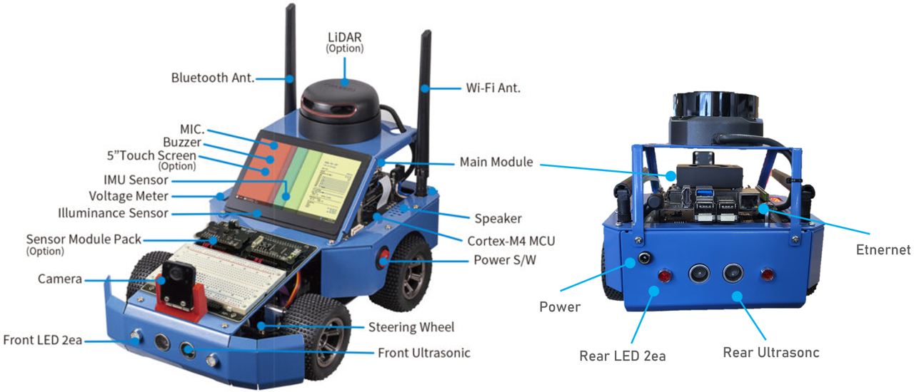

*AutoCar3 구조*<br>

제공되는 USB 이더넷 어댑터를 PC에 연결 ① 한 후 이더넷 케이블로 양쪽 이더넷 포트를 연결 ②,③ 합니다.  
> PC가 랩탑이라면 이더넷 포트가 없는 경우가 많고, 데스크탑이라면 인터넷에 연결되어 있으므로 별도의 USB 타입 이더넷 어댑터 제공 

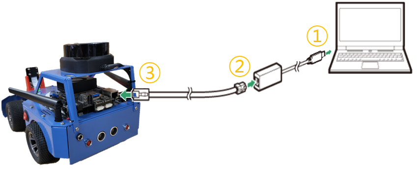


## AutoCar3 부팅
처음 시작하거나 내장된 배터리 전원이 충분치 않으면 전원 어댑터에 콘센트 연결선 ① 을 꼽고 콘센트에 연결 ② 합니다.  
반대쪽을 AutoCar3의 전원 포트 ③ 에 연결한 후 전원 스위치를 ON ④ 시킵니다.

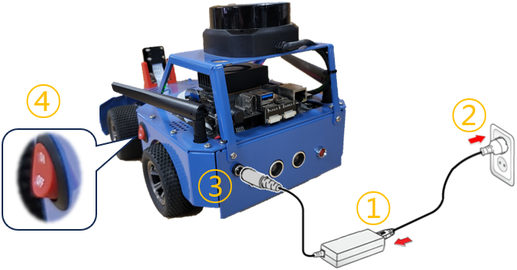

AutoCar3에 전원이 공급되면 메인 모듈은 범용 리눅스 운영체제를, 서브 모듈은 FreeRTOS로 구현한 펌웨어를 시작합니다.  
전원이 공급된 후 약 5초 정도 지나면 짧은 부저 음이 울리면서 CAN을 통해 다음과 같이 서브 모듈의 기능을 사용할 수 있게 됩니다.
- IMU 센서값(가속도, 각속도, 지자기, 오일러, 쿼터니언) 읽기
- 앞/뒤 초음파 센서값(장애물 거리) 읽기
- 빛 센서값 읽기
- 앞/뒤 LED 켜고 끄기
- 뒤 좌/우 DC 모터 구동
- 앞 서보 모터(스티어링) 구동

메인 모듈의 리눅스는 약 1분정도 더 기다려야 사용할 수 있으며 주요 기능은 다음과 같습니다.
> 리눅스는 윈도우처럼 커널을 비롯해 많은 디바이스 드라이버의 초기화가 필요해 더 많은 시간이 걸립니다.
- **우분투** 리눅스를 수정해 인공지능 자율주행 교육에 최적화한 환경 제공
- 엔비디아의 임베디드 GPU 개발환경인 **JetPack(CUDA, CuDNN, TensorRT, Tensorflow, Pytorch 등)** 포함
- 좀 더 쉽게 AutoCar3를 제어하고 간편하게 인공지능 기술을 자율주행에 적용하는 **Pop 라이브러리** 포함

## AutoCar3 전원
AutoCar3의 전자 장치는 외부 전원과 배터리로 움직이며, 외부 전원을 연결하면 배터리 충전과 전자 장치의 전원 공급이 동시에 이뤄집니다.  

- 외부 전원
  - 어댑터로 220V AC를 19V DC로 변환해 AutoCar3에 공급
  - AutoCar3의 전원부는 이를 각 부품이 요구하는 전압으로 변환해 공급
    - 충전 회로에는 배터리 충전 전압인 16.8V로 변환해 전달
- 배터리
  - 외부 전원을 연결하지 않으면 배터리 전원 사용
    - 외부 전원을 연결하면 배터리는 충전 상태로 바뀌고, 외부 전원 사용
  - 충전 전압, 충전 종지 전압: 16.8V 
  - 정격 전압: 14.8V (정격 용량 7000mA)
  - 방전 종지 전압: 10.6V
> 충전 전압은 배터리를 충전하는데 필요한 전압이고 충전 종지 전압은 배터리가 완충 되었을 때 전압입니다.  
> 정격 전압은 배터리를 처음 생산해 출고할 때 전압으로 AutoCar3는 이 값보다 작으면 배터리 충전을 요구합니다.   
> 방전 종지 전압은 충전에 필요한 최소 전압으로 이보다 작으면 더 이상 충전되지 않으므로 주의해야 합니다.


AutoCar3에는 사용자가 현재 전압을 확인할 수 있도록 외부 전원 ① 또는 배터리 전원 ② 에 대한 전압 상태를 표시합니다.
> AutoCar3에 연결된 어댑터 및 배터리 출고값에 따라 0.1V ~ 0.3 정도의 편차가 있습니다.

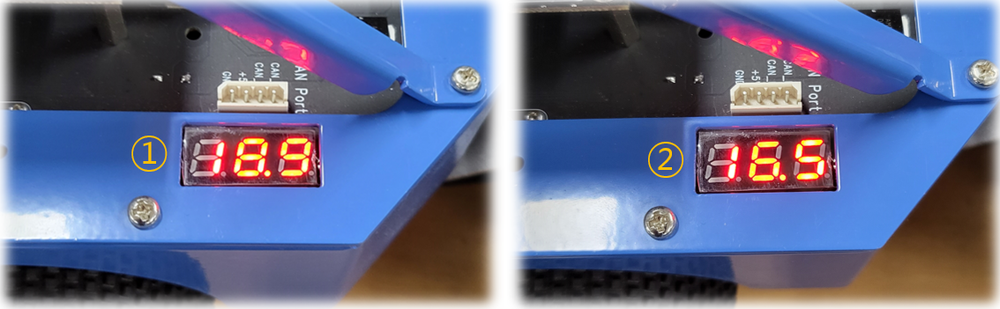

### 배터리 방전 주의 
배터리를 사용할 때 정격 전압 이하가 되면 방전 경고음이 울립니다.  
이때부터는 가급적 AutoCar3의 사용을 멈추고 외부 전원을 연결해 배터리를 충전합니다.

- 전원 스위치를 OFF 시키고, 전원 어댑터를 AutoCar3에 연결한 후 2시간 이상 충전할 것  
- 완충까지는 최대 5시간 소요  

## PC 네트워크 설정
이더넷 케이블로 연결된 PC와 AutoCar3가 서로 통신하려면 PC의 이더넷 어댑터에 대한 TCP/IPv4 네트워크 설정이 필요합니다.  
AutoCar3는 다음과 같이 사전에 네트워크 주소가 설정되어 있습니다.
- IP주소: 192.168.101.101
- 서브넷 마스크: 255.255.255.0

따라서 PC의 네트워크 설정은 다음과 같아야 합니다. (단, IP주소는 변경 가능)
- IP주소: 192.168.101.120
- 서브넷 마스크: 255.255.255.0

> 마스크 비트의 일종인 서브넷 마스크는 IP주소와 비트 AND 연산한 결과를 로컬과 리모트 네트워크 구분에 사용합니다.  
>> 로컬 네트워크는 직접, 리모트 네트워크는 게이트웨이를 경유해 AutoCar3에 데이터를 전송합니다.   
>> 호스트 주소는 로컬 네트워크에서 유일해야 합니다.    

서브넷 마스트 255.255.255.0은 IP주소 앞 3자리를 네트워크 그룹으로, 나머지 1자리를 고유한 호스트 주소로 구분합니다.  
- 네트워크 그룹: 192.168.101.0
- 호스트 주소: PC는 120, AutoCar3는 101
  - 0, 255는 예약되어 있고, 1(또는 254)은 로컬에서 리모트 네트워크를 연결하는 게이트웨이의 IP주소로 사용합니다.


PC에 연결된 USB 이더넷 어댑터의 네트워크 설정은 다음과 같습니다.  
- 실행창(윈도우+R)에서 **ncpa.cpl** ① 명령으로 제어판의 네트워크 설정 애플릿을 실행합니다.
- AutoCar3와 연결된 USB 이더넷 어댑터 ② 의 속성 ③ 을 선택합니다.
- 인터넷 프로토콜 버전 4(TCP/IPv4) ④ 를 선택한 후 다음 IP주소 사용 ⑤ 으로 IP주소와 서브넷 마스크 ⑥ 를 입력합니다.

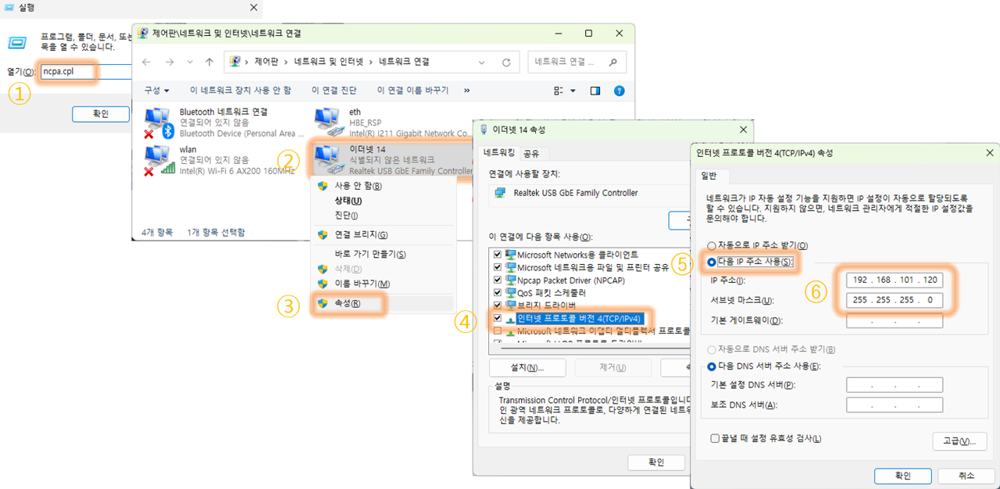

PC 네트워크 설정이 끝나면 통신이 가능한지 확인하기 위해 명령 프롬프트를 실행한 후 **ping** 명령으로 AutoCar3의 응답을 확인합니다.

```sh
ping 192.168.101.101
```

통신이 가능하다면 결과는 다음과 같아야 합니다.

```
Ping 192.168.101.101 32바이트 데이터 사용:
192.168.101.101의 응답: 바이트=32 시간<1ms TTL=64
192.168.101.101의 응답: 바이트=32 시간<1ms TTL=64
192.168.101.101의 응답: 바이트=32 시간<1ms TTL=64
192.168.101.101의 응답: 바이트=32 시간<1ms TTL=64

192.168.101.101에 대한 Ping 통계:
    패킷: 보냄 = 4, 받음 = 4, 손실 = 0 (0% 손실),
왕복 시간(밀리초):
    최소 = 0ms, 최대 = 0ms, 평균 = 0ms
```

결과가 다르면 처음부터 다시 시도해 보세요. 
> PC의 USB 포트에 USB 이더넷 어댑터가 잘 꼽혀 있는지 확인합니다.  
> 양쪽 이더넷 포트에 이더넷 케이블이 잘 꼽혀 있는지 확인합니다.  
> PC의 USB 이더넷 어댑터에 네트워크 설정이 맞는지 확인합니다.
> 간혹 이더넷 케이블 내부가 끊어진 경우가 있습니다. 다른 케이블로 시도해 봅니다.  

<br>

# AutoCar3 원격 접속 
PC와 AutoCar3가 통신 가능한 상태라면 PC에 설치한 VSCode를 통해 AutoCar3에 원격 접속할 수 있습니다.

## 연결 정보 만들기
VSCode로 AutoCar3에 원격 접속하려면 AutoCar3의 IP주소와 계정 정보(IP, 패스워드)가 필요합니다.  
연결할 때마다 매번 입력하는 것보다 연결 정보 파일을 만든 후 이를 이용하면 편리합니다.  

AutoCar3의 기본 계정 정보는 다음과 같습니다.    
- ID: soda  
- 패스워드: soda  

VSCode를 실행하고 왼쪽 사이드바에서 **Remote Explorer** ① 를 선택한 후 다음 순서대로 AutoCar3 연결 정보를 만듦니다.
- SSH 항목의 **Open SSH Config File** ② 을 누릅니다.  
- 목록이 표시되면 **C:\User\로그인_이름\.ssh\config** ③ 을 선택합니다.
- 파일이 열리면 AutoCar3 연결에 필요한 정보 ④ 를 입력합니다. 
  - Host는 연결 이름이며, HostName은 AutoCar3의 IP 주소, User는 AutoCar3의 계정 이름입니다.
- 연결 정보 입력이 끝나면 **<Ctrl>+s** ⑤ 를 눌러 파일을 저장합니다.
  - C:/User/<로그인 계정 이름>/.ssh/config에 저장
- REMOTES 항목의 **Reflash** ⑥ 를 누르면 SSH 항목 아래 설정한 연결 이름이 표시됩니다.

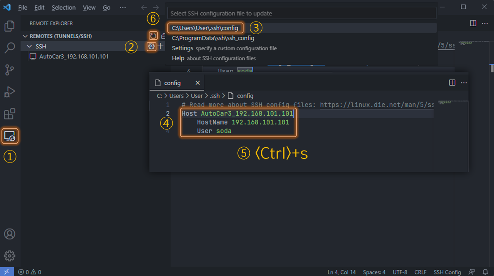

## 원격 접속
처음 AutoCar3에 원격 접속할 때는 면 몇 가지 절차를 더 진행하는데, PC는 반드시 인터넷에 연결되어 있어야 합니다.  
VSCode는 AutoCar3에서 실행되는 **VS Code Server**가 없으면 자동으로 인터넷 저장소에서 이를 다운받아 설치합니다.  

AutoCar3 접속은 사이드바의 **Remote Explorer**에서 다음과 같이 진행합니다.
> 각 단계를 진행할 때 시간을 너무 지연하면 연결이 실패합니다.

- 앞서 만든 연결 이름(AutoCar3_192.168.101.101)에서 **Connect in Current Window** ① 를 선택합니다.
- 처음 연결이라면 플랫폼 선택창이 표시되는데, **Linux** ② 를 선택합니다.
- 처음 연결이라면 암호화 통신에 필요한 키 교환 창이 표시되는데, **Continue** ③ 를 선택합니다.
  - 현재 AutoCar3 연결에 대한 키 정보는 C:/User/<로그인 계정 이름>/.ssh/known_hosts에 저장됩니다.
- AutoCar3 패스워드 입력창이 표시되면 **soda** ④ 를 입력합니다.
  - 연결 정보 파일에는 보안을 위해 AutoCar3 soda 계정의 패스워드가 저장되어 있지 않습니다.
- 처음 연결했다면 자동으로 **VS Code Server**를 다운로드한 후 설치 ⑤ 합니다. 
- 연결 절차가 성공적으로 끝나면 상태 표시줄에 연결 이름 ⑥ 이 표시됩니다. 

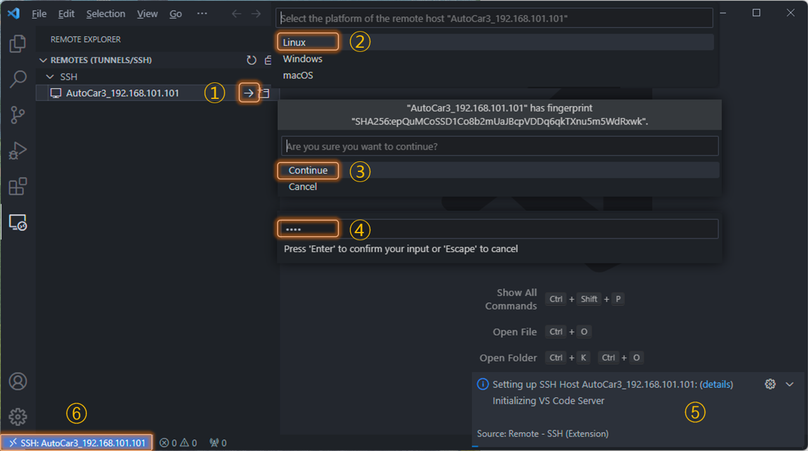


## 문제 해결
연결 실패 창이 표시되면 **Close Remote**를 선택한 후 처음부터 다시 시도합니다.

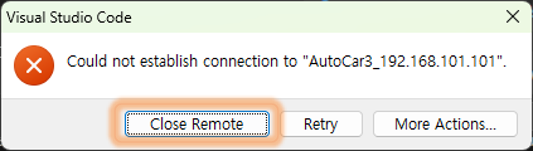

문제가 계속되면 다음 사항을 확인합니다.
- 명령 프롬프트에서 **ping 192.168.101.101** 명령을 실행하면 AutoCar3가 정상적으로 응답하는가?
  - PC가 인터넷에 연결되어 있는가?
  - PC의 USB 이더넷 어댑터의 네트워크 설정이 맞는가?
  - 앞서 만든 AutoCar3의 연결 정보가 맞느가?
  - AutoCar3가 켜져 있는가? 켜져 있다면 메인 모듈이 시작될 만큼 충분한 시간이 훌렀는가?

그래도 문제가 해결되지 않으면 다음 내용을 실행한 후 다시 시도합니다.
- VSCode를 종료한 후 탐색기를 통해 VSCode 루트의 data 폴더 아래 만들어진 **user-data** 폴더 삭제
  - user-data 폴더에는 VSCode의 실행 상태(캐시 데이터) 및 사용자 설정 정보가 저장됩니다.
- C:/User/<로그인 계정 이름>/.ssh 폴더 안에 들어있는 **known_hosts**, **known_hosts.old** 파일 삭제
  - 앞서 진행한 접속 절차에 따라 해당 파일이 없음 수도 있음

# AutoCar3 설정
AutoCar3의 메인 모듈은 우분투 리눅스로 운영되며 미리 기본적인 설정이 되어 있습니다.  

## Wi-Fi로 인터넷 연결
AutoCar3는 이더넷과 Wi-Fi를 지원합니다. 이더넷은 PC와 연결되어 있으므로 인터넷 연결은 Wi-Fi를 권장합니다.  
또한 주행 실습은 대부분 배터리 전원을 사용하므로 공유기가 준비되어 있다면 PC와도 Wi-Fi로 연결할 필요가 있습니다.   
AutoCar3를 Wi-Fi 공유기에 연결하면 VSCode가 AutoCar3에 원격 접속되어 있어야 하고, 관리자에게 Wi-Fi 공유기 이름(SSID)과 패스워드를 확인해야 합니다.  

사전 준비가 끝나면 다음과 같이 AutoCar3의 리눅스 쉘을 실행합니다.
> 쉘은 사용자의 표준 입력을 해석해 운영체제의 핵심 영역인 커널로 전달하고, 응답을 표준 출력으로 사용자에게 돌려줍니다.  
>> 표준 입력은 키보드, 표준 출력은 모니터의 텍스트 모드 영역을 가리키며, 이를 명령 라인 인터페이스(CLI)라 합니다.  
>> AutoCar3의 기본 쉘은 현대적인 zsh이며, oh-my-zsh이 함께 설정되어 있습니다.

- VSCode 메뉴의 **Terminal** ① 에서 **New Terminal** ② 을 선택합니다.
- 터미널창 ③ 이 표시되면, 리눅스 명령을 실행할 수 있습니다.
- 터미널창에 포함된 **Maximize Panel Size** ④ 을 선택해 창 크기를 최대화합니다.

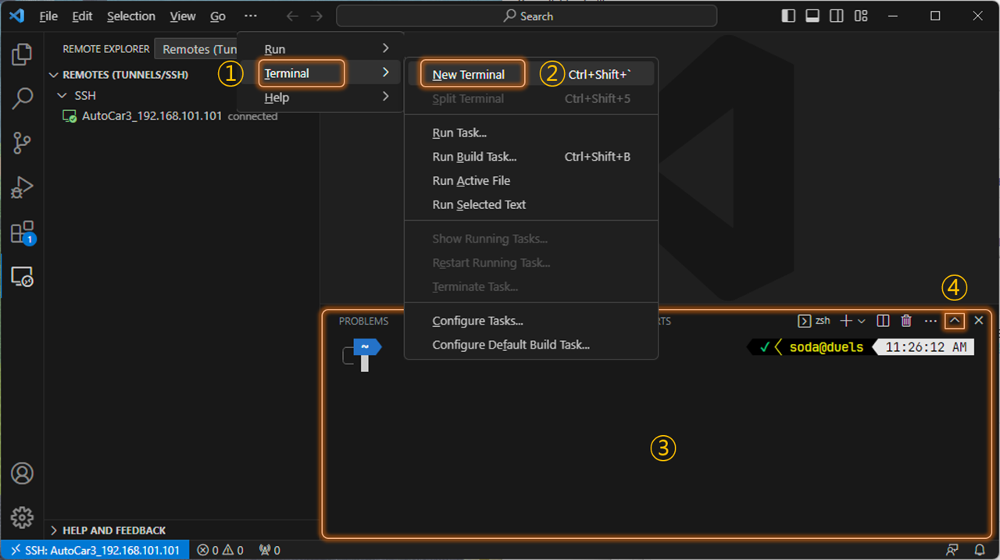


네트워크 관리자인 nmcli 명령을 이용해 AutoCar3를 다음과 같이 해당 공유기에 연결합니다.
> sudo는 root(관리자) 권한으로 해당 명령을 실행할 때 사용합니다.  
>> 리눅스는 시스템 설정을 변경하려면 root 권한이 필요합니다.  
>> 처음 sudo가 포함된 명령을 실행하면 패스워드를 요구하는데, soda 계정의 패스워드인 soda를 입력합니다.  

- AutoCar3의 Wi-Fi 어댑터 이름은 **wlan0**이며, **device** 옵션으로 확인합니다.
  ```sh 
  nmcli device
  ```
- 연결 가능한 Wi-Fi 공유기를 찾을 때는 **wifi list** 옵션을 추가합니다.
  ```sh
  nmcli device wifi list
  ```
- **list** 대신 **connect \<이름\>** 및 **password \<패스워드\>** 옵션으로 해당 Wi-Fi 공유기에 연결합니다.
  ```sh
  sudo nmcli device wifi connect HBE_RSP password hanback91!
  ```
  > Wi-Fi 공유기 이름이 HBE_RSP, 패스워드는 hanback91!로 가정. (연결을 완료하는데 약간의 시간 필요)

- 성공적으로 공유기에 연결되면 ping 명령으로 인터넷에 연결되는지 확인합니다.
  ```sh
  ping www.google.co.kr
  ```  

터미널창 크기를 원래 크기로 되돌리면 **Restore Panel Size**를 선택합니다.
 
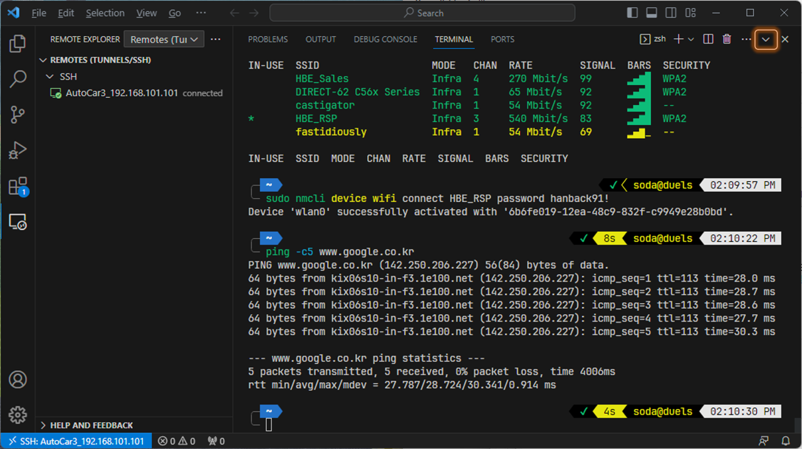


## 기존 패키지를 최신 버전으로 업그레이드
많은 오픈소스 패키지(라이브러리, 응용프로그램 등)들이 미리 설치되어 있지만 시간이 지나면 이들의 업그레이드가 필요합니다.

패키지 관리자인 apt 명령을 이용해 다음과 같이 설치된 패키지들의 최신 버전이 있다면 업그레이드합니다.
- 배포 서버로부터 패키지 목록 업데이트
  ```sh
  sudo apt update
  ```
- 설치된 패키지들을 최신 버전으로 업데이트
  ```sh
  sudo apt -y upgrade
  ```

만약 패키지를 업그레이드할 때 마지막에 다음 오류가 표시되면 무시합니다.  
> Errors were encountered while processing:  
>  nvidia-l4t-bootloader  
> E: Sub-process /usr/bin/dpkg returned an error code (1)  
>> 데비안 패키지와 엔비디아 L4T 패키지 사이 호환성 문제로 사용에는 문제가 없습니다.

## 파이썬 및 주피터 확장 설치
우리의 작업은 새 파이썬 또는 노트북 파일을 만든 후 AutoCar3에 내장된 파이썬 인터프리터나 주피터랩의 파이썬 커널을 통해 이를 실행하는 것입니다.  
이때 VSCode에 파이썬과 주피터 확장을 설치하면 다음과 같은 장점이 있습니다.
- 파이썬 확장
  - 미리 파이썬 구문의 유효성 검사(Linting) 및 필요한 키워드나 함수, 클래스 또는 메소드 추천(InteliSense)
  - 코드 탐색(Navigation) 및 형식 맞춤(Formatting), 구조 변경(Refactoring) 지원
  - 실행 및 실시간 디버깅 지원
- 주피터 확장
  - 셀 단위로 구문을 작성하고 실행하는 주피터 환경 지원
    - 이미지, 멀티미디어 렌더링 지원
    - 간단한 GUI 환경인 Widgets 지원
    - 파이썬 확장 기능 포함
  - 파이썬 코드에서 직접 주피터 노트북처럼 셀 단위로 구분해 실행하는 환경 지원
  
<br>

파이썬 및 주피터 확장은 **Extensions**의 검색 상자을 통해 다음과 같이 설치합니다.
> 현재 VSCode는 AutoCar3에 원격 접속된 상태이므로 확장들은 AutoCar3에 설치됩니다.  
> 앞서 진행한 VSCode 확장 설치를 참조하세요.

- **Python**을 입력한 후 Microsoft에서 배포하는 Python 확장을 설치합니다.
  - 상황에 따른 구문 추천 도우미인 Pylance도 함께 설치됩니다.
- **Jupyter**를 입력한 후 Microsoft에서 배포하는 Jupyter 확장을 설치합니다.
  - Notebook Renderers, Slide Show, Cell Tags, Keymap도 함께 설치됩니다.
    - 단, Keymap은 PC에 설치되어 주피터 노트북의 단축키 정보를 VSCode에 연결합니다.

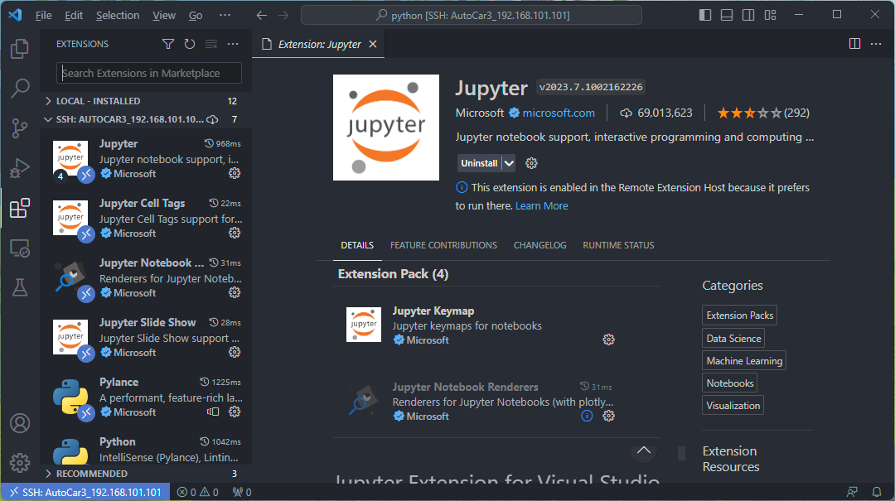


## 작업공간 선택
작업공간(Workspace)는 사용자가 프로젝트를 진행할 때 관련된 여러 소스 코드 파일과 리소스를 한데 모아 놓은 폴더입니다.
파이썬 또는 노트북 파일로 AutoCar3 제어 프로그램을 작성할 때도 먼저 작업공간을 선택해야 합니다.

VSCode에서 AutoCar3의 작업공간을 선택하는 방법은 다음과 같습니다.
- 사이드 바에서 **Explorer** ① 를 실행합니다.
- **Open Filder** ② 를 선택합니다.
- 폴더 선택창이 표시되면 /home/soda/Project/python 폴더 ③ 를 선택합니다.
  - 현재 VSCode는 AutoCar3에 원격 접속된 상태이므로 선택 경로는 AutoCar3의 리눅스 파일시스템 경로입니다.
- 패스워드 입력창이 표시되면 **soda** ④ 를 입력합니다.
- 현재 작업공간에 대한 신뢰성 확인이 표시되면 **체크박스와 Yes 버튼** ⑤ 을 선택합니다.

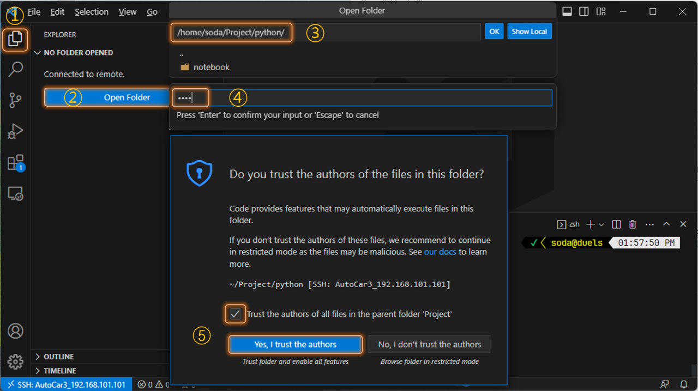


## 작업 파일 만들기
작업공간이 선택되면 파이썬 코드 작성을 위해 새 파일을 만드는데, 작업공간 루트 또는 새로 만든 하위 폴더 모두 가능합니다.  
확장자 **.py**는 파이썬 스크립트를, **.ipynb**는 주피터 노트북 파일을 의미합니다.  

**Explorer**에서 다음과 같이 작업 파일을 만들어 봅니다.
- **New Folder**를 선택한 후 폴더 이름으로 autocar3 ① 를 입력합니다.
- autocar3 폴더가 선택된 상태에서 **New File**을 통해 basic.ipynb ② 와 basic.py ③ 를 차례로 만듦니다. 
- 편집 영역에서 두 번째 만든 basic.py의 탭을 마우스로 선택해 오른쪽 끝에 최대한 가깝게 **끌어서 놓기** 하면 편집창이 분할 ④ 됩니다.
- basic.ipynb 편집창의 첫 번째 셀에 파이썬 구문을 입력하면 자동으로 코드를 추천 ⑤ 합니다.
- basic.py 편집창에서도 동일하게 자동 코드 추천 기능 ⑥ 을 사용할 수 있습니다.

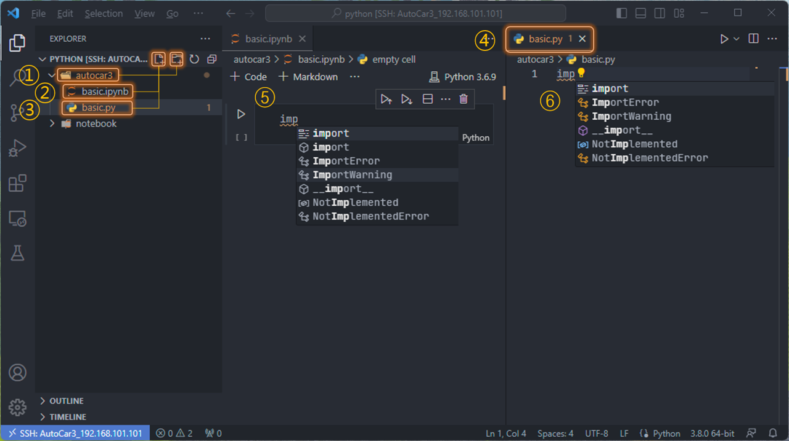

# 더 알아보기
지금까지 PC와 AutoCar3를 TCP/IP 네트워크로 연결한 후 VSCode 원격 개발환경을 통해 코드를 작성하는 과정을 알아보았습니다.  
이런 원격 개발환경을 사용하면 실제 모든 작업은 AutoCar3에서 이뤄지고, PC는 AutoCar3의 모니터와 키워드 역할만 수행합니다.  
물론 VSCode 자체는 PC에서 실행되지만, AutoCar3에 설치된 VS Code Server를 통해 VSCode에서 수행하는 모든 작업이 AutoCar3에서 반영됩니다.  
따라서 PC 성능은 VSCode를 실행할 정도면 충분합니다.  


